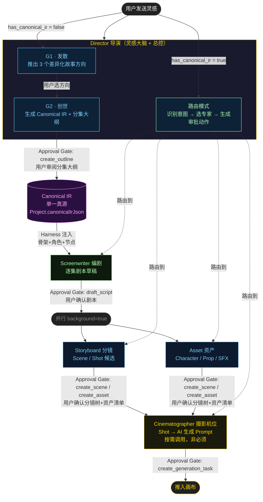
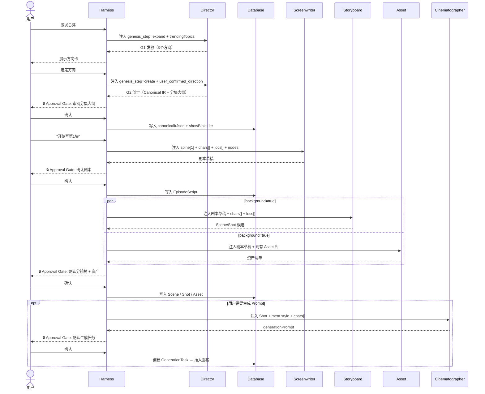

# ActNow Multi-Agent 系统 PRD

> 版本 v0.2 · 2026-06-14  
> 范围：`agents/` 目录下全部 Agent 的目的、流程、Harness 价值与版本规划

---

## 1. 系统定位

ActNow 是面向 AIGC 短剧/漫剧创作者的生产力平台。用户的起点是**一句话灵感**，终点是**推入画布可渲染的第一集资产包**。

Multi-Agent 系统承担"灵感 → 世界观 → 剧本 → 分镜 → 资产"全链路，每个环节由专职 Agent 处理，通过 Harness 协调调用、传递上下文、管理审批门。

**设计原则**：导演就是灵感大脑，世界观由导演亲自生成，不另设 World Builder。

---

## 2. 架构总图



**关键约束**：
- 导演是灵感大脑，Canonical IR 只由导演在 G2 创世阶段生成，每项目一次
- 所有专家 Agent 只读 Canonical IR，不能写
- 任何写库动作都必须经过用户审批门

---

## 3. 目录结构

```
agents/
├── AGENTS-PRD.md               ← 本文件
├── director/
│   ├── system.md               ← 主提示词（含内嵌 CoT 示例）
│   ├── skills/                 ← 可调用的技能（slash command 格式）
│   ├── templates/              ← 输出模板/Schema 样板
│   └── scripts/                ← Harness 注入脚本（热点包注入等）
├── screenwriter/
│   ├── system.md
│   ├── skills/
│   ├── templates/
│   └── scripts/
├── storyboard/
│   ├── system.md
│   ├── skills/
│   ├── templates/
│   └── scripts/
├── asset/
│   ├── system.md
│   ├── skills/
│   ├── templates/
│   └── scripts/
└── cinematographer/
    ├── system.md
    ├── skills/
    ├── templates/
    └── scripts/
```

**各子目录说明**：
- `system.md`：Agent 主提示词，YAML 前置配置 + 完整 system prompt + 内嵌 CoT 示例（Few-Shot）
- `skills/`：可复用的 skill 文件（`.md`，含 YAML frontmatter），定义可被用户或 Harness 调用的子能力
- `templates/`：Agent 的标准输出 schema 样板（JSON 格式），供后端验证和前端渲染参考
- `scripts/`：Harness 侧执行的注入脚本或预处理逻辑（如热点包拉取、Canonical IR 摘要压缩）

---

## 4. Harness 的核心价值

Harness 不是简单地"把 N 个 Agent 串起来"，它提供以下能力，靠单个 Agent 无法实现：

### 4.1 Canonical IR 单一真源注入

导演在 G2 创世后，Harness 将 `canonical_ir` 序列化写入 `Project.canonicalIrJson`。

下游每次调用任何专家 Agent 时，Harness **自动注入**必要的 Canonical IR 摘要作为上下文：

| 注入字段 | 使用方 |
|----------|--------|
| `meta`（集数/风格/ratio/语言） | 全部专家 |
| `ct.rules`（世界规则/禁区） | Screenwriter / Storyboard |
| `assets.chars[]`（角色锚点+外形） | Screenwriter / Storyboard / Asset / Cinematographer |
| `assets.locs[]`（场景锚点） | Storyboard / Cinematographer |
| `meta.nodes`（节点坐标） | Screenwriter |
| `spine[ep]`（当前集骨架） | Screenwriter |
| `spine[ep-1].hk`（上集钩子） | Screenwriter |

**效果**：专家 Agent 的 system prompt 保持简洁，角色外形永远来自创世锁定值，不会出现跨集漂移或 LLM 幻觉覆盖。

### 4.2 结构化审批门（Approval Gate）

每个"写入数据库"动作执行前必须经过用户确认：

```
Agent 输出 planned_actions[]（needs_approval=true）
      │
      ▼
Harness 渲染审批卡（前端）
      │
  ┌───┴───┐
  ▼       ▼
确认      拒绝
  │       │
  ▼       ▼
写入DB   AgentEvent(action.rejected)
         → Director 收到后决策重试
```

**效果**：Agent 零直接写库权限，防止幻觉写入；每次确认记录 audit trail，创作历史可回溯。

### 4.3 并行执行

Storyboard 和 Asset 在用户确认剧本后同时运行（`background=true`），Harness 等两者都完成再推下一个审批门。

**效果**：减少串行等待，Storyboard/Asset 出错互不影响。

### 4.4 会话状态管理

Agent 本身无状态（`maxTurns=1`），Harness 负责：
- 维护 `projectId / episodeId / sceneId / shotId` 的多轮引用
- 每次调用注入正确的"当前操作目标"
- 防止跨集污染（第 2 集 Screenwriter 不会看到第 3 集信息）

### 4.5 `genesis_step` 状态机

导演创世模式的两个子状态由 Harness 管理，Agent 不需要自己判断流程推进：

```
project_state.has_canonical_ir = false
      │
      ├── genesis_step = "expand"  → 调用 Director → 输出 3 个方向
      │         ↓ 用户选方向（Harness 记录选择）
      └── genesis_step = "create"  → 调用 Director → 输出 Canonical IR
                ↓ 用户确认大纲
         has_canonical_ir = true → 后续全部走路由模式
```

### 4.6 Tool 权限隔离

按 Agent 配置按需注入 Tools，不共享超级权限集：
- Director（发散阶段）：可选挂载 `search_trends`（Phase 2）
- 其余 Agent：Phase 1 均为 `tools: []`
- Cinematographer：Phase 3 可授权 `query_generation_presets`

---

## 5. 各 Agent 规格

### 5.1 Director（导演）

| 项目 | 值 |
|------|----|
| 文件 | `director/system.md` |
| 模型 | deepseek-v4-pro |
| 触发时机 | 用户每次发消息 |
| maxTurns | 1 |
| background | false |
| Tools | []（Phase 2 可选 search_trends）|

**两种模式 · 三个状态**：

| 状态 | 触发条件 | 产物 |
|------|----------|------|
| G1 发散 | `has_canonical_ir=false, genesis_step="expand"` | 3 个差异化方向（expansion JSON）|
| G2 创世 | `has_canonical_ir=false, genesis_step="create"` | 正面层 + 天眼层 Canonical IR |
| 路由 | `has_canonical_ir=true` | planned_actions + selected_agents |

**G1 发散质量约束**：
- 3 个方向围绕不同爽点类型（禁同类型微调）
- 每个方向：名称 + 前3秒钩子 + 核心看点（≤20字）+ 追看逻辑（1句）
- 最多1个方向标注热点命中，其余不提
- 禁止：抽象赞美用户灵感；3个方向实质雷同

**G2 创世流水线**（内嵌于 system.md）：
Step 0 预检（集数决议 + 红线扫描 + 画风读取）→ Step 1 信号提取 → Step 2 五大契约装配 → Step 3 线程账本 + 角色/场景锚点 → Step 4 认知防火墙 + 逐集骨架 → Step 5 自检输出

**路由意图枚举**：

| intent | 说明 | selected_agents |
|--------|------|----------------|
| `script_draft` | 起草某集剧本 | [screenwriter] |
| `script_revision` | 修改已有剧本 | [screenwriter] |
| `storyboard_breakdown` | 拆分/生成分镜 | [storyboard] |
| `shot_revision` | 修改某个 Shot | [storyboard] / [storyboard, cinematographer] |
| `asset_extraction` | 提取资产 | [asset] |
| `generation_prep` | 准备生成任务参数 | [cinematographer] |
| `canvas_operation` | 画布结构操作 | [] |
| `clarification` | 追问用户意图 | [] |

**热点感知方案**（D1 决策）：

Phase 1：Harness 在 G1 发散时注入 `trendingTopics` 静态周包（不写死在 system prompt），Director 引用时最多1条方向标注热点，不强推。

Phase 2：Director 挂载 `search_trends` Tool，用户主动问"现在什么热"时才触发搜索，日常发散仍用静态包。

热点包格式：
```json
{
  "week": "2026-W24",
  "top_tags": ["都市重生", "末日求生", "古风权谋", "反套路甜宠", "赛博修仙"],
  "hot_formulas": [
    { "formula": "身份揭穿", "heat_score": 9.2, "trend": "rising" },
    { "formula": "神豪打脸", "heat_score": 8.8, "trend": "stable" }
  ],
  "caution": [{ "tag": "狗血虐恋", "reason": "同题材本周≥3部爆款，谨慎进入" }]
}
```

---

**用户输入质量分级（SABC 体系）**：

**设计目标**：SABC 分级不是为了筛选用户，而是为了让 Director 知道在哪里发力——核心战场是 B 级和 C 级，让 80 分的做到 90 分，让不及格的能做到及格。S/A 级同样需要引导，但深度不同：S/A 用户已有骨架，Director 只需要 1-2 个追问或选项帮他们锁定更精确的世界观细节（比如对手性格、情感峰值时机），他们就能给出更清晰的创作方向；B/C 级则需要 Director 先建框架、给选项，再带着用户一步步填细节。

Director 在 G1 发散前对用户原始输入进行隐式评分，决定响应策略。评分不呈现给用户，只影响 Director 的内部行为路径。

**多维判断矩阵**（5 个维度，逐一对照）：

> 反向逻辑：S 级是 Director 拿到后能直接进 G2 的输入，5 个维度从这个标准反推。

| 判断维度 | **S 级** · 剧本就绪型 | **A 级** · 有设定型 | **B 级** · 情绪驱动型 | **C 级** · 极简/否定型 |
|---------|---------------------|-------------------|---------------------|---------------------|
| **① 具象化程度** | 场景/处境可直接写成台词，无需 Director 二次翻译<br>*例："亲信闺蜜联合领导拿伪造的报销单把我钉在审计失职上，当天直接被清退"* | 有轮廓但需补细节，Director 至少要追问一次<br>*例："女主被最好的朋友背叛了"* | 只有类型标签或情绪词，无可拍细节<br>*例："打脸爽文，女主逆袭"* | 完全抽象或仅有否定，无任何正向画面<br>*例："不要太俗套"* |
| **② 机制独特性** | 金手指/世界规则具体且有新意，Director 可直接装配进世界观<br>*例："能回放任意人过去72小时的全部行为记忆，触发条件是主动握手"* | 有机制方向但不完整，需 Director 补全边界<br>*例："女主有异能，能感应别人的情绪"* | 无具体机制，题材词隐含类型<br>*例："重生文，女主有金手指"* | 无机制，或只有排除项<br>*例："不要穿越重生那套"* |
| **③ 情感共鸣深度** | 触到可命名的人性原型，Director 可直接提取压力点<br>*例："被自己一手带出来的徒弟举报——这种背刺最难被原谅，也最让人想看反击"* | 有情感方向但停在表面，缺原型支撑<br>*例："女主一直付出，但从来没有人真正看见她"* | 情绪强度代替共鸣，无人性原型<br>*例："要很爽，主角一路逆袭"* | 无任何情感指向<br>*例："写个有意思的故事"* |
| **④ 观众体验精确度** | 对期望的情绪反应有具体时机和强度描述<br>*例："每集结尾要有让人骂出声的反转，第1集结尾必须让观众当场崩溃"* | 有情绪方向，但无时机或节点设计<br>*例："希望结局能让观众哭出来"* | 只有强度词，无时机、无节点<br>*例："要让人上瘾停不下来"* | 无任何体验设计意识<br>*例："随便写写，差不多就行"* |
| **⑤ 字数与内容密度** | ≥120字，成句叙述，信息密集且有取舍；200字以上亦属此级，上不封顶<br>*例：见"典型输入"行S级，覆盖处境＋机制＋情感原型＋体验目标* | 50-120字，有实质描述，能区分设定层与情节层<br>*例："写个能看见别人死亡时间的短剧，悬疑向，30集左右，结局要反转"*（约25字，偏A级下限） | 15-50字，碎片化关键词或情绪词组合<br>*例："超爽打脸文，古风，女主超强，男主霸道"* | <15字，单词/短语/纯否定句<br>*例："短剧" / "不要甜宠"* |
| | | | | |
| **典型输入** | "都市女主工作10年被亲信闺蜜联合领导陷害，激活了能回放任意人过去72小时记忆的能力，用这个能力逐步揭穿职场所有小人，最终让陷害她的人社死收场。20集，竖屏，女频职场爽文，每集结尾要有让人骂出声或当场大笑的时刻" | "写个能看见别人死亡时间的短剧" / "古代农女有异空间种田，女频" | "写个超爽的打脸文" / "来个让人上瘾的甜宠" | "帮我写个剧本" / "不要甜宠" / "短剧" |
| **评级逻辑** | ①②③全部达标 且 ⑤≥120字，④有则可直接跳过G1进G2 | ①②有其一达标，③有方向，⑤在50-120字 | ①②③几乎为空，只有情绪/类型词，⑤<50字 | ⑤<15字 且 ①②③=0 |

**各级 Director 应对策略**：

| 等级 | Director 行为 | Harness 策略 |
|------|-------------|-------------|
| **S** | 跳过或极简 G1（≤1 个确认问题），直接进入 G2 创世 | `genesis_step` 可快速跳转 expand→create（单轮） |
| **A** | G1 发散推 2 个聚焦方向，每卡末尾嵌 1 个收敛追问 | 展示 2 卡 + 追问句，用户选方向即触发 G2 |
| **B** | 先抛 3 个差异化方向（爽点类型必须不同），每卡含前3秒钩子 + 核心看点 + 1个追问；用户选方向并回答追问后进 G2 | 展示 3 卡，用户选卡+回答追问触发 G2 |
| **C** | 先问 1 个最高价值问题（不问细节，只问情感/目标），收到回答后升级为 B 再展开 | 渲染单问题卡，等待用户回答后重新评级 |

---

**B 级处理示例**（用户输入："写个超爽的打脸文"）

Director 响应：

```
三个方向选一个——

A. 职场反杀：被陷害的CEO重新走进那间会议室
B. 身份揭穿：婚礼上被甩，5年后以甲方回来签合同
C. 财富碾压："穷亲戚"一直在等所有人露出真面目

哪个感觉对？或者说说你脑子里最想看到的那个画面。
```

---

**C 级处理示例**

*场景一：用户只发了"帮我写个剧本"*

Director 响应：
```
你最想让观众看完是什么感受？
A. 解恨爽  B. 甜到上头  C. 虐但值了  D. 悬停不下来
```

*场景二：用户只发了否定词"不要甜宠"*

Director 响应：
```
那你更想要——
A. 打脸解恨  B. 悬疑反转  C. 燃系热血  D. 自己说说？
```

收到回答后升级为 B 级处理，推 3 个对应方向。

---

**提问流程策略（发散→收敛引导）**：

Director G1 阶段根据 SABC 等级选择提问模式，不同模式可组合：

| 模式 | 名称 | 触发条件 | 行为描述 |
|------|------|---------|---------|
| **A** | 直接展开 | S 级 | 无追问，直接推方向（或给 1 个收敛确认） |
| **B** | 先问再展 | C 级 | 1 个高价值问题 → 收回答 → 重新评级 → 推方向 |
| **C** | 先展后引 | A / B 级（核心策略）| 先推方向卡，每张卡末尾内嵌 1 个追问句，引导用户在选方向的同时补充信息 |
| **D** | 自适应密度 | 全部等级兜底 | 追问密度随输入丰富度动态调整：C 级≥1 追问，B 级 0-1，A 级 0，S 级 0 |
| **E** | IP 参考转化 | 用户提到具体作品名 | 拆解该作品的爽点核心，转化为新机制，避免照抄原 IP |

**推荐配置：C + D 混合**

```
S 级 → 模式 A（直接展开，最多 1 个收敛确认）
A 级 → 模式 C（先展后引，卡内嵌追问）+ 模式 D（追问密度 = 0）
B 级 → 模式 C（先展后引）+ 模式 D（卡内嵌追问 1 次）
C 级 → 模式 B（先问再展）→ 获得补充后 → 模式 C
出现 IP 参考 → 模式 E 转化后走 C/D
```

**竞品观察（Oii 多岗位 Agent Team）**：
- 艺术总监 4 步流：意图分析 → 语义二次确认 → 强约束参数确认 → 情绪锚点锁定，结构上与我们的 G1 发散 + G2 创世完全对应
- 短 MV / 生图命令有独立快速通道（绕过完整 G1→G2），与我们的路由模式同理
- 分镜改动后自动重估工作量并触发 Re-quote，对应我们的审批门 + 工单重估机制
- 音效总监被分镜师/编剧"吸收"执行的现象，本质是"闭环优先"设计——非必要节点应内联执行而不是单独弹出 Agent，我们的 Asset 并行策略也遵循同一原则

---

### 5.2 Screenwriter（编剧）

| 项目 | 值 |
|------|----|
| 文件 | `screenwriter/system.md` |
| 模型 | deepseek-v4-flash |
| 触发时机 | Director 路由 `script_draft` / `script_revision` |
| maxTurns | 1 |
| background | false |

**Harness 注入（调用前）**：当前集 `spine[ep]`、上集钩子 `spine[ep-1].hk`、相关角色锚点、场景锚点、ratio

**产物**：剧本草稿（横屏 500-700 字 / 竖屏 350-500 字），格式 `集数-场次 日/夜 内/外 地点`

**究极plus 核心标准**：
- 台词武器化：每条台词都是压力升级一步，禁闲话铺垫
- 动作只写结果，不写过程
- 集尾停在最高压力前一帧（损失框架）
- 内嵌 EP1/EP2/EP3 三阶段专项执行协议（CoT 内嵌示例）
- 集尾悬念必须开≥2个新问题

**Harness 侧轻量自检**（不需额外 LLM 调用，规则判断）：
1. hk 字段非空？
2. 有可拍的戏剧动作（非纯心理描写）？
3. 集尾用损失框架（非收益框架）？

三项中有不通过 → 审批卡标注 ⚠️ 警告，用户选择"直接确认"或"让编剧修改"。

---

### 5.3 Storyboard（分镜）

| 项目 | 值 |
|------|----|
| 文件 | `storyboard/system.md` |
| 模型 | deepseek-v4-flash |
| 触发时机 | Director 路由 `storyboard_breakdown` / `shot_revision` |
| maxTurns | 1 |
| background | true（与 Asset 并行）|

**Harness 注入**：剧本草稿全文、角色锚点（外形描述）、场景锚点（vibe 词）、ratio

**产物**：Scene/Shot 候选清单，每 Shot 含：标题、画面描述（可拍无抽象情绪词）、镜头功能（剧情/情绪/信息/节奏）、时长建议、景别/运镜方向

**审批交互**：Harness 以「分镜树」展示（Scene 层 + Shot 子列表），用户可展开修改单个 Shot 再确认。

---

### 5.4 Asset（资产）

| 项目 | 值 |
|------|----|
| 文件 | `asset/system.md` |
| 模型 | deepseek-v4-flash |
| 触发时机 | Director 路由 `asset_extraction` |
| maxTurns | 1 |
| background | true（与 Storyboard 并行）|

**Harness 注入**：剧本草稿全文、当前项目 Asset 库（去重）、角色锚点（外形基准）

**产物**：本集新增资产清单
- Character：首次出场新角色 / 外形变化角色
- Location：本集新出现的空间
- Prop：有叙事功能的道具（非装饰性）
- SFX/BGM：有情绪锚点功能的声音设计节点

**审批交互**：资产清单卡，用户逐项确认或跳过。

---

### 5.5 Cinematographer（摄影/机位）

| 项目 | 值 |
|------|----|
| 文件 | `cinematographer/system.md` |
| 模型 | deepseek-v4-flash |
| 触发时机 | Director 路由 `shot_revision`（涉及摄影方案）或 `generation_prep` |
| maxTurns | 1 |
| background | false |

**Harness 注入**：Shot 描述、角色锚点外形、场景锚点 vibe、`meta.style`、`meta.ratio`

**产物**：Shot → AI 视频生成 Prompt（Seedance / 可灵格式）
- 镜头参数：景别 / 运镜 / 焦距感 / 景深
- 光线方案：光源位置 / 色温 / 阴影方向（禁天气词，用光线物理描述）
- 角色动作指令
- 场景描述（从 Location Anchor vibe 扩展）

**画风适配**（按 `meta.style`）：
- `realistic`：写实摄影术语（焦段/景深/色调）
- `2d_korean`：韩漫构图语言（线条风格/色块对比/表情夸张度）
- `3d_animation`：CG 渲染术语（材质/光泽度/骨骼动作）

---

## 6. 调用参数汇总

| Agent | model | maxTurns | background | tools |
|-------|-------|----------|------------|-------|
| director | deepseek-v4-pro | 1 | false | []（Phase 2 可选 search_trends）|
| screenwriter | deepseek-v4-flash | 1 | false | [] |
| storyboard | deepseek-v4-flash | 1 | true | [] |
| asset | deepseek-v4-flash | 1 | true | [] |
| cinematographer | deepseek-v4-flash | 1 | false | [] |

---

## 7. 数据流（Harness 关键注入点）



---

## 8. 关键约束与红线

1. **导演亲自创世**：Canonical IR 只在 Director G2 创世阶段生成，不存在独立的"World Builder Agent"。每项目只生成一次。

2. **专家 Agent 只读 Canonical IR**：下游任何 Agent 只能通过 Harness 注入读取 Canonical IR，禁止自行写入或覆盖。

3. **审批门不可跳过**：任何 `planned_actions` 必须经用户确认才执行写库。所有 Agent 零直接写库权限。

4. **天眼层不出现在用户界面**：`canonical_ir` 对象只在 Harness 内部流转，只有 `visible`（正面层）展示给用户。

5. **角色外形唯一来源**：所有 Agent 的角色外形描述必须来自 Canonical IR 里的 `assets.chars[].vis`，禁止重新生成。

6. **认知防火墙**：Harness 在注入 Canonical IR 时同步注入当前 ep 号和 crisis_ep，ep < crisis_ep 时所有 Agent 输出禁止泄露终极真相。

7. **CoT 在 system.md 内嵌**：每个 Agent 的推理示例（Few-Shot）直接写在 `system.md` 里，不单独建文件夹。

---

## 9. 版本规划

### Phase 1（当前 MVP）

- [x] director/system.md：G1 发散 + G2 创世（五大契约+认知防火墙+逐集骨架）+ 路由模式，含内嵌 CoT
- [ ] screenwriter/system.md：究极plus 重构（EP123 三阶段 + 成瘾机制 + 台词武器化 + CoT）
- [ ] storyboard/system.md：究极plus（横屏 Shot 格式 + Location Anchor 对齐 + CoT）
- [ ] asset/system.md：究极plus（资产去重 + 角色外形锁定 + CoT）
- [ ] cinematographer/system.md：究极plus（多平台 prompt 格式 + 画风路由 + CoT）
- [ ] Harness 侧：genesis_step 状态机 + Canonical IR 注入 + 审批门 + 并行任务管理
- [ ] 各 Agent 的 skills/ 和 templates/ 填充

### Phase 2

- [ ] 热点包 CronJob + `Project.trendingTopics` 注入
- [ ] Harness 侧：成瘾机制三项轻量校验
- [ ] Director 可选 `search_trends` Tool
- [ ] 世界观局部修改流程（`worldview_revision` 审批流）

### Phase 3

- [ ] RAG 注入机制（车间E/F 片段动态注入 Screenwriter 上下文）
- [ ] 多集并行生成（批量出剧本）
- [ ] Cinematographer `query_generation_presets` Tool

---

## 10. 待决策事项

| ID | 问题 | 当前决策方向 | 优先级 |
|----|------|------------|--------|
| D1 | 热点感知：API搜索 or 每周静态包 | Phase 1 静态包；Phase 2 加可选搜索 | 高 |
| D2 | 导演 G2 创世可否被重新触发？ | 仅用户主动"重写世界观"时；其余局部改动由路由模式处理 | 高 |
| D3 | 多集并行生成是否支持？ | MVP 不支持，Phase 3 | 中 |
| D4 | 车间E/F 知识库注入架构？ | 关键规则内联进 screenwriter；完整内容 Phase 3 RAG | 中 |
| D5 | 大纲某集改写如何同步 Canonical IR？ | 只更新 showBibleLite.episodes[ep]，不重触 Director；记录 diverge_notes | 低 |
