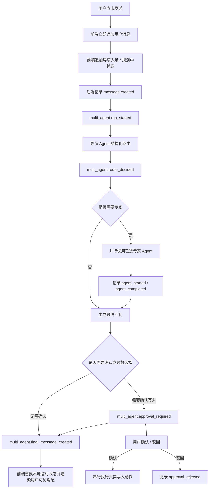

# PRD-Multi-Agent Chatroom / Agent 编排模块

| 字段 | 内容 |
| --- | --- |
| 文档版本 | v0.4 聊天体验与事件可见性基线 |
| 创建日期 | 2026-06-12 |
| 更新日期 | 2026-06-14 |
| 所属产品 | ActNow AIGC 短剧 / 漫画剧创作平台 |
| 模块定位 | 产品核心入口：由导演 Agent 总控，多专家 Agent 协作，把用户自然语言转换为剧本、分镜、资产、画布和生成任务的可确认工作流 |
| 当前状态 | 已进入可运行原型阶段：公司文本模型已接入，导演结构化路由、专家事件、确认卡片和首个 Shot 写入动作已具备工程骨架 |

## 0. 当前产品决策

- Multi-Agent 聊天室是 ActNow 核心模块，不是普通聊天机器人。
- 当前以原型为最新产品真源，PRD 是当前实现基线，不覆盖原型判断。
- MVP 是 demo 单用户模式，先不做登录、多用户协作和权限系统。
- 导演 Agent 是总控，负责意图识别、专家路由、确认判断、最终回复和后续动作计划。
- 聊天室首个入场 Agent 是“导演”，不是“艺术总监”或普通助手；UI 可以借鉴同类产品的交互节奏，但不能照抄角色命名和表达。
- 专家 Agent 包括：编剧、分镜、资产、摄影/机位。
- 文本模型走公司代理：导演暂定 `deepseek-v4-pro`，其他专家暂定 `deepseek-v4-flash`。
- 图像 / 视频仍走人在环；当前只准备文本、引用、prompt package 和生成任务草案。
- 用户确认前，Agent 输出不能直接写入剧本、分镜、资产、画布或生成任务。
- 任何会改变项目状态的内容必须先生成 `approval_required` 确认卡片。
- 默认不向用户展示模型完整思考链、route JSON、run id、模型名、专家原始 payload 或工具调试信息；这些只进入后台审计事件。
- 剧本是画布的一等内容对象，不只是聊天文本；进入画布后必须能看到“我的剧本 / 剧本正文”卡片，并作为后续角色、分镜、资产拆解的起点。
- 刷新页面默认回到首页；用户需要从“我的项目”重新打开项目，不自动恢复上一次聊天。

## 1. 产品目标

用户希望用自然语言推进一部短剧 / 漫画剧从灵感到可制作画布：

- 把灵感整理成剧本方向。
- 把剧本拆成 Scene / Shot。
- 把角色、场景、道具整理成资产。
- 把镜头要求转换成画布节点和生成准备。
- 在需要时导出提示词包，等待人在环上传图像 / 视频结果。

Agent 聊天室必须同时满足两个目标：

- 像聊天一样低门槛输入。
- 像工作台一样可追踪、可确认、可落盘、可驱动画布。

## 1.1 聊天体验原则

聊天室必须按正常聊天软件的时序呈现，而不是等待后端全部完成后一次性刷出结果：

1. 用户点击发送后，用户消息立即出现在时间线顶部当前位置。
2. 导演进入聊天室，显示轻量状态，例如“导演进入聊天室”。
3. 导演开始规划，显示“导演正在规划...”等可见进度。
4. 后端编排完成后，用真实事件替换本地临时状态，展示导演的用户可读回复。
5. 如果需要用户选择参数或确认写入，展示产品化卡片。
6. 如果请求失败，保留用户消息并显示导演失败提示，允许重试。

用户可见内容必须像“对话 + 工作流卡片”，不可像日志查看器。内部事件仍需要完整记录，但默认不直接展示。

工作流参数卡片的“确认并继续”不是“进入画布”：

- 它只表示用户确认影片长度、比例、对白语言等短剧工作流参数。
- 点击后仍留在聊天室，由导演继续组织编剧、分镜等专家拆解剧本结构、Scene 和 Shot 候选。
- 只有用户显式点击“进入画布”，或后续有明确的画布阶段动作时，才切换到画布。
- 参数确认本身不应触发剧本锁定、画布初始化或任何业务写入；如需写入，仍必须生成确认卡片。
- 参数确认后的用户可见气泡只显示“信息已确认”，并保留“更新短片参数”的已完成步骤；内部给导演的继续指令、结构化参数和下一步任务 brief 不得展示给普通用户。

项目恢复规则：

- 浏览器刷新后进入首页，不直接进入上次的聊天室或画布。
- 首页展示“我的项目”列表，用户点击某个项目后再恢复该项目 workspace。
- 当前 demo 单用户模式下，“我的项目”来自 `GET /api/projects`。

## 2. Agent 组织方式

参考 Claude Code 的 Agent 组织方式，ActNow 的 Agent 不应只是代码里的 prompt 字符串，而应是带元数据的独立定义文件。

当前定义目录：

- `agents/director.system.md`
- `agents/screenwriter.system.md`
- `agents/storyboard.system.md`
- `agents/asset.system.md`
- `agents/cinematographer.system.md`

每个 Agent 文件由 frontmatter 和正文组成：

```yaml
---
name: storyboard
description: 分镜 Agent，负责把剧情意图拆成 Scene / Shot 候选、镜头节奏、镜头目标和分镜结构。
model: deepseek-v4-flash
tools: []
maxTurns: 1
background: false
color: blue
---
```

正文是该 Agent 的 system prompt。运行时由 `AgentRegistryService` 读取并校验：

- `name`: Agent id，必须和文件对应。
- `description`: 给导演路由使用的能力说明。
- `model`: 默认模型，可被环境变量覆盖。
- `tools`: 该 Agent 可用工具范围，MVP 阶段为空。
- `maxTurns`: 单轮最大执行轮数，MVP 阶段为 1。
- `background`: 是否后台运行，MVP 阶段为 false。
- `systemPrompt`: Agent 的完整行为约束。

这样做的原因：

- prompt 可维护，不再散落在 TypeScript 代码里。
- 导演可以只看 `description` 做路由，专家执行时再读取完整 prompt。
- 后续可以为不同 Agent 配不同工具、模型、记忆、后台执行和并行策略。

## 3. MVP Agent 清单

| Agent | 定位 | 模型 | 主要输入 | 主要输出 | 是否总控 |
| --- | --- | --- | --- | --- | --- |
| 导演 Agent | 总控 / 路由 / 确认 / 最终回复 | `deepseek-v4-pro` | 用户消息、项目上下文、最近历史、焦点对象 | `intent`、`selected_agents`、`needs_approval`、`planned_actions`、`director_message` | 是 |
| 编剧 Agent | 剧情、角色动机、台词、冲突 | `deepseek-v4-flash` | 导演路由、剧本上下文 | 剧情建议、台词建议、结构修改草稿 | 否 |
| 分镜 Agent | Scene / Shot、镜头节奏、分镜结构 | `deepseek-v4-flash` | 导演路由、剧本 / Shot 上下文 | Scene / Shot 候选或修改建议 | 否 |
| 资产 Agent | 角色、场景、道具、参考素材 | `deepseek-v4-flash` | 剧本 / 分镜 / 画布引用 | 资产清单、缺失项、引用关系 | 否 |
| 摄影/机位 Agent | 景别、机位、运动、光线、压迫感 | `deepseek-v4-flash` | Shot、情绪目标、参考风格 | 镜头语言、生成提示词方向 | 否 |

## 4. 导演结构化路由

导演必须只输出 JSON，不输出 Markdown 或解释文字。

```json
{
  "intent": "shot_revision",
  "selected_agents": ["storyboard", "cinematographer"],
  "needs_approval": true,
  "planned_actions": [
    {
      "action_type": "update_shot_description",
      "target_type": "shot",
      "target_id": "shot_xxx",
      "summary": "把第 8 镜改得更压迫一点",
      "diff": {
        "before": "当前镜头描述；未知时为 null",
        "after": "新的镜头描述"
      }
    }
  ],
  "director_message": "我会让分镜和摄影/机位先给出镜头修改方案，确认后再写入 Shot。"
}
```

`intent` 枚举：

- `creative_brainstorm`
- `script_structuring`
- `storyboard_breakdown`
- `shot_revision`
- `asset_extraction`
- `generation_prep`
- `canvas_operation`
- `clarification`

`selected_agents` 只能包含：

- `screenwriter`
- `storyboard`
- `asset`
- `cinematographer`

`planned_actions[].action_type` 当前允许：

- `update_shot_description`
- `create_scene`
- `create_shot`
- `draft_script`
- `create_asset`
- `create_generation_task`
- `update_canvas`

## 5. 编排流程



关键约束：

- 专家建议阶段可并行。
- 写入动作必须在用户确认后串行执行。
- 没有确认前，不能写入业务表。
- 每个专家都是“新进入房间的同事”，调用时必须给完整任务 brief：用户输入、项目上下文、导演路由、确认边界。
- 前端可先插入 `ui.*` 本地临时事件改善响应感；这些事件不作为业务真源，后端真实事件返回后应被替换。

## 6. 事件流

### 6.1 后台审计事件

当前必须记录的后台核心事件：

- `message.created`
- `multi_agent.run_started`
- `multi_agent.route_decided`
- `multi_agent.agent_started`
- `multi_agent.agent_completed`
- `multi_agent.approval_required`
- `multi_agent.final_message_created`
- `multi_agent.approval_confirmed`
- `multi_agent.approval_rejected`
- `tool.started`
- `tool.completed`
- `tool.failed`

后台事件用于审计、调试、回放和后续可观测性，可以包含 route、selected_agents、planned_actions、专家摘要、工具执行结果和错误信息。

### 6.2 用户可见事件

前端聊天室不能直接 `JSON.stringify(payload)`，默认只展示以下用户可理解内容：

- 确认卡片
- 用户消息
- 导演入场和规划状态
- 导演最终回复
- 工作流/参数选择卡片
- 写入成功或失败结果

前端允许的可见事件：

- `message.created`
- `ui.director_joined`，前端本地临时事件，不写入后端。
- `ui.director_planning`，前端本地临时事件，不写入后端。
- `ui.director_failed`，前端本地临时事件，不写入后端。
- `multi_agent.final_message_created`
- `multi_agent.approval_required`
- `multi_agent.approval_confirmed`
- `multi_agent.approval_rejected`
- `tool.completed`
- `tool.failed`

默认不可见事件：

- `multi_agent.run_started`
- `multi_agent.route_decided`
- `multi_agent.agent_started`
- `multi_agent.agent_completed`
- `tool.started`

不可见事件可以进入开发调试面板，但不能进入普通用户聊天时间线。

### 6.3 思考链边界

- 如果模型或代理返回 reasoning / thinking 字段，后台可以按供应商协议决定是否保存摘要，但不能在普通聊天中展示完整思考链。
- UI 最多展示“导演正在规划”“正在整理专家建议”等状态，不展示逐字思考过程。
- 若后续需要开发者模式，可通过显式开关展示摘要级诊断，不作为默认体验。

## 7. 确认和写入

确认前：

- 只生成建议、候选、`planned_actions` 和 `approval_required`。
- UI 展示确认卡片。
- 用户可以确认或驳回。

确认后：

- 后端读取 approval 中的 `actions`。
- 按顺序执行写入动作。
- 记录 `tool.started` / `tool.completed` / `tool.failed`。
- 更新 workspace 返回给前端刷新。

当前优先真实写入动作：

- `update_shot_description`: 修改 Shot 描述并递增版本。

后续动作按风险顺序推进：

1. `create_shot`
2. `create_scene`
3. `create_asset`
4. `draft_script`
5. `create_generation_task`
6. `update_canvas`

## 8. 当前工程文件

后端：

- `apps/api/src/services/agent-registry.service.ts`
- `apps/api/src/services/text-model.service.ts`
- `apps/api/src/services/multi-agent-orchestrator.service.ts`
- `apps/api/src/services/agent-events.service.ts`
- `apps/api/src/routes/agent.controller.ts`

前端：

- `apps/web/src/components/ChatStage.tsx`
- `apps/web/src/components/HomeStage.tsx`
- `apps/web/src/components/CanvasStage.tsx`
- `apps/web/src/lib/api.ts`

配置：

- `TEXT_MODEL_PROXY_BASE_URL`
- `TEXT_MODEL_PROXY_API_PATH`
- `TEXT_MODEL_PROXY_MODE`
- `TEXT_MODEL_PROXY_API_KEY`
- `TEXT_MODEL_PROXY_MAX_TOKENS`
- `DEFAULT_TEXT_MODEL`
- `TEXT_MODEL_DIRECTOR_MODEL`
- `TEXT_MODEL_WORKER_MODEL`
- `AGENTS_DIR` 可选，用于覆盖 Agent 定义目录。

## 9. 验证优先级

常规验证：

```bash
npm.cmd run build --workspaces --if-present
npm.cmd run test --workspaces --if-present
docker compose up -d
docker compose ps -a
```

运行验证：

- API health: `http://localhost:18080/api/health`
- 前端: `http://localhost:18081`
- Multi-Agent API: `POST /api/agent/threads/:threadId/messages`
- 事件流: `GET /api/agent/threads/:threadId/events`

注意：当前 Windows 环境中 `4173` 位于系统保留端口段，前端外部访问端口使用 `18081`；不要改回 `5173` 或 `4173`。

## 10. 未完成事项

- 需要把当前“本地临时事件 + 后端批量事件”的体验继续升级为 SSE / 流式事件，减少规划完成前的等待。
- 确认写入链路需要补端到端测试，尤其是 `tool.failed` 事务回滚后的事件持久化策略。
- 需要继续修复前端和其他源码中的历史中文乱码。
- 专家输出仍是自然语言，后续可按 Agent 类型逐步结构化。
- 并行 Agent 现在是后端 Promise 并行，事件仍是请求完成后批量返回；后续再升级 SSE 实时事件。
- 还需要补“修改后再次确认”和“多动作审批”的 UI 细节。
