# ActNow PRD

| 字段 | 内容 |
|------|------|
| 产品类型 | Web应用 |
| 版本 | v0.1 |
| 日期 | 2026-06-09 |
| 状态 | 草稿 |

## 修改记录

| 日期 | 版本 | 变更 | 修改人 |
|------|------|------|--------|
| 2026-06-09 | v0.1 | 初始化PRD | [待确认] |
| 2026-06-09 | v0.2 | 模块1 项目背景 | [待确认] |
| 2026-06-09 | v0.3 | 模块2 用户与场景 | [待确认] |
| 2026-06-09 | v0.4 | 模块3 目标·指标·范围 | [待确认] |
| 2026-06-09 | v0.5 | 模块4 产品方案·Harness架构·信息架构·主流程 | [待确认] |
| 2026-06-09 | v0.6 | 模块5 功能需求总览 | [待确认] |
| 2026-06-09 | v0.7 | 模块6a 创意阶段 | [待确认] |
| 2026-06-09 | v0.8 | 模块6b 资产管理 | [待确认] |
| 2026-06-09 | v0.9 | 模块6c 分镜与生成 | [待确认] |
| 2026-06-09 | v0.10 | 模块6d 合成与导出 | [待确认] |
| 2026-06-09 | v0.11 | 模块6e Agent聊天框 | [待确认] |
| 2026-06-09 | v0.12 | 模块6f PC无限画布 | [待确认] |
| 2026-06-09 | v0.13 | 模块7 数据模型与对象关系 | [待确认] |
| 2026-06-09 | v0.14 | 模块8 生成任务状态机 | [待确认] |
| 2026-06-09 | v0.15 | 模块9 人在环交付协议 | [待确认] |
| 2026-06-09 | v0.16 | 模块10 Agent编排 | [待确认] |
| 2026-06-09 | v0.17 | 模块11 业务规则与异常 | [待确认] |
| 2026-06-09 | v0.18 | 模块12 数据·埋点·权限·账号 | [待确认] |
| 2026-06-09 | v0.19 | 模块13 上线与运营 | [待确认] |
| 2026-06-09 | v0.20 | 模块14 风险·待决·自检 | [待确认] |
| 2026-06-09 | v0.21 | 模块4.3 补关键页面骨架与控件 | [待确认] |
| 2026-06-09 | v0.22 | 统一首页入口（去独立"进创意聊天"，输入即进聊天室）同步4.4/5/6a/11 | [待确认] |
| 2026-06-09 | v0.23 | 4.3 补画布节点工作流（comfyui式分组）+ 6步骤节点展开骨架 | [待确认] |
| 2026-06-09 | v0.24 | 3D导播台并入①资产框（场景资产升级），主步骤重排为①资产②分镜③分镜图④视频⑤合成 | [待确认] |
| 2026-06-09 | v0.25 | 新增画布分组框组合技按钮（=Skill画布载体，预置+自定义，沉淀工作流模板），同步4.3/3范围/6f | [待确认] |
| 2026-06-09 | v0.26 | 明确6a-R2：风格/比例/时长/模型剧本确定后锁定，仅Skill制作期可改 | [待确认] |
| 2026-06-09 | v0.27 | 版权改为免责声明用户自负（核心入MVP），去掉无版权剧本边界纠结，同步6a/11/12/14/3范围 | [待确认] |
| 2026-06-09 | v0.28 | PRD查漏收口：详设级待确认全部给定工程默认值（引用/版本/重试/降级/回传/容差/存储/编排），Q8/Q18定稿，风格时长填默认；仅Q3/Q4/Q17+免责条款保留 | [待确认] |
| 2026-06-09 | v0.29 | 新增4.5技术栈选型：前端React+tldraw、后端Node.js+NestJS、Prisma+PostgreSQL、LangGraph.js编排、S3存储（前后端统一TS） | [待确认] |
| 2026-06-09 | v0.30 | Q17风格一致机制收口（6c-R8：风格锁定+统一注入，与角色一致正交） | [待确认] |

---

## 1. 项目背景

### 1.1 产品定位

**ActNow**（暂名）是一款以 **Harness 工程**理念驱动的**多路线 AIGC 内容创作平台**，面向有质量追求、想要精细画面控制的进阶个人创作者。

> **Harness（挽具）**：指围绕 AI 模型构建的工程层——工作流编排、上下文管理、多 Agent 调度、提示词工程基础设施。模型负责"生成"，Harness 负责"让生成在真实创作流程里可控、可用、可复现"。

核心主张：**AI 模型是底层资源，产品价值在于围绕它构建的编排层。** 平台把上述 Harness 这套工程做深，**Agent 聊天框是它最直接的用户侧入口**——用户纯靠对话即可驾驭从一句灵感到成片的完整创作工作流。产品的差异化来自这层工程与交互设计，而非选用了哪个模型。

MVP 先落地**漫剧/短剧**路线，但产品从数据结构与路由骨架上即按多路线设计，创意短片、电商视频作为后续路线，将来扩展不重构。

### 1.2 背景与待解问题

现有 AIGC 创作工具陷入两种极端，都未触及创作流程的本质矛盾：

| 流派 | 代表 | 形态 | 擅长 | 较弱的环节 |
|------|------|------|------|-----------|
| 纯聊天室 | 堆友 / OiiOii / Bloome | 对话即生成 | 创意阶段轻量、易上手 | 进入确定性生产阶段后，结构化管控偏弱 |
| 步骤流水线 | LuxReal / 巨日禄 | 固定步骤推进 | 生产阶段流程清晰、质量稳 | 创意发散阶段受步骤约束，灵感打磨空间小 |
| 无限画布 | LibTV / Lovart | ComfyUI 式节点 | 节点编排灵活、控制力强 | 门槛较高，创意阶段缺启发式引导 |

**本质矛盾**：创意阶段需要**发散**（灵感由模糊到具象），生产阶段需要**确定性**（流程可控、可复现）。两者是不同的创作心智，单一交互形态较难同时服务好。ActNow 的思路是分阶段采用不同形态，而非在某一派上做平替。

ActNow 的两个产品范式决策（详见模块 4）正是针对这个本质矛盾：**分水岭交互**（创意=聊天室发散收敛 / 制作=画布+步骤的确定性流程）、**双路径对等**（对话操作与画布操作功能等价，新手用嘴、老手上手）。

> 至于生成后端，做成可切换是务实约束而非创新点：当前缺少便宜的图像/视频 API，所以产品负责产出提示词、由用户拿到外部工具跑（人在环），后续接固定 API；架构预留统一适配层，顺带支持切换模型，仅此而已（详见 1.5、模块 9）。

### 1.3 产品用途（三位一体）

| 用途 | 说明 |
|------|------|
| 求职 demo | 体现产品 sense + Harness 工程能力，目标岗位：AI 产品经理 |
| 创业方向验证 | 为"一人公司"验证 AIGC 创作平台方向的可行性 |
| 能力展示 | 创作者本人为提示词工程师转 AI 产品经理，演示提示词工程 + 产品设计的结合 |

**核心演示诉求**：从一句剧本 → 生成一段带角色一致性的分镜，并走完整一条龙到成片。

### 1.4 竞品参照系

下表为竞品调研结论。ActNow 的定位不是对某一家做平替，而是在工程编排与分阶段交互上整合各家所长。

| 竞品 | 交互形态 | 核心能力 / 特点（调研发现） | 对 ActNow 的参考价值 |
|------|----------|------------------------------|----------------------|
| **LuxReal** | 步骤流水线 | 自研 Lux3D + 3D Agent；支持整季剧本上传；720° 全景空间管理；制作质量与界面成熟度高 | 整体交互体验、视觉风格、全景空间思路的主要参照 |
| LibTV | 无限画布 | 图生 720° 全景 + 导演台素模摆位；全景能力闭源自研 | 画布节点范式、全景空间思路 |
| Lovart | 无限画布 | ComfyUI 式节点编排，控制力强 | 制作阶段的画布编排范式 |
| OiiOii | 聊天室 | 多 Agent 对话式生成 | 创意阶段对话引导、多 Agent 思路 |
| 堆友 | 聊天室 | 对话式创作、素材生态丰富 | 创意阶段的启发式引导 |
| Bloome | 聊天室 | 对话式内容生成 | 创意阶段交互参考 |
| 巨日禄 | 步骤流水线 | 漫剧/短剧流水线化生产 | 漫剧生产流程参考 |

> 注：LuxReal 的 Lux3D、LibTV 的全景导演台均为闭源自研，我方全景能力采用开源替代方案（PanFusion / DiT360 等，详见模块 4）。

### 1.5 核心约束

| 约束 | 内容 | 影响 |
|------|------|------|
| 不自研底层模型 | 以调 API + 开源项目为主 | 决定"可切换生成后端"架构 |
| 生成后端可切换 | 人在环（开发期，当前缺便宜 API）/ 真实 API（演示·后续固定接入）/ 预置样例（兜底），统一适配层 | 务实过渡方案，非卖点；顺带支持切换模型 |
| 文本类可直接接真 API | 公司代理 `http://120.24.30.8:8098/api/proxy`（OpenAI 兼容，多模型） | 剧本/拆资产/分镜/对话 Agent 等文本任务无需人在环 |
| 图像/视频开发期人在环 | 平台出提示词 → 外部工具跑 → 回传上传 | 决定"人在环交付协议"（详见模块 9） |
| 桌面端优先 | Web 应用；移动端适配为最低优先级（Roadmap 垫底） | MVP 不做移动端 |
| 时间优先 | 越快越好，但完整流程必须做扎实 | 范围按 MVP 分期 |
| 规模假设 | MVP 演示目标 = 一集完整短片（数十镜头级）；架构支持整季多集 | demo 不必全跑整季 |

---

## 2. 用户与场景

### 2.1 目标用户分层

用户按**两个轴**划分：主轴是创作路线（决定做什么内容），副轴是能力层级（决定如何服务）。

**主轴 · 创作路线**

| 用户群体 | 典型动机 | 核心诉求 | MVP 状态 |
|----------|----------|----------|----------|
| 短剧/漫剧创作者 | 做剧情向漫剧/短剧 | 角色一致、空间不穿帮、一条龙出片 | ✅ MVP 落地 |
| 创意短片创作者 | 炫技、好玩、做爆款（不一定为盈利） | 自由表达、快速试效果/试爆点 | 二期（Roadmap） |
| 电商创作者 | 卖货/带货/商品展示 | 商品视频高效产出 | 三期（Roadmap） |

**副轴 · 能力层级**

| 层级 | 定位 | 服务方式 |
|------|------|----------|
| **进阶创作者（核心人群）** | 有付费力、有质量追求、要精细画面控制 | 产品价值与付费重心；开放画布手动 + 对话双路径、精控能力 |
| 入门创作者 | 想做但缺乏经验/技术 | 靠预设 / 模板 / 一键同款（创意路线）/ 平台教程接住，非核心但要覆盖 |

> 边界说明：本产品**不以"纯小白傻瓜工具"为定位**，而是服务进阶创作者、把入门用户用预设/模板/教程接住。供给侧（出售 Skill 的资深创作者）属生态层，非付费核心用户，不列入主表（见 03 范围）。

### 2.2 Job Story

> 主用户 = 漫剧/短剧进阶创作者（MVP 核心）；创意短片、电商为 Roadmap 群体，一并规划。

| 用户群体 | Job Story |
|----------|-----------|
| 漫剧/短剧（MVP 核心） | 当我有漫剧故事/剧本但没专业团队，我想要一个能从一句灵感/剧本走到成片、每步都能介入精控的 AI 工作台，从而独立做出角色一致、空间不穿帮、画面可控的漫剧，不用组团队、不在零散工具间反复搬运抽卡 |
| 创意短片（Roadmap） | 当我冒出一个脑洞/想炫技/想做爆款（不一定为赚钱），我想把灵感或参考快速变成有视觉冲击的短视频，从而低成本试爆点、表达创意、获得流量与认可 |
| 电商视频（Roadmap） | 当我要给商品产出带货/展示视频，我想低成本批量产出多版本、且商品展示真实可信，从而提升转化、覆盖多平台/多人群 |

### 2.3 四力分析

| 用户群体 | Push（现状痛点） | Pull（新方案吸引力） | Anxiety（顾虑） | Habit（惯性） |
|----------|------------------|----------------------|-----------------|---------------|
| 漫剧/短剧 | 没团队/没预算做不起来；多工具拼接割裂；角色漂移、正反打穿帮；反复抽卡耗时 | 单人一条龙、托管又可随时介入；720° 全景根治穿帮；角色一致锁定；对话式定向改 | 质量够不够；成本（尤其视频）可控吗；改一处会牵连全局吗；进度会丢吗；上手难不难 | 已习惯 MJ/SD/剪映拼接；或找外包；或用巨日禄/OiiOii |
| 创意短片 | 想法多但落地难；手做特效/变装成本高；蹭热点要快；同质化内卷 | 一句灵感/一张参考快速出片；题材模板丰富；低成本高视觉冲击；一键同款蹭热点 | 够不够"爆"/够不够炫；风格稳不稳；会不会一看就 AI 味；热点过期前赶得出吗 | 即梦/可灵/Pika 单点拼接；剪映套模板 |
| 电商视频 | 拍摄/模特/场地成本高；上新快、视频产能跟不上；多平台/多尺寸/多人群要多版本 | 上传商品图自动出片；3D/全景真实展示；AI 模特/虚拟试穿降本；个性化多版本批量 | 商品会不会失真/货不对板（信任·合规）；转化真有提升吗；版权/平台规则；量大成本可控吗 | 找拍摄/模特外包；剪映套模板；数字人工具单点做 |

### 2.4 任务分层

| 用户群体 | 功能任务 | 情感任务 | 社会任务 |
|----------|----------|----------|----------|
| 漫剧/短剧 | 剧本→分镜→分镜图→视频→成片；维护角色/场景/道具资产复用；保一致性 | "一个人也能做专业级漫剧"的掌控感、不被黑盒绑架 | 产出拿得出手、被观众/同行认可 |
| 创意短片 | 灵感/参考→选题材→自由编排→出短视频；快速产多版本试爆 | 炫技爽感、好玩、创意被看见 | 爆款带来的流量、关注、涨粉、人设标签 |
| 电商视频 | 商品图+卖点→选类型→出带货视频；多版本多平台适配 | 省心降本、产能放大 | 业绩/GMV、店铺专业形象 |

### 2.5 MVP 聚焦用户画像

MVP 阶段所有功能设计围绕**漫剧/短剧进阶创作者**：

| 维度 | 描述 |
|------|------|
| 身份 | 独立短剧/漫剧创作者，或小团队核心创作者；有内容经验、缺完整制作团队 |
| 能力 | 懂剧情与分镜，能写或能找到剧本；对画面质量有要求，愿意逐镜调 |
| 痛点 | 角色跨镜漂移、正反打穿帮、多工具搬运、抽卡耗时、改一处牵连全局 |
| 期望 | 一人完成一条龙、关键环节可精控、进度可保存续作、成片质量拿得出手 |
| 付费意愿 | 有——质量与效率达标即愿付费，是产品价值与商业化重心 |

---

## 3. 目标、指标与范围

### 3.1 产品目标

| 层级 | 目标 |
|------|------|
| 北极星 | 让一个进阶创作者，独立、可控地完成一部角色一致、空间不穿帮的漫剧从灵感到成片的全流程 |
| 产品目标 | 用 Harness 工程把 AIGC 创作流程编排成可对话驾驭、可逐步精控的一条龙工作台 |
| MVP 目标 | 跑通漫剧/短剧一条龙 demo，可现场演示"一句剧本 → 角色一致分镜 → 成片"，并预留多路线架构 |
| 演示目标 | 一集完整短片（数十镜头级）端到端贯通，生成环节允许外部回填 |

### 3.2 成功指标（MVP 验收）

| 指标 | 定义 | 目标 | 数据来源 |
|------|------|------|----------|
| 演示核心场景 | 一句灵感/剧本 → 一段角色一致性分镜 | 可现场演示 | 实测演示 |
| 端到端跑通 | 剧本→成片全流程贯通（生成可外置回填） | 完整走完 1 条 | 实测演示 |
| 角色一致性 | 同角色不同镜头外貌相似度 | 目测无明显漂移 | 人工评审 |
| 全景正反打 | 同场景正反打背景空间 | 不穿帮 | 人工评审 |
| 对话式修改 | 单点修改是否牵连其他镜头 | 仅目标镜头重生成 | 实测 |
| 后端可切换 | 人在环/真实 API/样例三模式切换 | 接口预留、可切 | 实测 |
| 断点续作 | 关闭后重进的进度/资产恢复 | 完整恢复 | 实测 |
| 降门槛可用 | 用模板/一键同款能产出可用初稿 | 入门用户可走通 | 实测 |
| 多路线入口可见 | 导航呈现创意短片/电商入口 | 入口可见、引导清晰 | 实测 |

### 3.3 项目范围

> **规划原则（方案 A）**：PRD 完整规划全产品蓝图（广度不偷懒）；深度分层——MVP（漫剧）写到可开发深度，Roadmap 写到规划级。实施 SOP 按 MVP 优先分期。

#### 做（MVP 一期 · 详细规划）

| 类别 | 范围项 |
|------|--------|
| 核心工作流 | 剧本输入（一句灵感起步，也支持上传剧本）；AI 资产提取；分镜脚本生成；批量分镜图（角色跨镜一致）；批量视频片段（语音随模型直出）；合成导出（含音效/BGM） |
| 核心差异能力 | 720° 全景场景管理（能力必做、使用可选，可只做 2D）；角色一致性（多形态/人与非人）；对话式定向修改；进阶画面精控；文生/图生镜头级可选 + 图生首尾 1s 变速 |
| Harness 工程 | 统一生成适配层（人在环/真实 API/样例）；Agent 编排（总控+专家）；生成任务状态机；人在环交付协议 |
| 降门槛辅助 | 预设（风格/镜头/角色模板）；项目模板；**画布组合技按钮（Skill 雏形：预置+自定义，见 6f-R7~R9）** |
| 资产与项目 | 角色/场景/道具入库跨项目复用；项目进度保存、断点续作 |
| 多路线架构 | 项目带"路线类型"字段；导航呈现创意短片/电商入口（引导至 Roadmap，不落地内容） |
| 基础系统 | 基础登录与账号管理 |

#### Roadmap（规划级 · PRD 完整规划，实施非本期）

> 路线分期：一期=漫剧（MVP）→ 二期=创意短片（创作者本人有经验）→ 三期=电商（复用全景空间一致性强项）。

| Roadmap 项 | 期次/优先级 |
|------------|-------------|
| 创意短片路线（题材见 01 维度二） | 二期 |
| 电商视频路线（主图视频/3D 预览/种草/AI 模特/虚拟试穿等） | 三期 |
| 发行与投流（一条龙 ⑤） | 随路线推进 |
| 完整 Skill 组件系统 + Skill 市场（创作者付费经济） | 中后期 |
| 教程/课程体系（平台自营，覆盖入门） | 中期 |
| 一键做同款（仅创意视频路线，不覆盖漫剧） | 二期·靠后 |
| 漫剧"二创"（相同灵感/叙事节奏的再创作，区别于抄同款） | 记录想法·非当期 |
| 团队协作与权限管理 | 后期 |
| 积分/配额商业化体系 | 后期 |
| 外部运镜预设库（MVP 切镜运镜先由内置提示词规则做） | 以后考虑 |
| 优质分镜版本存为可复用资产 | 以后考虑 |
| 版权合规增强（AI 生成标识 / 审核 / 水印溯源；核心免责声明已入 MVP，见模块11） | Roadmap 增强 |
| 移动端适配 | 最低优先级·垫底 |

#### 不做（明确排除）

| 排除项 | 原因 |
|--------|------|
| 自研底层图像/视频大模型 | 坚持调 API + 开源 |
| 面向纯小白的傻瓜工具 | 小白靠预设/模板/教程覆盖，不拉低产品 |

---

## 4. 产品方案概述 · Harness 架构 · 信息架构 · 主流程

### 4.1 Harness 分层架构

产品自上而下分三层：**交互层**（用户怎么操作）、**编排层**（Harness 工程的核心，把意图变成可控可复现的工作流）、**资源层**（可切换的生成能力）。

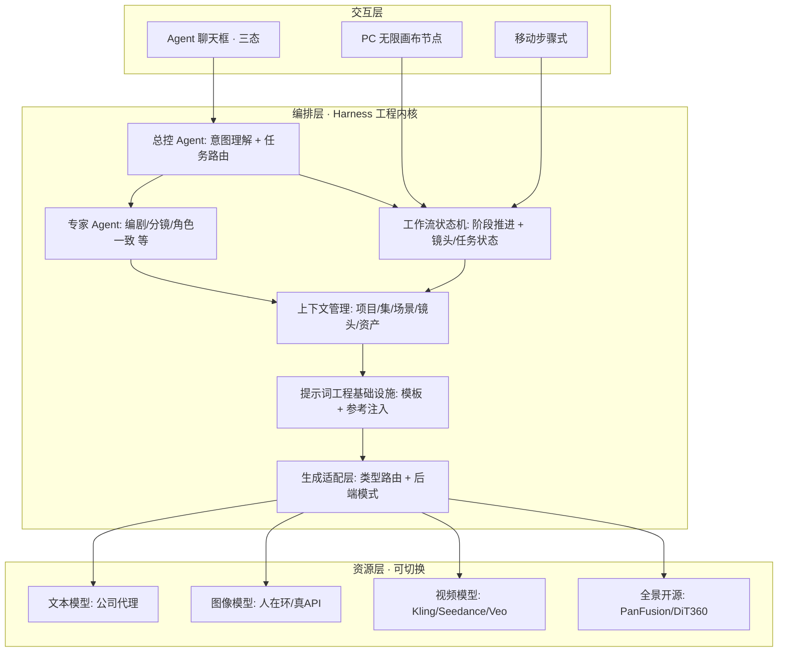
```mermaid
flowchart TD
    subgraph 交互层
        Chat[Agent 聊天框 · 三态]
        Canvas[PC 无限画布节点]
        Step[移动步骤式]
    end
    subgraph 编排层[编排层 · Harness 工程内核]
        Director[总控 Agent: 意图理解 + 任务路由]
        Experts[专家 Agent: 编剧/分镜/角色一致 等]
        WF[工作流状态机: 阶段推进 + 镜头/任务状态]
        Ctx[上下文管理: 项目/集/场景/镜头/资产]
        Prompt[提示词工程基础设施: 模板 + 参考注入]
        Adapter[生成适配层: 类型路由 + 后端模式]
    end
    subgraph 资源层[资源层 · 可切换]
        LLM[文本模型: 公司代理]
        Img[图像模型: 人在环/真API]
        Vid[视频模型: Kling/Seedance/Veo]
        Pano[全景开源: PanFusion/DiT360]
    end
    Chat --> Director
    Canvas --> WF
    Step --> WF
    Director --> Experts
    Director --> WF
    Experts --> Ctx
    WF --> Ctx
    Ctx --> Prompt
    Prompt --> Adapter
    Adapter --> LLM
    Adapter --> Img
    Adapter --> Vid
    Adapter --> Pano
```

> 关键点：**交互层的两条入口（对话 / 画布）最终都收敛到同一套编排层**——这是"双路径对等"的架构基础。资源层任意替换不影响上层（生成适配层吸收差异）。

### 4.2 两个产品范式决策

#### 决策一：分水岭交互（按创作心智分阶段切换形态）

| 阶段 | 心智 | 交互形态 | 理由 |
|------|------|----------|------|
| 创意阶段（灵感→大纲→编剧） | 发散 | **聊天室**：AI 启发式提问 + 推荐选项 | 流水线在此段易把灵感框死、难出精彩题材 |
| —— 剧本确定 = **分水岭** —— | —— | —— | 剧本定稿后基本是确定流程 |
| 制作阶段（拆分→资产→分镜→生成→合成） | 确定性 | **PC=无限画布节点 / 移动=步骤式** | 确定流程要可控可复现；画布成功案例可沉淀为工作流模板 |

#### 决策二：双路径对等（对话操作与画布操作功能等价）

- 用户可**纯靠 Agent 对话完成全部编辑动作**（拆资产/改分镜/重生成/设机位/合成…）。
- 也可在**画布上手动操作**——更快、更省 token，适合老手。
- 两条路径**功能完全等价、可混用**，都能到达任意目标状态；不存在"AI 只能做简单操作"的天花板。

> Agent 聊天框三态：全屏 / 侧边栏 / 桌宠悬浮窗，贯穿全程，主战场在创意阶段。

### 4.3 信息架构

**顶层阶段骨架 = 剧本 / 资产 / 制作 / 预览 4 步**（"制作"在画布上展开为 分镜→分镜图→视频 等节点，与 LuxReal 4 步同量级，不强行拆 5 步 tab）。

**左侧导航（对标 LuxReal）**：

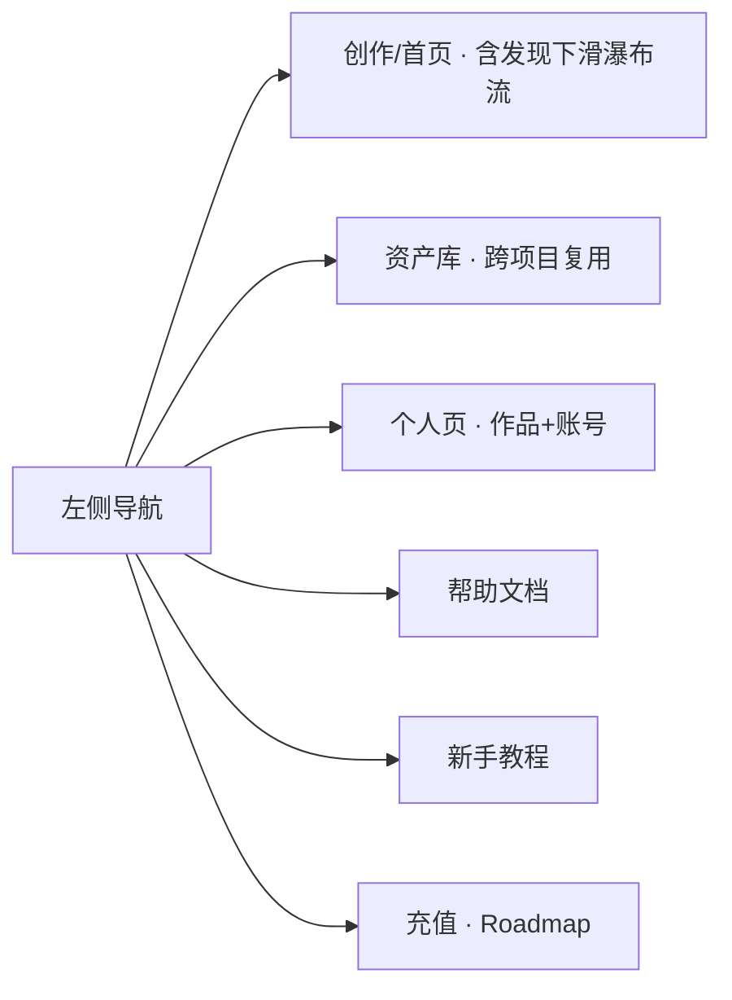
```mermaid
flowchart LR
    Nav[左侧导航] --> Home[创作/首页 · 含发现下滑瀑布流]
    Nav --> Lib[资产库 · 跨项目复用]
    Nav --> Me[个人页 · 作品+账号]
    Nav --> Help[帮助文档]
    Nav --> Tutor[新手教程]
    Nav --> Pay[充值 · Roadmap]
```

- **发现不单开页**：作为首页下滑区瀑布流（案例 + 一键同款·仅创意视频）。
- **资产两层**：①"拆资产"是项目内提取（画布节点 + 聊天补充）；②"全局资产库"沉淀历史资产跨项目复用（左侧导航独立入口）。

#### 关键页面骨架与控件

> 本节给页面级布局骨架与核心控件清单；控件的操作/状态/规则在模块 6 各页"页面与交互"表展开。

##### 首页/创作页（对标 LuxReal，核心入口）

布局（左导航固定，右主区自上而下）：

```
┌────────┬───────────────────────────────────────────┐
│ 左导航  │  [路线卡]  (漫剧✅) (创意短片) (电商)         │
│ ·创作  │                                             │
│ ·资产  │  ┌───────────────────────────────────────┐  │
│ ·个人  │  │  大输入框                              │  │
│ ·教程  │  │  「一句灵感起步，或粘贴/上传整季剧本…」  │  │
│ ·帮助  │  │                          [📎上传] [开始→]│  │
│ ·充值  │  └───────────────────────────────────────┘  │
│        │  [创作设置条] 风格▾ 比例▾ 时长▾ 模型▾ Skill＋│
│        │ ═══════════════ 下滑分隔 ═══════════════     │
│        │  最近项目  [卡][卡][卡] …                     │
│        │  发现 · 瀑布流  [案例][案例][一键同款·创意]…  │
└────────┴───────────────────────────────────────────┘
```

核心控件清单：

| 控件 | 类型 | 候选/默认 | 说明 |
|------|------|-----------|------|
| 路线卡 | 单选卡片 | 漫剧（✅默认）/ 创意短片 / 电商 | 创意/电商 MVP 引导至 Roadmap 说明 |
| 大输入框 | 多行文本 + 上传 | 空，占位"一句灵感起步，或上传整季剧本" | **统一入口**：输入即进创意聊天室；上传剧本同样进聊天室、附带后台解析拆分 |
| 上传按钮 | 文件上传 | 支持文本/文档 | 上传整季剧本 → 进聊天室 + 后台解析拆分 |
| 开始按钮 | 主操作 | — | 进入创意聊天室创作流（灵感→发散；上传剧本→附带解析拆分） |
| 风格 | 下拉 | 国风/写实/日系动漫/3D-CG/水墨/赛博朋克（运营可扩展） | 清单按运营补充 |
| 比例 | 下拉 | 9:16 竖屏（默认）/ 16:9 横屏 / 1:1 | 漫剧默认竖屏 |
| 时长 | 下拉 | 单集 <1min / 1-3min（默认）/ 3-5min / 自定义 | 档位按创作经验可调 |
| 模型 | 下拉 | 智能默认 / 指定生成模型 | 进阶用户可指定，默认隐藏复杂度 |
| Skill | 多选挂载 | 轻量预设组件（MVP 雏形） | 完整 Skill 系统见 Roadmap |
| 发现瀑布流 | 信息流 | 案例卡 + 一键同款（仅创意） | 下滑区，不单开页 |

> 创作设置条与输入框**同屏**（分水岭前可改；剧本确定后 风格/比例/时长/模型 锁定，仅 Skill 仍可挂载/调整，见 6a-R2）。
> **入口统一**：不设独立"进创意聊天"按钮——无论输入灵感还是上传剧本，都先进创意聊天室；区别仅在上传剧本会附带后台解析拆分（见 6a 流程）。

##### 创意聊天台（聊天室）

```
┌────────┬──────────────────────────┬──────────────┐
│ 左导航  │  对话流                   │  大纲/剧本草稿 │
│        │  AI: 提问 + [推荐选项][选项]│  (实时生成区)  │
│        │  我: …                    │  大纲▸        │
│        │                          │  剧本▸        │
│        │  ┌──────────────────────┐│  [确认剧本→]  │
│        │  │ 输入… [发送]          ││              │
│        │  └──────────────────────┘│              │
└────────┴──────────────────────────┴──────────────┘
```

控件：对话输入框、AI 推荐选项按钮组、大纲/剧本草稿面板、"确认剧本"（触发分水岭）；可全屏/侧边切换。

##### 制作画布工作台（PC · 分水岭后）

```
┌────────┬──────────────────────────────┬──────────┐
│ 左导航  │  无限画布（pan/zoom）          │ Agent聊天 │
│        │  [拆资产]→[分镜]→[分镜图]→[视频]│ (侧边/可  │
│        │       ↘[全景/3D导播台·可选]    │  最小化为 │
│        │   节点连线表达依赖             │  悬浮窗)  │
│        │                              │          │
│        │ [底部工具栏: 资产库▾ 模板▾ 导出]│          │
└────────┴──────────────────────────────┴──────────┘
```

控件：画布节点（各制作环节）、连线、节点内编辑、底部工具栏（资产库入口/模板/导出）、右侧 Agent 聊天三态。资产库入口形态见 6f-R5（待定）。

##### 画布节点工作流（comfyui 式分组，制作阶段核心）

制作各步骤在画布上以**分组框（group）**区分（类似 comfyui 工作流的分组美化），框内是该步骤的节点；分组间连线表达制作依赖，数据沿连线流动：

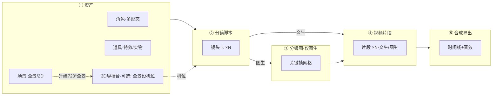
```mermaid
flowchart LR
    subgraph G1[① 资产]
        A1[角色·多形态]
        A2[场景·全景/2D]
        A3[道具·特效/实物]
        P1[3D导播台·可选: 全景设机位]
        A2 -.升级720°全景.-> P1
    end
    subgraph G2[② 分镜脚本]
        B1[镜头卡 ×N]
    end
    subgraph G3[③ 分镜图·仅图生]
        C1[关键帧网格]
    end
    subgraph G4[④ 视频片段]
        D1[片段 ×N·文生/图生]
    end
    subgraph G5[⑤ 合成导出]
        E1[时间线+音效]
    end
    G1 --> G2
    P1 -.机位.-> G2
    G2 -->|图生| G3
    G2 -->|文生| G4
    G3 --> G4
    G4 --> G5
```

**分组框快捷动作（组合技 / Skill 的画布载体）**

每个分组框**右下角**可挂 1~N 个**快捷动作按钮**，封装一套"组合技"——一键执行多步操作（自动创建下游节点、连好线、按上下文预填并触发生成）：

```
╔══ ① 资产 ═══════════════════════╗
║ [角色·多形态] [场景] [道具]      ║
║                  [⚡一键分镜▾][＋]║  ← 右下角组合技按钮
╚═════════════════════════════════╝
```

- **示例**：资产提取完成后点 ① 资产框右下角「⚡一键分镜」→ 依据已提取的角色/场景/道具与剧本，**自动创建 ② 分镜脚本节点、连好线、预生成分镜**。
- **预置组合技（MVP）**：平台内置常用组合（如 资产→分镜、分镜→批量分镜图、整集→一键成片）。
- **用户自定义组合技**：用户把常用的一串操作录制/编排为按钮，挂到分组框，跨项目复用（`[＋]` 新增）。
- **实现**：确定性组合走脚本；含创意判断的走 Agent 编排（见模块 10）。
- **概念打通**：组合技按钮 = **Skill 的画布载体**；自定义组合技可沉淀为**工作流模板 / 轻量 Skill**（呼应 MVP Skill 雏形与模块 6f 模板）。与对话路径对等——组合技就是把"对 Agent 说一串指令"固化成画布上的一个按钮。

**节点通用结构**（画布上每个节点卡）：

```
┌─ [步骤名]            [●状态] ─┐   状态: ○待生成 ⟳生成中 ✓完成 ✗失败
│   缩略内容预览                │
│   [展开] [对话改] [重生/重试] │
└──────────────────────────────┘
```

各步骤节点展开后的工作面板：

**① 资产节点（展开）**

```
┌─ 拆资产  [角色|场景|道具] ──────────┐
│ ┌────┐  名称____  类型(人类/非人)   │
│ │基准│  形态[少年][成年][＋]        │
│ │ 图 │  描述________              │
│ └────┘  [上传参考图][设主/配角]    │
└────────────────────────────────────┘
```
控件：资产 tab、基准图位、多形态标签、类型切换、描述、上传参考图、主配角、（场景）升级 720° 全景 → 进 3D 导播台（属场景资产，见下方独立小节）。

**② 分镜脚本节点（展开）**

```
┌─ 分镜脚本 ─────────────────────────┐
│ #  景别 机位 运镜 情绪 台词 时长 模式│
│ 01 远景 ..  ..  紧张 ..  3s  图生▾ │
│ 02 特写 ..  ..  平静 ..  2s  文生▾ │
│ [改字段][重生单镜][调序][＋镜]      │
└────────────────────────────────────┘
```
控件：逐镜字段表、文生/图生模式下拉（镜头级）、单镜重生、调序、增删镜。

**③ 分镜图节点（展开，仅图生）**

```
┌─ 分镜图·关键帧 (整集预览) ─────────┐
│ [图01][图02][图03][图04]            │
│ [图05][图06] …                     │
│ [批量生成][单张重生][对话改][换形态]│
└────────────────────────────────────┘
```
控件：关键帧网格、批量生成、单张重生、对话式改、换角色形态、选预设。

**④ 视频片段节点（展开）**

```
┌─ 视频片段 ─────────────────────────┐
│ #  预览  模式  进度     操作        │
│ 01 [▶]  图生  ✓完成   [首尾1s变速] │
│ 02 [▶]  文生  ⟳生成中  [重试/回填] │
│ [文生⇄图生切换][外部回填]          │
└────────────────────────────────────┘
```
控件：片段列表、模式切换、进度态、首尾变速（图生）、失败重试、外部回填。

**⑤ 合成导出节点（展开）**

```
┌─ 合成导出 ─────────────────────────┐
│ 时间线 [片01][片02][片03] …        │
│ 音轨   [BGM━━━━━][音效━━]          │
│ [加转场][音效编辑][预览][导出mp4▾] │
└────────────────────────────────────┘
```
控件：时间线轨、音轨（BGM/音效）、转场、音效编辑、预览、导出（选比例/分辨率）。

> **移动端**：以上节点工作流在移动端**拍平为步骤 tab**（① 资产 → ② 分镜 → ③ 分镜图 → ④ 视频 → ⑤ 合成），顺序推进，单步骤页内控件与上方各节点展开面板一致（移动端 Roadmap 垫底）。

##### 3D 导播台（全景 · 可选单独页）

```
┌─────────────────────────────────┬──────────────┐
│  360° 全景视图（拖拽转视角）        │ 控制面板      │
│                                  │ yaw/pitch/fov │
│   [人物素模可摆位]                │ 机位列表      │
│                                  │ [截视角图]    │
│                                  │ [返回工作台]  │
└─────────────────────────────────┴──────────────┘
```

控件：全景视图（拖拽 yaw/pitch/fov）、人物素模摆位、机位列表、截视角图、返回。

### 4.4 主流程

#### 流程一：总览（两入口 → 分水岭 → 制作）

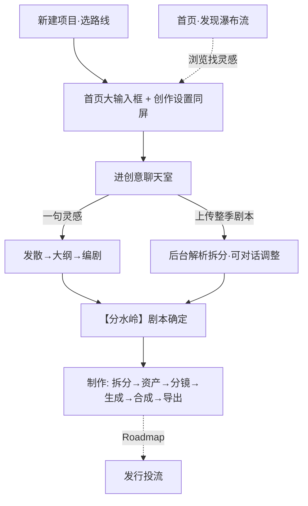
```mermaid
flowchart TD
    Start[新建项目·选路线] --> Home[首页大输入框 + 创作设置同屏]
    Home --> Chat[进创意聊天室]
    Chat -->|一句灵感| Dev[发散→大纲→编剧]
    Chat -->|上传整季剧本| Parse[后台解析拆分·可对话调整]
    Dev --> WS[【分水岭】剧本确定]
    Parse --> WS
    WS --> Make[制作: 拆分→资产→分镜→生成→合成→导出]
    Make -.Roadmap.-> Pub[发行投流]
    Discover[首页·发现瀑布流] -.浏览找灵感.-> Home
```

#### 流程二：创意阶段（编剧之前 · 聊天室，发散→收敛）

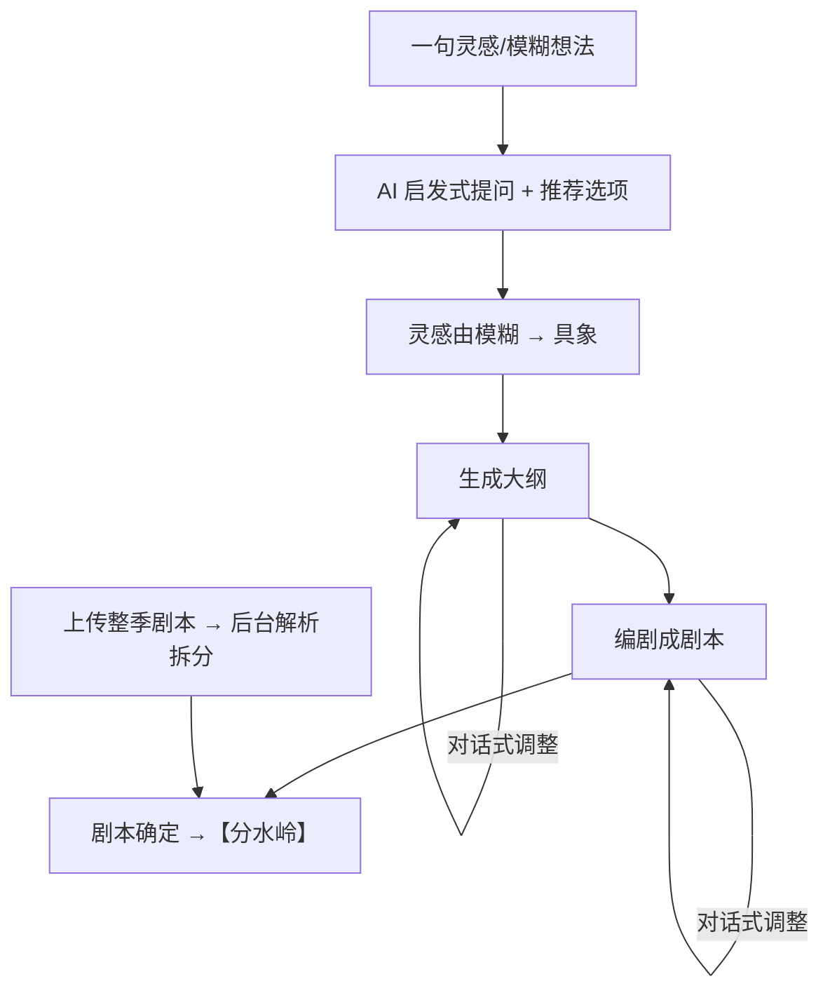
```mermaid
flowchart TD
    I[一句灵感/模糊想法] --> Q[AI 启发式提问 + 推荐选项]
    Q --> Concrete[灵感由模糊 → 具象]
    Concrete --> Outline[生成大纲]
    Outline -->|对话式调整| Outline
    Outline --> Write[编剧成剧本]
    Write -->|对话式调整| Write
    Write --> Done[剧本确定 →【分水岭】]
    Up[上传整季剧本 → 后台解析拆分] --> Done
```

#### 流程三：制作阶段（编剧之后 · 画布/步骤，确定流程）

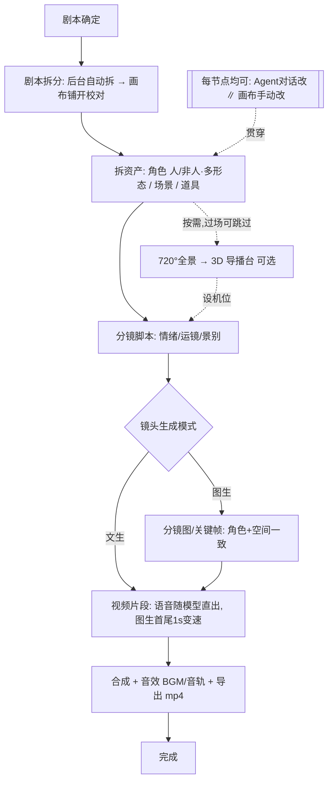
```mermaid
flowchart TD
    Done[剧本确定] --> Split[剧本拆分: 后台自动拆 → 画布铺开校对]
    Split --> Asset[拆资产: 角色 人/非人·多形态 / 场景 / 道具]
    Asset -.按需,过场可跳过.-> Pano[720°全景 → 3D 导播台 可选]
    Asset --> SB[分镜脚本: 情绪/运镜/景别]
    Pano -.设机位.-> SB
    SB --> Mode{镜头生成模式}
    Mode -->|图生| Img[分镜图/关键帧: 角色+空间一致]
    Mode -->|文生| Vid
    Img --> Vid[视频片段: 语音随模型直出, 图生首尾1s变速]
    Vid --> Comp[合成 + 音效 BGM/音轨 + 导出 mp4]
    Comp --> End[完成]
    DualPath[["每节点均可: Agent对话改 ∥ 画布手动改"]] -.贯穿.-> Asset
```

> 制作阶段 6 个子步骤详图（拆资产 / 分镜脚本 / 生成模式分支 / 分镜图 / 视频片段 / 合成导出）见 `shaping/04-pages-and-flows.md`，并在模块 6b/6c/6d 展开。

#### 流程四：生成适配层（每个生成节点共用 · Harness 核心）

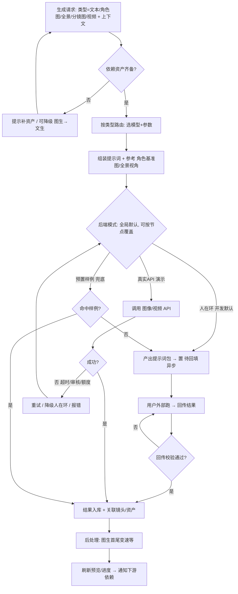
```mermaid
flowchart TD
    N[生成请求: 类型=文本/角色图/全景/分镜图/视频 + 上下文] --> Dep{依赖资产齐备?}
    Dep -->|否| Fix[提示补资产 / 可降级 图生→文生]
    Fix --> N
    Dep -->|是| Route[按类型路由: 选模型+参数]
    Route --> P[组装提示词 + 参考 角色基准图/全景视角]
    P --> Qm{后端模式: 全局默认, 可按节点覆盖}
    Qm -->|人在环 开发默认| R1[产出提示词包 → 置 待回填 异步]
    R1 --> R2[用户外部跑 → 回传结果]
    R2 --> V{回传校验通过?}
    V -->|否| R2
    V -->|是| U
    Qm -->|真实API 演示| S[调用 图像/视频 API]
    S --> Sok{成功?}
    Sok -->|否 超时/审核/额度| Retry[重试 / 降级人在环 / 报错]
    Retry --> Qm
    Sok -->|是| U
    Qm -->|预置样例 兜底| T{命中样例?}
    T -->|是| U
    T -->|否| R1
    U[结果入库 + 关联镜头/资产] --> Post[后处理: 图生首尾变速等]
    Post --> Refresh[刷新预览/进度 → 通知下游依赖]
```

> 生成适配层是 Harness 工程的核心枢纽，状态机详见模块 8，人在环交付协议详见模块 9。

#### 流程五：创意短片路线（Roadmap·规划级）

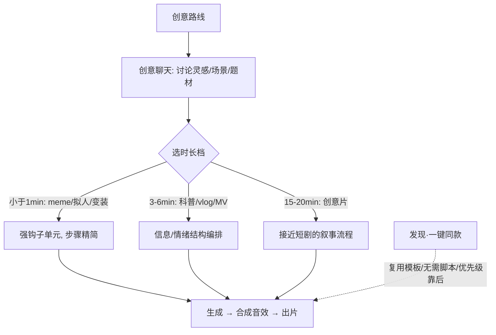
```mermaid
flowchart TD
    CS[创意路线] --> CChat[创意聊天: 讨论灵感/场景/题材]
    CChat --> CLen{选时长档}
    CLen -->|小于1min: meme/拟人/变装| C1[强钩子单元, 步骤精简]
    CLen -->|3-6min: 科普/vlog/MV| C2[信息/情绪结构编排]
    CLen -->|15-20min: 创意片| C3[接近短剧的叙事流程]
    C1 --> CGen[生成 → 合成音效 → 出片]
    C2 --> CGen
    C3 --> CGen
    CMimic[发现·一键同款] -.复用模板/无需脚本/优先级靠后.-> CGen
```

#### 流程六：电商视频路线（Roadmap·规划级）

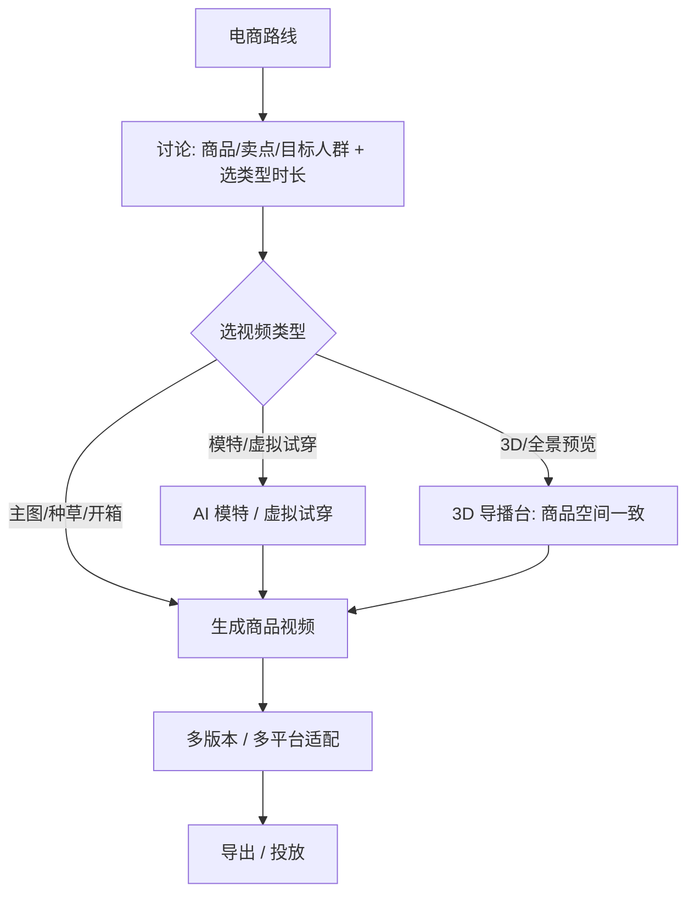
```mermaid
flowchart TD
    ES[电商路线] --> EChat[讨论: 商品/卖点/目标人群 + 选类型时长]
    EChat --> ET{选视频类型}
    ET -->|主图/种草/开箱| EGen[生成商品视频]
    ET -->|模特/虚拟试穿| EModel[AI 模特 / 虚拟试穿]
    ET -->|3D/全景预览| E3D[3D 导播台: 商品空间一致]
    EModel --> EGen
    E3D --> EGen
    EGen --> EVer[多版本 / 多平台适配]
    EVer --> EOut[导出 / 投放]
```

---

### 4.5 技术栈选型

> 原则：前后端统一 TypeScript（一人维护成本低）；模型层可切换、与框架解耦。标 [建议] 者为推荐默认、详设可调。

| 层 | 选型 | 说明 |
|----|------|------|
| 前端框架 | **React + TypeScript** | tldraw 基于 React |
| 无限画布 | **tldraw** | 自带 AI agent kit + 富媒体 shape（见 6f-R6） |
| UI/样式 | [建议 Tailwind CSS] | 详设可调 |
| 后端框架 | **Node.js + NestJS（TypeScript）** | 与前端同语言栈 |
| ORM / 数据库 | **Prisma + PostgreSQL** | 结构化数据，支持 JSON 字段 |
| Agent 编排 | **LangGraph.js**（或自研轻量编排） | 总控+专家图状编排（见模块10） |
| 生成适配层 | 自研统一适配层 | 三模式切换（见模块4.4/8/9） |
| 文本模型 | 公司代理 API（OpenAI 兼容多模型） | 见模块1.5 |
| 图像/视频模型 | 人在环（开发期）→ Kling/Seedance/Veo（真 API） | 见模块6c |
| 全景生成 | PanFusion / DiT360 等开源 | 待实测选型（Q3） |
| 对象存储 | S3 兼容 + CDN | 生成产物冷热分层 |
| 部署 | [建议 Docker 容器化] | 详设可调 |

---

## 5. 功能需求总览

全平台功能区一览（MVP 漫剧落地；标注所属详述模块与期次）。

| # | 页面/功能区 | 阶段·形态 | 用户任务 | 主要操作 | 详述模块 | 期次 |
|---|------------|----------|----------|----------|----------|------|
| 1 | 登录/注册 | — | 进入系统 | 登录、注册 | 模块 12 | MVP |
| 2 | 首页/创作页（含发现） | ① 入口·首页 | 开始创作 + 逛案例找灵感 | 上传剧本/进聊天台/选设置/生成；下滑浏览发现瀑布流 | 模块 6a | MVP |
| 3 | 创意聊天台 | ① 创意·聊天室 | 灵感→大纲→编剧 / 上传剧本解析 | AI 提问+给选项、发散→收敛、确认剧本 | 模块 6a | MVP |
| 4 | 剧本拆分 | ① 后台自动+画布校对 | 校对/微调拆分 | 合并/拆分单元、改场景边界、确认 | 模块 6a | MVP |
| 5 | 拆资产（项目内） | ② 画布节点+聊天补充 | 校对角色/场景/道具 | 编辑描述、上传参考图、设主配角、加形态、触发全景 | 模块 6b | MVP |
| 6 | 3D 导播台（全景） | ② 单独页·可选 | 设机位、画面精控 | 拖拽转视角、摆素模、设机位、截视角图 | 模块 6b | MVP（可选用） |
| 7 | 分镜脚本 | ③ 画布节点/步骤 | 校对分镜表 | 改字段、重生成单镜、调顺序 | 模块 6c | MVP |
| 8 | 分镜图工作区（仅图生） | ③ 画布节点/步骤 | 生成/校对关键帧 | 批量生成、单张重生、对话式改、选预设 | 模块 6c | MVP |
| 9 | 视频片段工作区 | ③ 画布节点/步骤 | 生成/回填视频 | 文生/图生切换、首尾1s变速、逐镜生成、失败重试、外部回填 | 模块 6c | MVP |
| 10 | 合成导出 | ④ 画布节点/步骤 | 出成片 | 拼接、音效编辑（BGM/音轨）、导出 mp4 | 模块 6d | MVP |
| 11 | Agent 聊天面板（核心） | 贯穿·三态 | 对话式完成全部编辑动作 | 对话指挥任意动作；全屏/侧边/桌宠切换 | 模块 6e | MVP |
| 12 | PC 无限画布工作台 | ②-④ 画布容器 | 制作主界面（PC） | 自由布局节点、连线、存工作流模板、资产库入口 | 模块 6f | MVP |
| 13 | 移动端步骤式工作台 | ②-④ 步骤容器 | 制作主界面（移动） | 顺序推进各步骤 tab | 模块 6f | Roadmap·垫底 |
| 14 | 个人页（作品+账号） | 全局·左导航 | 管理作品/账号 | 打开/重命名/删除项目、模板新建 | 模块 12 | MVP |
| 15 | 资产库（全局复用） | 全局·左导航 | 跨项目复用 | 浏览、复用、存为模板、收藏 | 模块 6b | MVP |
| 16 | 充值/积分 | 全局·左导航 | 充值、查积分 | 充值、查账单 | 模块 12 | Roadmap |
| 17 | 发行投流 | ⑤ | （规划级占位） | — | 模块 11 | Roadmap |

> 核心功能模块（模块 6a-6f）将逐个详述：目标 / 用户故事 / 流程 / 页面交互 / 业务规则 / 验收标准。Harness 工程内核（模块 7-10）单独成章。

---

## 6. 核心功能模块详述

### 6a 创意阶段（入口 + 创意聊天台 + 剧本拆分）

#### 目标

承接"分水岭"之前的全部环节：让用户从一句灵感或一份现成剧本出发，经由聊天室式的发散收敛，得到一份**确定的、结构化拆分好的剧本**，进入制作阶段。

#### 用户故事

| 角色 | 场景 | 需求 | 价值 |
|------|------|------|------|
| 有剧本的创作者 | 已有整季剧本 | 上传剧本 → 进聊天室后台自动解析拆分、可对话微调 | 跳过发散创作、快速进制作 |
| 没剧本的创作者 | 只有一个模糊脑洞 | 输入灵感即进聊天室，AI 启发式提问把灵感变具象、生成原创剧本 | 解决"没有好剧本"痛点；原创发散规避抄现成剧本的风险 |
| 任意创作者 | 拿不准方向 | 下滑看发现瀑布流找灵感 | 降低冷启动门槛 |

#### 流程

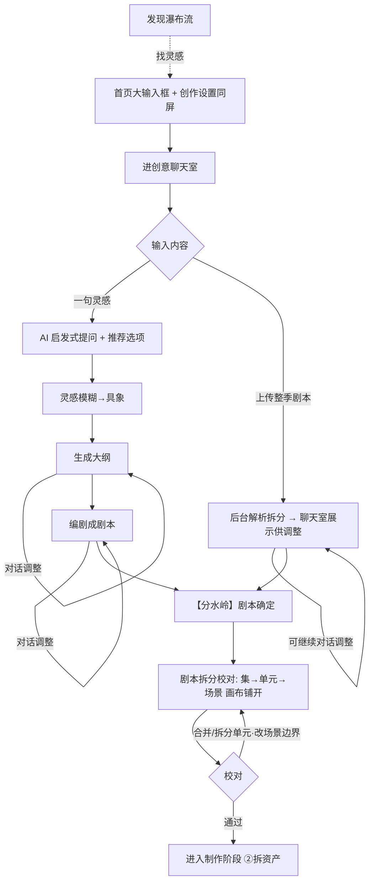
```mermaid
flowchart TD
    Home[首页大输入框 + 创作设置同屏] --> Chat[进创意聊天室]
    Chat --> What{输入内容}
    What -->|一句灵感| Ask[AI 启发式提问 + 推荐选项]
    Ask --> Conc[灵感模糊→具象]
    Conc --> Outline[生成大纲]
    Outline -->|对话调整| Outline
    Outline --> Script[编剧成剧本]
    Script -->|对话调整| Script
    What -->|上传整季剧本| Parse[后台解析拆分 → 聊天室展示供调整]
    Parse -->|可继续对话调整| Parse
    Script --> WS[【分水岭】剧本确定]
    Parse --> WS
    WS --> Split[剧本拆分校对: 集→单元→场景 画布铺开]
    Split --> Review{校对}
    Review -->|合并/拆分单元·改场景边界| Split
    Review -->|通过| Done[进入制作阶段 ②拆资产]
    Disc[发现瀑布流] -.找灵感.-> Home
```

#### 页面与交互

| 页面/区域 | 核心信息 | 主要操作 | 状态 | 规则 |
|-----------|----------|----------|------|------|
| 首页/创作页 | 路线卡（漫剧✅/创意/电商）、**统一大输入框（灵感/上传剧本）+ 创作设置条（同屏）**、下滑发现瀑布流 | 选路线、输入灵感或上传剧本、设设置、开始（进聊天室）、浏览发现 | 默认页 | 创作设置与输入框**同屏**（对标 LuxReal 首页）；输入即进聊天室 |
| 创意聊天台 | 对话流、AI 推荐选项、大纲/剧本草稿 | AI 提问+给选项、对话调大纲/剧本、确认剧本 | 聊天室·可全屏/侧边 | 启发式引导：先发散（给选项启发）后收敛（落定剧本） |
| 剧本拆分 | 集→叙事单元→场景 结构树 | 合并/拆分单元、改场景边界、确认 | 后台自动拆 + 画布铺开 | 拆分自动完成后给"已拆 X 集 Y 单元"摘要 + 跳转 |

#### 业务规则

| 编号 | 规则 | 触发条件 | 例外 | 待确认 |
|------|------|----------|------|--------|
| 6a-R1 | 首页大输入框为统一入口：输入灵感或上传剧本都先进创意聊天室，都必须产出"确定剧本"才能过分水岭；上传剧本附带后台解析拆分 | 进入制作前 | — | — |
| 6a-R2 | 创作设置中 风格/比例/时长/模型 与剧本输入同屏，分水岭前可改、剧本确定后**锁定不可改**（改动会致已生成内容不一致）；**仅 Skill 可在制作期继续挂载/调整** | 剧本确认时 | — | — |
| 6a-R3 | 用户勾选免责声明协议，生成内容的版权与合规责任由用户自负；平台不做版权审查。灵感发散生成的内容一般无版权风险 | 注册/创作时勾选 | — | — |
| 6a-R4 | 剧本拆分后台自动完成，画布/列表铺开供校对，不强制用户逐项确认 | 剧本确定后 | — | — |
| 6a-R5 | 情节/情绪节奏结构在大纲或编剧阶段产出 | 创意阶段 | — | — |

#### 验收标准

- Given 用户只输入一句灵感，When 走完创意聊天台引导，Then 能产出一份结构完整、可拆分的剧本。
- Given 用户上传整季剧本并设好创作设置，When 确认，Then 直接进入剧本拆分、无需再走聊天。
- Given 剧本已确定，When 进入剧本拆分，Then 系统自动拆为"集→叙事单元→场景"并铺开供校对。
- Given 用户在首页下滑，Then 能看到发现瀑布流并可由案例进入创意聊天。

---

### 6b 资产管理（拆资产 + 3D 导播台 + 全局资产库）

#### 目标

把剧本里的角色、场景、道具提取为**可复用、可锁定一致性**的结构化资产；为有多机位/正反打需求的场景提供 720° 全景与 3D 导播台；并让资产跨项目沉淀复用。资产是角色一致性与空间一致性的源头。

#### 用户故事

| 角色 | 场景 | 需求 | 价值 |
|------|------|------|------|
| 创作者 | 剧本确定后 | 自动提取角色/场景/道具清单并校对 | 省去手动建档 |
| 创作者 | 角色跨集变化 | 同角色设多形态（年龄/身份） | 一个角色档案覆盖全剧变化 |
| 创作者 | 需要正反打的对话场景 | 场景升级 720° 全景、3D 导播台设机位 | 根治多机位空间穿帮 |
| 创作者 | 新项目复用老角色 | 从全局资产库调取历史资产 | 跨项目复用、积累资产 |

#### 流程（拆资产）

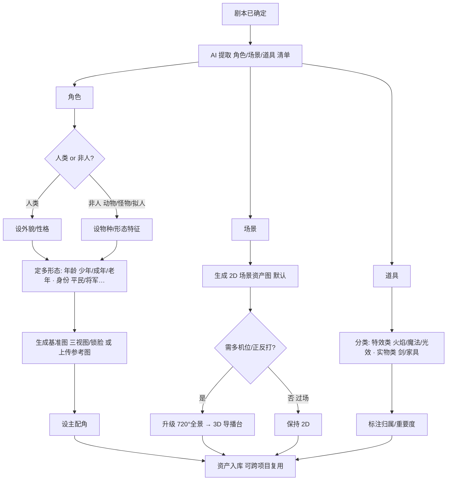
```mermaid
flowchart TD
    S[剧本已确定] --> Ext[AI 提取 角色/场景/道具 清单]
    Ext --> Cha[角色]
    Ext --> Sce[场景]
    Ext --> Pr[道具]
    Cha --> CT{人类 or 非人?}
    CT -->|人类| CH[设外貌/性格]
    CT -->|非人 动物/怪物/拟人| CN[设物种/形态特征]
    CH --> Form[定多形态: 年龄 少年/成年/老年 · 身份 平民/将军…]
    CN --> Form
    Form --> Base[生成基准图 三视图/锁脸 或 上传参考图]
    Base --> Role[设主配角]
    Sce --> Sce2D[生成 2D 场景资产图 默认]
    Sce2D --> SN{需多机位/正反打?}
    SN -->|是| Pano[升级 720°全景 → 3D 导播台]
    SN -->|否 过场| Keep2D[保持 2D]
    Pr --> PrC[分类: 特效类 火焰/魔法/光效 · 实物类 剑/家具]
    PrC --> PrTag[标注归属/重要度]
    Role --> Lib[资产入库 可跨项目复用]
    Pano --> Lib
    Keep2D --> Lib
    PrTag --> Lib
```

#### 页面与交互

| 页面/区域 | 核心信息 | 主要操作 | 状态 | 规则 |
|-----------|----------|----------|------|------|
| 拆资产（项目内） | 资产卡片（角色含人/非人 + 多形态） | 编辑描述、上传参考图、设主配角、加形态、触发全景；对话式补充改 | 画布节点 + 聊天补充 | AI 自动提取后供校对；角色基准图为一致性锚点 |
| 3D 导播台 | 360° 全景图、yaw/pitch/fov、素模摆位 | 拖拽转视角、摆人物素模、设机位、截视角图 | 单独页·可选 | 非必走；可只用 2D 资产图；过场镜头可跳过 |
| 全局资产库 | 角色/场景/道具、预设/模板/工作流 | 浏览、复用、存为模板、收藏 | 左侧导航独立入口 | 跨项目复用；画布素材可收藏入库 |

#### 业务规则

| 编号 | 规则 | 触发条件 | 例外 | 待确认 |
|------|------|----------|------|--------|
| 6b-R1 | 角色分人类/非人两类，分别走不同描述维度 | 提取角色时 | — | — |
| 6b-R2 | 同角色可挂多个形态（年龄/身份），每形态有独立基准图；镜头通过 (character_id, form_id) 引用，一镜可引多个角色/形态 | 角色有变体时 | — | 详设可调引用粒度 |
| 6b-R3 | 场景默认生成 2D 资产图；仅在需多机位/正反打时升级 720° 全景 | 场景需求判定 | 过场镜头可跳过全景 | — |
| 6b-R4 | 道具分特效类/实物类，标注归属与重要度 | 提取道具时 | — | — |
| 6b-R5 | 3D 导播台对全景做确定性 PTZ 裁切产出视角图，背景空间一致由同一全景源保证 | 设机位时 | — | — |
| 6b-R6 | 资产可入全局库跨项目复用 | 用户收藏/入库 | — | — |

#### 验收标准

- Given 剧本已确定，When 触发拆资产，Then 自动产出角色/场景/道具清单供校对。
- Given 一个角色在剧中有少年与成年两种形态，When 建档，Then 可挂两个形态各带基准图。
- Given 一个对话场景需要正反打，When 升级为 720° 全景并在 3D 导播台设正反两个机位，Then 两个机位裁切出的背景空间一致、不穿帮。
- Given 老项目里有一个角色资产，When 新项目从全局资产库调取，Then 可直接复用其基准图。

---

### 6c 分镜与生成（分镜脚本 + 分镜图 + 视频片段）

#### 目标

把确定的剧本与资产，转化为可控、角色跨镜一致、空间不穿帮的分镜与视频片段。这是产品的**演示核心**：从一句剧本到一段角色一致性分镜在此完成。

#### 用户故事

| 角色 | 场景 | 需求 | 价值 |
|------|------|------|------|
| 创作者 | 资产就绪 | AI 按叙事生成分镜脚本（景别/机位/运镜/情绪/台词/时长） | 省去逐镜手写 |
| 创作者 | 要预览整集再生视频 | 走图生：先出分镜图关键帧，整集校对后再生视频 | 更可控、降低视频返工成本 |
| 创作者 | 镜头简单、求快 | 走文生：分镜脚本直接生视频 | 更快、无启停慢速 |
| 创作者 | 角色需跨镜一致 | 生成时注入角色基准图（对应形态）+ 场景全景视角 | 角色不漂移、背景不穿帮 |
| 创作者 | 某镜不满意 | 单镜重生 / 对话式定向改，不牵连其他镜头 | 精控、不重跑全流程 |

#### 流程（生成模式分支 → 分镜图 → 视频）

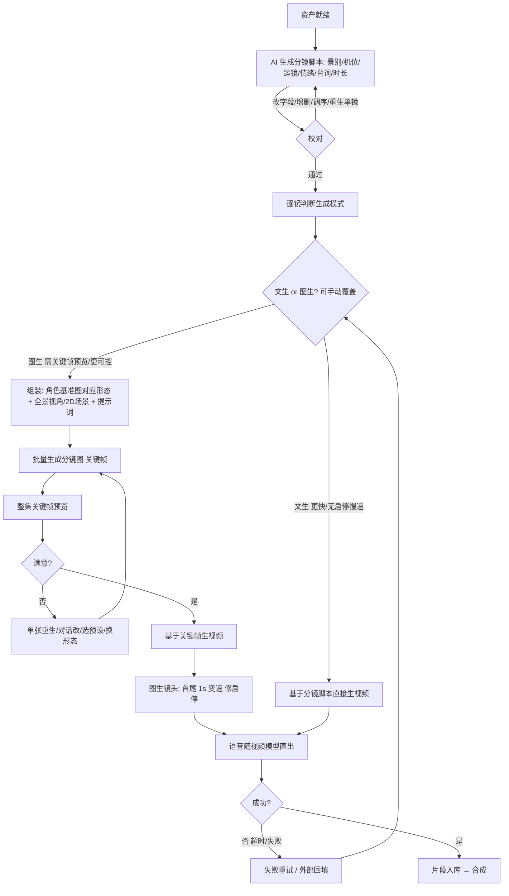
```mermaid
flowchart TD
    A[资产就绪] --> SB[AI 生成分镜脚本: 景别/机位/运镜/情绪/台词/时长]
    SB --> Rev{校对}
    Rev -->|改字段/增删/调序/重生单镜| SB
    Rev -->|通过| Mode[逐镜判断生成模式]
    Mode --> Sw{文生 or 图生? 可手动覆盖}
    Sw -->|图生 需关键帧预览/更可控| Asm[组装: 角色基准图对应形态 + 全景视角/2D场景 + 提示词]
    Asm --> Batch[批量生成分镜图 关键帧]
    Batch --> Prev[整集关键帧预览]
    Prev --> Ck{满意?}
    Ck -->|否| Fix[单张重生/对话改/选预设/换形态]
    Fix --> Batch
    Ck -->|是| GV[基于关键帧生视频]
    Sw -->|文生 更快/无启停慢速| TV[基于分镜脚本直接生视频]
    GV --> Speed[图生镜头: 首尾 1s 变速 修启停]
    Speed --> Aud[语音随视频模型直出]
    TV --> Aud
    Aud --> Vok{成功?}
    Vok -->|否 超时/失败| Re[失败重试 / 外部回填]
    Re --> Sw
    Vok -->|是| Done[片段入库 → 合成]
```

#### 页面与交互

| 页面/区域 | 核心信息 | 主要操作 | 状态 | 规则 |
|-----------|----------|----------|------|------|
| 分镜脚本 | 逐镜头字段表（景别/机位/运镜/情绪/台词/时长） | 改字段、重生成单镜、调顺序 | 画布节点/步骤 | 切镜/运镜由内置提示词规则驱动；用户可改 |
| 分镜图工作区（仅图生） | 镜头缩略图网格 = 整集关键帧预览 | 批量生成、单张重生、对话式改、选预设、换形态 | 仅图生镜头走此步 | 文生镜头跳过此步 |
| 视频片段工作区 | 片段列表、进度、生成模式 | 文生/图生切换、首尾1s变速、逐镜生成、失败重试、外部回填 | 异步生成 | 语音随模型直出；图生支持首尾变速 |

#### 业务规则

| 编号 | 规则 | 触发条件 | 例外 | 待确认 |
|------|------|----------|------|--------|
| 6c-R1 | 生成模式按镜头可选文生/图生，可手动覆盖；二者都注入资产、同样保角色一致 | 每镜生成前 | — | — |
| 6c-R2 | 图生路径先出分镜图关键帧、整集可预览校对后再生视频；文生路径跳过分镜图直接生视频 | 选定模式后 | — | — |
| 6c-R3 | 图生镜头支持首尾各 1s 变速，修正启停慢速 | 图生生视频时 | 文生无此步 | — |
| 6c-R4 | 生成时注入角色基准图（对应形态）+ 场景全景视角/2D 图作参考，保证角色与空间一致 | 任意图像/视频生成 | — | 注入实现细节见模块7/9 |
| 6c-R5 | 台词语音由视频生成模型直接产出，不做独立 TTS | 视频生成时 | 兜底独立 TTS 见 Roadmap | — |
| 6c-R6 | 单镜重生/对话式改只影响目标镜头，不牵连其他 | 定向修改时 | — | — |
| 6c-R7 | 切镜/运镜由内置提示词规则驱动，AI 规划用户可改 | 分镜生成时 | 外部运镜预设库见 Roadmap | — |
| 6c-R8 | **美术风格一致**：风格在创作设置选定后锁为项目级参数，每次图像/视频生成自动注入统一风格提示词（+ 风格参考图）；跨镜/跨集继承同一风格。与角色一致（靠基准图）正交、互不干扰 | 任意图像/视频生成 | 真 API 期可用风格 LoRA/风格参考强化 | 一致性强度真 API 期验证 |

#### 验收标准

- Given 资产就绪，When 触发分镜生成，Then 产出逐镜字段完整的分镜脚本。
- Given 某镜走图生，When 批量生成分镜图，Then 同角色在不同镜头的分镜图外貌无明显漂移。
- Given 整集关键帧预览满意，When 基于关键帧生视频，Then 视频中角色与背景与关键帧一致。
- Given 某镜走文生，When 直接生视频，Then 跳过分镜图、且角色仍一致。
- Given 用户对第 3 镜做对话式修改，When 重生成，Then 仅第 3 镜更新，其余镜头不变。

---

### 6d 合成与导出

#### 目标

把生成好的视频片段按分镜顺序拼成完整成片，加转场与音效，预览后导出。

#### 用户故事

| 角色 | 场景 | 需求 | 价值 |
|------|------|------|------|
| 创作者 | 片段就绪 | 按分镜顺序拼接 + 加转场 | 自动成片 |
| 创作者 | 成片缺氛围 | 加 BGM、添加/编辑音轨 | 提升成片质感 |
| 创作者 | 某段不满意 | 回退改某镜/某轨 | 局部修不重来 |
| 创作者 | 要发布 | 按比例/分辨率导出 mp4 | 拿到可用成片 |

#### 流程

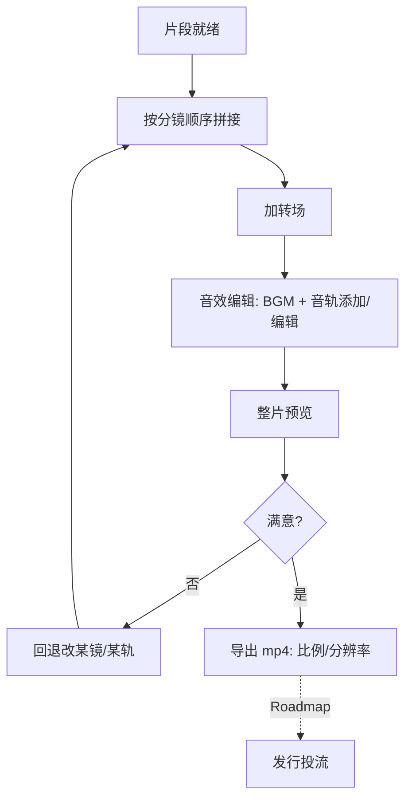
```mermaid
flowchart TD
    S[片段就绪] --> Seq[按分镜顺序拼接]
    Seq --> Tr[加转场]
    Tr --> Snd[音效编辑: BGM + 音轨添加/编辑]
    Snd --> PV[整片预览]
    PV --> Ok{满意?}
    Ok -->|否| Bk[回退改某镜/某轨]
    Bk --> Seq
    Ok -->|是| Exp[导出 mp4: 比例/分辨率]
    Exp -.Roadmap.-> Pub[发行投流]
```

#### 页面与交互

| 页面/区域 | 核心信息 | 主要操作 | 状态 | 规则 |
|-----------|----------|----------|------|------|
| 合成导出 | 时间线、音效/音轨 | 拼接、音效编辑（含 BGM、音轨添加）、导出 mp4 | 画布节点/步骤 | 音效定位为"音效（含 BGM）"，视频模型直出语音之外的补充 |

#### 业务规则

| 编号 | 规则 | 触发条件 | 例外 | 待确认 |
|------|------|----------|------|--------|
| 6d-R1 | 片段按分镜顺序拼接 | 进入合成 | 用户可手动调序 | — |
| 6d-R2 | MVP 音效 = BGM 选择 + 音轨增删/音量调节；不做专业混音/逐帧音效（Roadmap）；台词语音已由视频模型直出 | 合成阶段 | 专业混音留 Roadmap | — |
| 6d-R3 | 回退修改某镜/某轨不影响其他部分 | 局部返工 | — | — |
| 6d-R4 | 导出支持选比例/分辨率 | 导出时 | 多版本投流见 Roadmap | — |

#### 验收标准

- Given 所有片段就绪，When 触发合成，Then 按分镜顺序拼出完整预览。
- Given 成片需要 BGM，When 添加并编辑音轨，Then 成片含 BGM 且与画面同步。
- Given 用户改了某一镜，When 重新合成，Then 仅该镜更新、整片其余不变。
- Given 预览满意，When 导出，Then 得到指定比例/分辨率的 mp4。

---

### 6e Agent 聊天框（Harness 用户侧核心）

#### 目标

让用户**纯靠对话即可驾驭完整创作工作流**——这是 Harness 工程的用户侧入口。聊天框不是旁挂的助手，而是把"自然语言意图"翻译成"工作流上的可控操作"的中枢。它与画布手动操作**功能对等**：新手用嘴、老手上手。

#### 一句话指令背后发生了什么（设计核心）

以"把第三场的角色服装改成红色，重新生成这组分镜图"为例：

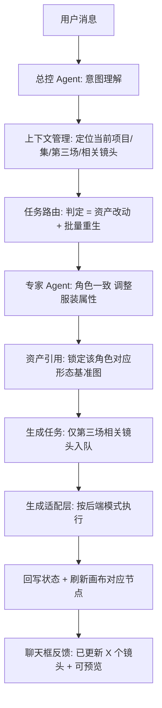
```mermaid
flowchart TD
    Msg[用户消息] --> Director[总控 Agent: 意图理解]
    Director --> Ctx[上下文管理: 定位当前项目/集/第三场/相关镜头]
    Ctx --> Route[任务路由: 判定 = 资产改动 + 批量重生]
    Route --> Expert[专家 Agent: 角色一致 调整服装属性]
    Expert --> Ref[资产引用: 锁定该角色对应形态基准图]
    Ref --> Task[生成任务: 仅第三场相关镜头入队]
    Task --> Adapter[生成适配层: 按后端模式执行]
    Adapter --> Back[回写状态 + 刷新画布对应节点]
    Back --> Reply[聊天框反馈: 已更新 X 个镜头 + 可预览]
```

> 这条链路体现 Harness 四要素：**上下文感知**（知道"第三场"指什么）、**任务路由**（映射到工作流节点）、**资产引用**（锁定角色形态）、**任务编排**（只重跑目标镜头）。详见模块 10 Agent 编排。

#### 用户故事

| 角色 | 场景 | 需求 | 价值 |
|------|------|------|------|
| 新手 | 不会用画布 | 用自然语言完成任意编辑 | 零门槛驾驭全流程 |
| 老手 | 追求效率 | 画布手动操作、聊天框做复杂批量指令 | 双路径混用、更省 token |
| 任意用户 | 不确定 AI 做了什么 | 聊天框反馈做了哪些改动、可预览 | 调度透明、可控可信 |

#### 页面与交互（三态）

| 形态 | 场景 | 说明 |
|------|------|------|
| 全屏 | 创意阶段主战场 | 沉浸式对话、发散收敛 |
| 侧边栏 | 制作阶段配合画布 | 一边看画布一边对话指挥 |
| 桌宠悬浮窗 | 专注画布时 | 最小化为悬浮窗，不打断画布操作 |

| 区域 | 核心信息 | 主要操作 | 状态 | 规则 |
|------|----------|----------|------|------|
| Agent 聊天面板 | 当前上下文、消息流、操作反馈 | 对话指挥任意动作；切换三态 | 贯穿全程 | 与画布手动功能对等；操作有反馈与可预览入口 |

#### 业务规则

| 编号 | 规则 | 触发条件 | 例外 | 待确认 |
|------|------|----------|------|--------|
| 6e-R1 | 对话可完成全部编辑动作（拆资产/改分镜/重生成/设机位/合成…），与画布功能对等 | 任意阶段 | — | — |
| 6e-R2 | 聊天框感知当前上下文（项目/集/场景/镜头/资产），指代可解析；无法唯一定位时列出候选或反问一个澄清问题，不猜测执行 | 用户发指令 | — | — |
| 6e-R3 | 每次执行操作后反馈"改了什么、影响哪些对象"，并给预览入口 | 操作完成 | — | — |
| 6e-R4 | 复杂指令由总控 Agent 拆解、路由给专家 Agent，对用户保持单一对话界面 | 多步骤指令 | — | 编排细节见模块10 |
| 6e-R5 | 三态可随时切换，状态与上下文不丢失 | 用户切换形态 | — | — |

#### 验收标准

- Given 新手用户，When 全程只用对话操作，Then 能完成从拆资产到合成的全部动作。
- Given 用户说"把第三场角色服装改成红色重生成"，When 执行，Then 仅第三场相关镜头按新服装重生成、并反馈影响范围。
- Given 用户在画布专注操作，When 把聊天框最小化为悬浮窗，Then 不影响画布操作、上下文保留。
- Given 指令存在指代歧义，When Agent 无法确定目标，Then 反问澄清而非误操作。

---

### 6f PC 无限画布工作台

#### 目标

制作阶段（分水岭之后）的 PC 主界面：以**无限画布节点**承载拆资产→分镜→分镜图→视频→合成的全过程，提供比步骤式更直观、更高效的编排视图；成功的画布案例可沉淀为**可复用工作流模板**。这是"双路径对等"中老手侧的高效路径。

#### 用户故事

| 角色 | 场景 | 需求 | 价值 |
|------|------|------|------|
| 老手 | 制作阶段 | 在画布上自由布局节点、连线、手动操作 | 比步骤式更快更直观、省 token |
| 创作者 | 做出一套好流程 | 把当前画布存为工作流模板 | 沉淀可复用的工作流 |
| 创作者 | 制作中需调资产 | 画布内访问资产库、收藏素材入库 | 不离开画布完成资产操作 |

#### 流程

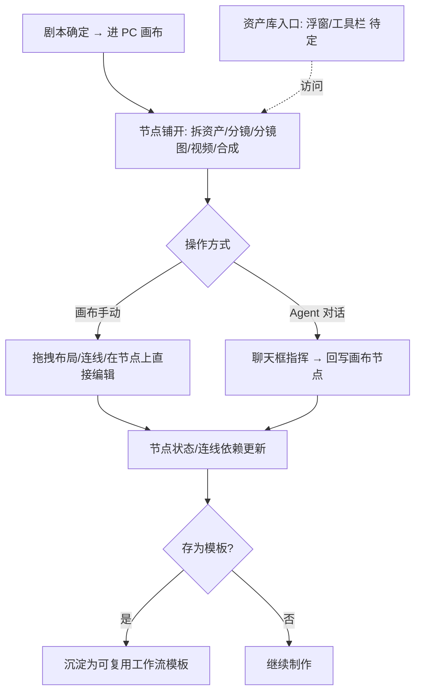
```mermaid
flowchart TD
    Enter[剧本确定 → 进 PC 画布] --> Nodes[节点铺开: 拆资产/分镜/分镜图/视频/合成]
    Nodes --> Op{操作方式}
    Op -->|画布手动| Manual[拖拽布局/连线/在节点上直接编辑]
    Op -->|Agent 对话| Chat[聊天框指挥 → 回写画布节点]
    Manual --> State[节点状态/连线依赖更新]
    Chat --> State
    State --> Save{存为模板?}
    Save -->|是| Tpl[沉淀为可复用工作流模板]
    Save -->|否| Cont[继续制作]
    LibEntry[资产库入口: 浮窗/工具栏 待定] -.访问.-> Nodes
```

#### 页面与交互

| 页面/区域 | 核心信息 | 主要操作 | 状态 | 规则 |
|-----------|----------|----------|------|------|
| PC 无限画布工作台 | 节点画布、连线、节点状态 | 自由布局节点、连线、节点内编辑；存工作流模板；资产库入口；画布素材收藏入库 | 制作阶段 PC 容器 | 与 Agent 聊天功能对等；pan/zoom |

#### 业务规则

| 编号 | 规则 | 触发条件 | 例外 | 待确认 |
|------|------|----------|------|--------|
| 6f-R1 | 画布是制作阶段 PC 主界面；移动端对应步骤式（见模块6f移动说明/模块13） | 进入制作（PC） | 移动端走步骤式 | — |
| 6f-R2 | 画布操作与 Agent 对话功能对等、可混用，状态同步 | 任意制作操作 | — | — |
| 6f-R3 | 节点间连线表达制作依赖（资产→分镜→分镜图→视频→合成） | 编排节点时 | — | — |
| 6f-R4 | 成功画布可存为工作流模板，跨项目复用 | 用户存模板 | — | — |
| 6f-R5 | 画布内资产库入口：默认聊天面板对侧浮窗，底部工具栏另提供快捷入口（两者并存） | 访问资产库 | — | — |
| 6f-R6 | 前端画布选型：**tldraw**（自带 AI agent kit + 富媒体 shape，契合节点+组合技）；React Flow 为备选 | 实现期 | — | — |
| 6f-R7 | 分组框右下角可挂快捷动作按钮（组合技/Skill），一键执行多步：自动建下游节点+连线+按上下文预填+触发生成 | 点击组合技按钮 | — | MVP 动作集=建节点/连线/预填/触发生成/选预设/换形态，不含跨项目与账号级操作 |
| 6f-R8 | 组合技分预置（MVP 内置）+ 用户自定义；自定义可沉淀为工作流模板/轻量 Skill，跨项目复用 | 用户编排/保存 | — | 完整 Skill 系统见 Roadmap |
| 6f-R9 | 组合技 = Skill 的画布载体，与对话路径对等（对 Agent 说一串指令的固化形式） | — | — | — |

#### 验收标准

- Given 剧本确定，When 进入 PC 制作，Then 各制作环节以节点形式铺在画布上、连线表达依赖。
- Given 用户在画布上手动操作，When 同时用聊天框下指令，Then 两者结果一致、状态同步。
- Given 用户做出一套满意流程，When 存为工作流模板，Then 新项目可复用该模板。
- Given 用户在画布制作中，When 打开资产库入口，Then 可浏览/复用资产并把画布素材收藏入库。

---

## 7. Harness 专项 · 数据模型与对象关系

> 对应 05 Q13。本章给出对象、关键字段、关系、数据来源与写入时机；字段为 PRD 级建议，标 `[待确认]` 者待详设。

### 7.1 ER 图

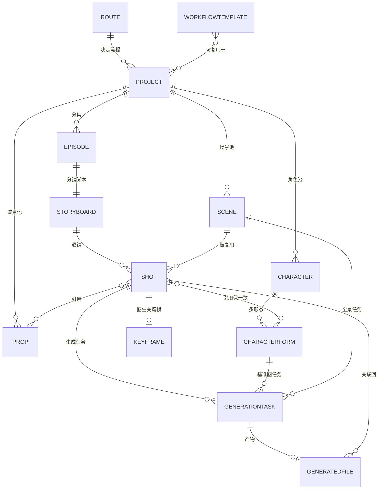
```mermaid
erDiagram
    ROUTE ||--o{ PROJECT : 决定流程
    PROJECT ||--o{ EPISODE : 分集
    PROJECT ||--o{ SCENE : 场景池
    PROJECT ||--o{ CHARACTER : 角色池
    PROJECT ||--o{ PROP : 道具池
    EPISODE ||--|| STORYBOARD : 分镜脚本
    STORYBOARD ||--o{ SHOT : 逐镜
    SCENE ||--o{ SHOT : 被复用
    CHARACTER ||--o{ CHARACTERFORM : 多形态
    SHOT }o--o{ CHARACTERFORM : 引用保一致
    SHOT }o--o{ PROP : 引用
    SHOT ||--o| KEYFRAME : 图生关键帧
    SHOT ||--o{ GENERATIONTASK : 生成任务
    CHARACTERFORM ||--o{ GENERATIONTASK : 基准图任务
    SCENE ||--o{ GENERATIONTASK : 全景任务
    GENERATIONTASK ||--o| GENERATEDFILE : 产物
    GENERATEDFILE }o--|| SHOT : 关联回
    WORKFLOWTEMPLATE }o--o{ PROJECT : 可复用于
```

> Asset（资产）是 Character / Scene / Prop / 基准图 / 全景 的统称（项目内 + 全局库两层），不是独立实体表，而是资产库的聚合视图。

### 7.2 对象字段表

| 对象 | 关键字段 | 关系 | 数据来源 | 写入时机 |
|------|----------|------|----------|----------|
| **Project** | id, name, route_type, settings(风格/比例/时长/模型/Skill), status, created_at | 属于 Route；含 Episode/Scene/Character/Prop | 用户新建 | 新建项目 |
| **Route** | type(漫剧/创意/电商), flow_config | 决定 Project 流程与题材 | 系统预置 | 内置 |
| **Episode** | id, project_id, index, title, narrative_units | 属 Project；1:1 Storyboard | 剧本拆分 | 剧本确定后 |
| **Scene** | id, project_id, desc, mode(2D/全景), pano_file_id | 属 Project；被多 Shot 复用 | 拆资产提取 | 拆资产 |
| **Shot** | id, episode_id, scene_id, 景别, 机位, 运镜, 情绪, 台词, 时长, gen_mode(文生/图生), status | 属 Storyboard/Scene；引用 CharacterForm/Prop | 分镜生成 | 分镜脚本阶段 |
| **Character** | id, project_id, name, type(人类/非人), 描述, role(主/配) | 属 Project；含多 CharacterForm | 拆资产提取 | 拆资产 |
| **CharacterForm** | id, character_id, label(年龄/身份), base_image_file_id | 属 Character；被 Shot 引用 | 用户建形态 | 拆资产/按需 |
| **Prop** | id, project_id, type(特效类/实物类), 归属, 重要度 | 属 Project；被 Shot 引用 | 拆资产提取 | 拆资产 |
| **GenerationTask** | id, target(shot/asset), gen_type(文本/角色图/全景/分镜图/视频), backend_mode, status, prompt_pkg_id, retry_count | 挂 Shot/Asset/CharacterForm/Scene | 生成请求 | 触发生成时 |
| **GeneratedFile** | id, task_id, file_type(图/视频/成片), uri, model_meta, version | 由 Task 产出；关联回 Shot/Asset | 生成完成/回传 | 生成成功 |
| **Storyboard** | id, episode_id | 属 Episode；含多 Shot | 分镜生成 | 分镜脚本阶段 |
| **Keyframe** | id, shot_id, file_id | 属 Shot（仅图生） | 图生分镜图 | 分镜图阶段 |
| **WorkflowTemplate** | id, name, node_graph, params | 可复用于多 Project | 用户存模板 | 画布存模板 |

### 7.3 关键引用关系（一致性来源）

| 关系 | 机制 | 作用 | 待确认 |
|------|------|------|--------|
| Shot → CharacterForm | 镜头持有 (character_id, form_id) 引用列表，可引多角色多形态 | 角色跨镜一致的源头 | 多对多，详设可调 |
| Shot → Scene(全景) → 视角图 | 同一全景确定性 PTZ 裁切 | 背景空间一致、不穿帮 | — |
| GeneratedFile → version | 同一 Shot 多次生成按版本保留，默认保留最近 5 版可回退、超出滚动清理 | 结果可追溯、可回退 | 版本上限详设可调 |

> 完整存储方案（GeneratedFile 落地存储、CDN/对象存储选型）见模块 8/12，本章只定关系。

---

## 8. Harness 专项 · 生成任务状态机

> 对应 05 Q16。GenerationTask 是 Harness 编排异步生成的核心载体，三种后端模式（人在环/真实 API/预置样例）共用一套状态机。

### 8.1 状态机

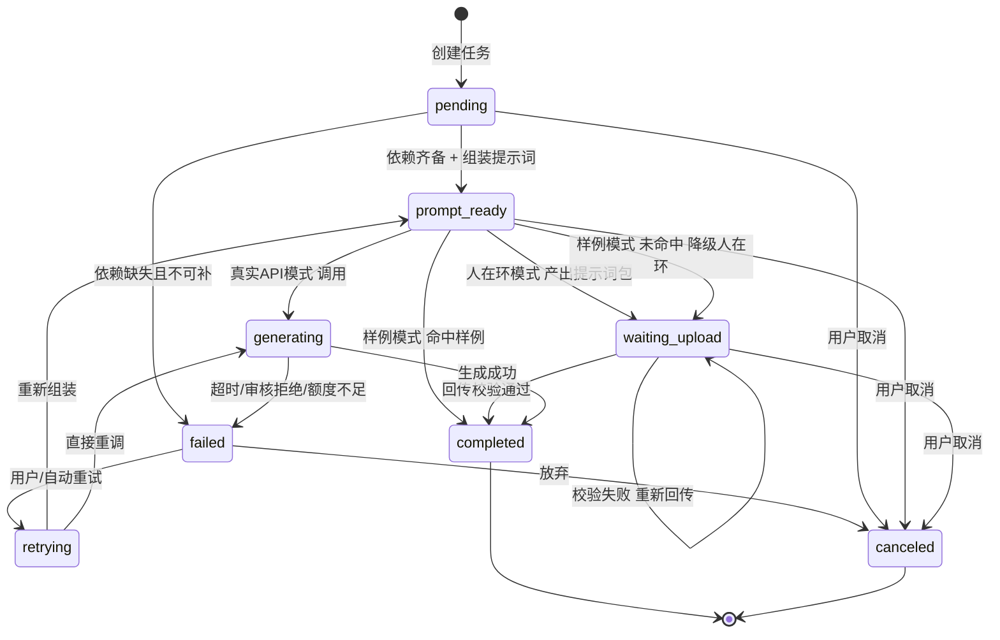
```mermaid
stateDiagram-v2
    [*] --> pending: 创建任务
    pending --> prompt_ready: 依赖齐备 + 组装提示词
    pending --> failed: 依赖缺失且不可补
    prompt_ready --> waiting_upload: 人在环模式 产出提示词包
    prompt_ready --> generating: 真实API模式 调用
    prompt_ready --> completed: 样例模式 命中样例
    prompt_ready --> waiting_upload: 样例模式 未命中 降级人在环
    waiting_upload --> completed: 回传校验通过
    waiting_upload --> waiting_upload: 校验失败 重新回传
    generating --> completed: 生成成功
    generating --> failed: 超时/审核拒绝/额度不足
    failed --> retrying: 用户/自动重试
    retrying --> prompt_ready: 重新组装
    retrying --> generating: 直接重调
    failed --> canceled: 放弃
    pending --> canceled: 用户取消
    prompt_ready --> canceled: 用户取消
    waiting_upload --> canceled: 用户取消
    completed --> [*]
    canceled --> [*]
```

### 8.2 状态转移条件

| 状态 | 含义 | 进入条件 | 可去往 |
|------|------|----------|--------|
| pending | 已创建、等依赖/排队 | 任务创建 | prompt_ready / failed / canceled |
| prompt_ready | 提示词包就绪 | 依赖资产齐备、提示词组装完成 | waiting_upload / generating / completed / canceled |
| waiting_upload | 人在环：等外部回传 | 人在环模式产出提示词包 | completed / waiting_upload(重传) / canceled |
| generating | 真实 API：生成中 | 真实 API 调用发起 | completed / failed |
| retrying | 重试中 | failed 后触发重试 | prompt_ready / generating |
| completed | 完成 | 校验通过/生成成功/命中样例 | 终态 |
| failed | 失败 | 超时/审核/额度/依赖缺失 | retrying / canceled |
| canceled | 取消 | 用户主动取消 | 终态 |

### 8.3 异步体验设计（Q16）

| 场景 | 设计 |
|------|------|
| 排队 | 任务进队列，显示队列位置/预计等待；视频片段耗时最久，单列进度 |
| 进度 | 节点上显示 pending/生成中/完成/失败 状态徽标；画布与聊天框同步刷新 |
| 单镜失败 | 标红该镜，提供"重试/降级文生/外部回填"操作，不阻塞其他镜头 |
| 批量部分完成 | 整批显示"成功 X / 失败 Y"，失败项可单独重跑；已成功项可继续下游 |
| 长耗时 | 允许离开页面，完成后通知；断点续作恢复任务状态 |

### 8.4 业务规则

| 编号 | 规则 | 待确认 |
|------|------|--------|
| 8-R1 | 后端模式为全局默认、可按节点覆盖 | — |
| 8-R2 | 真实 API 失败默认**不自动降级**：提示用户选择 重试/降级人在环/用样例；设置可开启自动降级 | 默认手动，详设可调 |
| 8-R3 | 默认自动重试 2 次，超限转 failed 待人工处理 | 重试次数详设可调 |
| 8-R4 | 部分完成批次中，成功项不因失败项回滚 | — |
| 8-R5 | 任务状态持久化，支持断点续作恢复 | — |

---

## 9. Harness 专项 · 人在环交付协议

> 对应 05 Q15。开发期（当前缺便宜图像/视频 API）的实际生产方式：平台产出提示词包 → 用户拿到外部工具跑 → 回传绑定。这是当下最常走的路径，必须做扎实。

### 9.1 人在环全流程

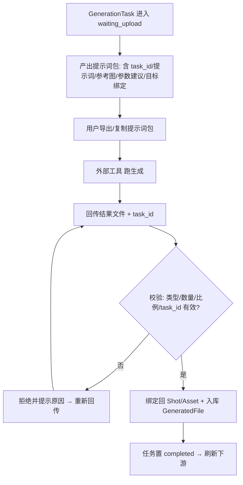
```mermaid
flowchart TD
    Task[GenerationTask 进入 waiting_upload] --> Pkg[产出提示词包: 含 task_id/提示词/参考图/参数建议/目标绑定]
    Pkg --> Export[用户导出/复制提示词包]
    Export --> Run[外部工具 跑生成]
    Run --> Upload[回传结果文件 + task_id]
    Upload --> Valid{校验: 类型/数量/比例/task_id 有效?}
    Valid -->|否| Reject[拒绝并提示原因 → 重新回传]
    Reject --> Upload
    Valid -->|是| Bind[绑定回 Shot/Asset + 入库 GeneratedFile]
    Bind --> Done[任务置 completed → 刷新下游]
```

### 9.2 提示词包结构

| 字段 | 说明 | 必填 |
|------|------|------|
| task_id | 任务唯一标识，回传据此绑定 | 是 |
| gen_type | 角色图/全景/分镜图/视频 | 是 |
| prompt | 组装好的完整提示词（含风格/Skill 注入） | 是 |
| reference_files | 参考图引用（角色基准图、全景视角图等，附下载链接） | 视类型 |
| params | 参数建议（模型、比例、分辨率、时长、首尾变速等） | 是 |
| target_binding | 目标绑定（shot_id / character_form_id / scene_id） | 是 |
| tool_hint | 外部工具说明（推荐工具/操作要点） | 否 |

### 9.3 回传与绑定规则

| 编号 | 规则 | 待确认 |
|------|------|--------|
| 9-R1 | 回传必须携带有效 task_id，据此绑定回原目标 | — |
| 9-R2 | 一个 task 可回传多文件（如多版本），按 version 入库，默认上限 5 版 | 上限详设可调 |
| 9-R3 | 绑定后自动关联回 Shot/Asset 并刷新下游依赖 | — |
| 9-R4 | 支持批量回传：zip 包 + manifest.json（task_id ↔ 文件映射） | 打包格式详设可调 |

### 9.4 校验规则

| 校验项 | 规则 | 失败处理 |
|--------|------|----------|
| task_id 有效性 | 存在且处于 waiting_upload | 拒绝、提示无效 |
| 文件类型 | 与 gen_type 匹配（图/视频） | 拒绝、提示类型错误 |
| 比例/分辨率 | 比例须与 params 一致，分辨率不低于建议 | 比例不符**强制拒绝**（影响排版）；分辨率偏低**警告可继续** |
| 文件数量 | 与预期一致 | 拒绝、提示数量不符 |
| 内容绑定 | target_binding 目标仍存在 | 拒绝、提示目标已删除 |

### 9.5 业务规则

| 编号 | 规则 |
|------|------|
| 9-R5 | 提示词包对文本任务不适用（文本直接走公司 API，无需人在环） |
| 9-R6 | 演示期切真实 API 后，人在环路径作为降级兜底保留 |
| 9-R7 | 提示词包结构与生成适配层、状态机解耦——切换后端不改协议本身 |

---

## 10. Harness 专项 · Agent 编排

> 对应 05 Q14。架构已定：混合制 = 1 总控（导演）+ 少量专家 Agent；视频/合成等为工具调用。本章定职责边界、编排路由、上下文交接与回滚。

### 10.1 编排架构

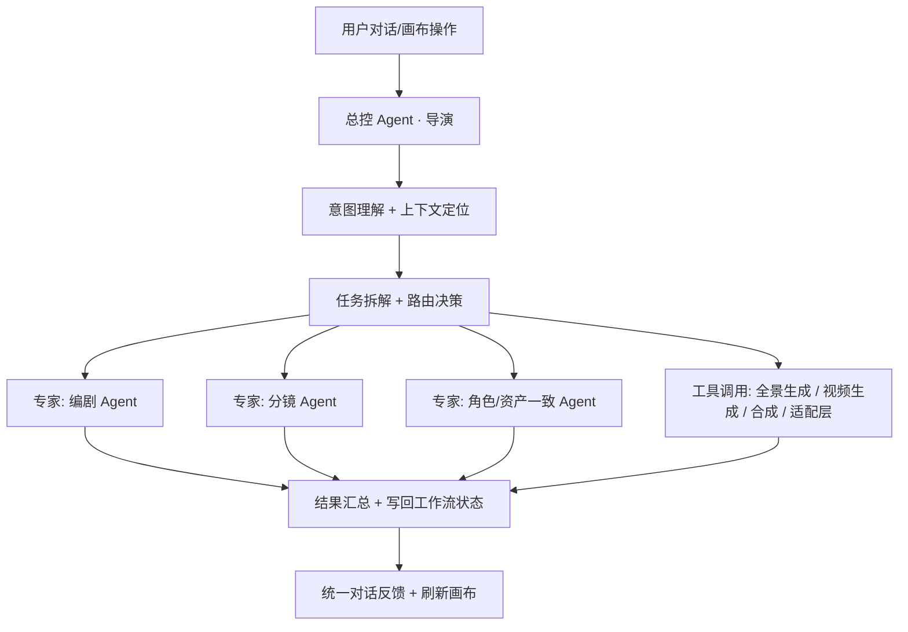
```mermaid
flowchart TD
    User[用户对话/画布操作] --> Director[总控 Agent · 导演]
    Director --> Intent[意图理解 + 上下文定位]
    Intent --> Plan[任务拆解 + 路由决策]
    Plan --> W[专家: 编剧 Agent]
    Plan --> SB[专家: 分镜 Agent]
    Plan --> AS[专家: 角色/资产一致 Agent]
    Plan --> Tools[工具调用: 全景生成 / 视频生成 / 合成 / 适配层]
    W --> Merge[结果汇总 + 写回工作流状态]
    SB --> Merge
    AS --> Merge
    Tools --> Merge
    Merge --> Reply[统一对话反馈 + 刷新画布]
```

### 10.2 Agent 清单与职责边界

| Agent | 角色 | 职责 | 边界（不做） |
|-------|------|------|--------------|
| 总控（导演） | 协调中枢 | 意图理解、上下文定位、任务拆解、路由、结果汇总、对外单一对话界面 | 不直接生成内容，只调度 |
| 编剧 Agent | 创意阶段专家 | 灵感发散、大纲、剧本、情节/情绪节奏 | 不做分镜/资产 |
| 分镜 Agent | 制作专家 | 分镜脚本、景别/机位/运镜/情绪、切镜规则 | 不做角色建模 |
| 角色/资产一致 Agent | 一致性专家 | 资产提取、角色形态管理、基准图与全景视角的参考注入策略 | 不做剧本 |
| 工具调用（非 Agent） | 执行 | 全景生成、图像/视频生成、合成、生成适配层 | 无自主决策，受编排驱动 |

> 设计取舍：比单 Agent 更有"团队感"（呼应"一人顶团队"），又比 OiiOii 七 Agent 更轻、更可控、更省 token。MVP 先落地总控 + 这三个专家，其余能力以工具调用承接。

### 10.3 编排与路由

| 指令类型 | 路由 | 示例 |
|----------|------|------|
| 创意类 | 总控 → 编剧 Agent | "把结局改得更反转" |
| 分镜类 | 总控 → 分镜 Agent | "第三场多给两个特写" |
| 资产/一致类 | 总控 → 角色资产 Agent | "把女主改成成年形态" |
| 生成类 | 总控 → 工具调用（经适配层） | "重生成这组分镜图" |
| 复合类 | 总控拆解 → 多 Agent/工具串行/并行 | "改服装并重生成第三场" |

### 10.4 上下文交接与记忆

| 机制 | 设计 | 待确认 |
|------|------|--------|
| 上下文定位 | 总控维护当前焦点（项目/集/场景/镜头/选中资产），专家按焦点层级 + 选中对象取切片 | 切片粒度详设可调 |
| 跨阶段记忆 | 项目级持久化全量结构化状态；长对话按窗口 + 摘要裁剪 | 裁剪策略详设可调 |
| 专家间交接 | 经总控汇总，MVP **不允许**专家直接链式调用，避免失控 | 链式协作留迭代 |
| 编排动态性 | MVP 静态规则路由；动态规划留 Roadmap | — |

### 10.5 可回滚点

| 回滚点 | 机制 |
|--------|------|
| 单镜生成 | 保留版本，可回退到上一版（见模块7 version） |
| 资产改动 | 资产变更不自动覆盖已用镜头，提示影响范围后再批量重生 |
| 剧本/分镜定稿 | 分水岭与定稿为关键检查点，可回退重做 |

### 10.6 业务规则

| 编号 | 规则 |
|------|------|
| 10-R1 | 对用户始终是单一对话界面，内部多 Agent 调度透明可见（反馈做了什么） |
| 10-R2 | 复合指令由总控拆解，执行前可向用户确认影响范围 |
| 10-R3 | 专家不直接互调，统一经总控汇总，保证可控可回滚 |
| 10-R4 | MVP 落地总控 + 编剧/分镜/角色资产三专家；编排细化与动态性留迭代 |

---

## 11. 业务规则与异常

### 11.1 全局业务规则

| 编号 | 规则 |
|------|------|
| G-R1 | 项目带"路线类型"字段，全流程按路线分流；MVP 仅漫剧落地，创意/电商入口可见但引导至 Roadmap |
| G-R2 | 分水岭（剧本确定）是关键检查点：之前=聊天室发散，之后=确定性制作流程 |
| G-R3 | 对话操作与画布操作功能对等、状态同步，任意时刻可互换 |
| G-R4 | 所有图像/视频生成经统一生成适配层，后端模式全局默认可按节点覆盖 |
| G-R5 | 项目进度持久化，支持断点续作，关闭重进恢复进度与资产 |

### 11.2 版权与合规（以免责声明为核心，轻量）

> 策略：平台不承担内容版权审查，通过**免责声明协议**把版权与合规责任转移给用户自负；灵感发散生成的内容一般无版权风险。其余为可选增强。

| 议题 | 方案 | 期次 |
|------|------|------|
| 免责声明（核心） | 用户注册/创作时勾选免责协议，生成内容的版权与合规责任由用户自负；平台不做版权审查 | MVP |
| 上传素材版权 | 用户上传参考图、一键同款来源的版权由用户自负（含于免责协议） | MVP |
| AI 生成标识 | 输出可注明"AI 生成"（合规友好） | Roadmap 增强 |
| 平台审核 / 水印溯源 | 违规拦截、水印溯源等 | Roadmap 增强 |

> 注：免责协议具体条款属法务范畴，PRD 不拟定文本，只定"注册/创作时勾选、用户自负"的产品机制。

### 11.3 异常处理总览

| 异常 | 触发 | 处理 |
|------|------|------|
| 依赖资产缺失 | 生成时依赖不齐 | 提示补资产；可降级（图生→文生） |
| 生成失败 | 超时/审核/额度 | 重试 / 降级人在环或样例 / 报错（见模块8） |
| 回传校验失败 | 人在环回传不合规 | 拒绝并提示原因，要求重传（见模块9） |
| 外部依赖不可用 | 公司 API/全景/视频模型故障 | 切兜底模式（样例）保证流程可演示 |
| 部分批次失败 | 批量生成部分失败 | 成功项保留、失败项单独重跑，不整批回滚 |
| 指代歧义 | Agent 无法定位目标 | 反问澄清，不误操作 |
| 进度丢失风险 | 异常关闭 | 状态持久化 + 断点续作恢复 |

---

## 12. 数据、埋点、权限与账号

> MVP 为单人创作场景，权限从简；团队协作与商业化（积分/配额）见 Roadmap。

### 12.1 账号与权限

| 项 | MVP | Roadmap |
|----|-----|---------|
| 账号 | 基础登录/注册（**注册勾选免责声明协议**，见模块11）；账号管理（个人页） | 第三方登录、组织账号 |
| 权限 | 单人=自己项目全权限 | 团队协作与角色权限管理 |
| 资产归属 | 资产归账号，可跨自己项目复用 | 团队共享资产库、Skill 市场授权 |

### 12.2 存储

| 数据 | 方案 | 待确认 |
|------|------|--------|
| 结构化数据（Project/Episode/Shot/资产元数据等） | PostgreSQL（关系型，支持 JSON 字段存灵活属性） | 选型详设可调 |
| GeneratedFile（图/视频/成片） | S3 兼容对象存储 + CDN；产物冷热分层 | 生命周期策略详设可调 |
| 项目状态/上下文 | 持久化，支持断点续作 | — |

### 12.3 关键埋点（围绕 MVP 验收与体验）

| 埋点 | 目的 |
|------|------|
| 端到端完成率 | 进入制作 → 导出成片的漏斗 |
| 各生成节点成功率/耗时 | 定位瓶颈（视频片段预计最久） |
| 重试/失败/降级次数 | 评估外部依赖与后端稳定性 |
| 对话 vs 画布操作占比 | 验证双路径对等的实际使用 |
| 一致性主观评分入口 | 角色一致/全景不穿帮的人工评审记录 |
| 后端模式切换 | 人在环/真API/样例使用分布 |
| 断点续作触发 | 进度恢复成功率 |

---

## 13. 上线与运营

### 13.1 后端三模式切换（开发→演示→兜底）

| 模式 | 用途 | 切换时机 |
|------|------|----------|
| 人在环 | 开发期默认（当前缺便宜 API） | 日常开发/内测 |
| 真实 API | 现场演示/上线 | 演示前接入图像/视频真 API |
| 预置样例 | 兜底演示 | 网络/额度异常时保证流程可跑通 |

> 文本任务始终走公司代理真 API；切换主要针对图像/视频节点。统一适配层保证切换零重构（见模块 4/8/9）。

### 13.2 Demo 演示路径（求职/验证核心）


```mermaid
flowchart LR
    D1[一句剧本/灵感] --> D2[创意聊天 → 剧本确定]
    D2 --> D3[拆资产: 角色多形态 + 全景场景]
    D3 --> D4[分镜脚本 → 分镜图 角色一致]
    D4 --> D5[视频片段 + 语音直出]
    D5 --> D6[合成 + 音效 → 导出成片]
    D6 --> D7[展示: 角色一致 + 全景不穿帮 + 对话式改]
```

| 演示要点 | 对应能力 |
|----------|----------|
| 一句剧本生成角色一致分镜 | 核心演示场景（模块6a/6c） |
| 正反打不穿帮 | 720° 全景 + 3D 导播台（模块6b） |
| 对话式定向改 | Agent 聊天框（模块6e） |
| 后端可切换 | 演示接真 API / 兜底样例（模块8） |

### 13.3 移动端（最低优先级）

| 项 | 说明 |
|----|------|
| 形态 | 制作阶段走步骤式 tab（确定流程适合步骤引导） |
| 创意阶段 | 进入即聊天，与桌面一致 |
| 优先级 | Roadmap 垫底，MVP 不实现 |

---

## 14. 风险、待决事项与自检

### 14.1 风险登记

| 风险 | 等级 | 现状/缓解 |
|------|------|-----------|
| 全景→分镜图→视频 空间一致 pipeline | 高 | 已调研可行（ERP 确定性裁切 + i2v 锁机位）；待落地实测 |
| 视频模型直出中文台词+对口型 | 高 | 已调研可行（Kling 3.0/Seedance 2.0/Veo 3.1）；闭源付费 |
| 全景开源选型落地 | 高 | PanFusion/DiT360/SD-T2I-360 候选；待实测选型 |
| 异步生成体验复杂度 | 中 | 状态机+部分失败处理已设计（模块8）；细节待打磨 |
| 外部依赖稳定性（API/额度/审核） | 中 | 三模式切换+兜底样例 |
| Agent 编排复杂度 | 中 | MVP 收敛为总控+3专家+工具调用，控制复杂度 |
| 美术风格跨镜/跨集一致 | 中 | 机制已定（6c-R8：风格锁定+统一注入）；一致性强度真 API 期验证 |

### 14.2 待决事项汇总

**A. 需外部动作/实测（PRD 无法纯文档解决，保留）**

| 编号 | 事项 | 归属 |
|------|------|------|
| Q3 | 全景开源模型选型实测 | 技术验证 |
| Q4 | LuxReal 界面抓取做视觉对标 | 设计 |

> 已在收口中定稿：Q8 资产库入口（浮窗 + 工具栏并存）、Q18 画布选型（tldraw）、Q17 风格一致机制（6c-R8，强度真 API 期验证）、6a-R2 创作设置锁定、版权免责机制、全栈技术选型（4.5）。

**B. PRD 内细节已收口**

> 各模块原 `[待确认]` 已收口为工程默认值（形态引用 = (character_id,form_id) 多对多、版本保留 5 版、自动重试 2 次、降级默认手动、批量回传 = zip+manifest、校验容差 = 比例强制/分辨率警告、存储 = PostgreSQL + S3、上下文/记忆/编排策略等），详设阶段可微调，见各模块规则表备注。

> 说明：Q13（数据模型）→模块7、Q14（编排）→模块10、Q15（人在环）→模块9、Q16（状态机/异步）→模块8 已在 PRD 展开。

---

## 附：自检与待完善清单

### 自检结果

| 自检项 | 结果 |
|--------|------|
| 目标、范围、功能需求是否一致 | ✅ 模块3 范围 ↔ 模块5/6 功能一一对应 |
| 用户角色、权限、状态名称全文一致 | ✅ 进阶/入门用户、生成任务状态名（pending/prompt_ready/...）全文统一 |
| 每个核心流程是否覆盖成功/失败/空/等待 | ✅ 生成链路覆盖成功/失败/重试/部分完成/等待（模块8） |
| 规则是否能落到触发条件、处理结果、例外 | ✅ 各模块业务规则表含触发/例外/待确认 |
| 数据来源、字段含义、写入时机是否明确 | ✅ 模块7 对象字段表含来源/写入时机；存储选型已定 PostgreSQL + S3 |
| 待确认项是否收口 | ✅ 详设参数已收口为工程默认值并标"详设可调"；仅外部验证类（Q3/Q4/Q17）与免责协议条款保留 |

### 待完善（进入研发前需收口）

1. 技术实测类：Q3 全景选型、全景→视频 pipeline、中文对口型真机验证。
2. 设计类：Q4 界面对标（Q17 风格一致机制已定，见 6c-R8）。
3. 法务类：免责协议条款文本。

> 注：原模块 7-12 的详设级 [待确认] 已在收口中给定工程默认值，进入详设阶段微调即可，不再阻塞。
4. 合规类：免责协议条款文本（法务，轻量；机制已定见模块11）。

> PRD 当前为 v0.16 草稿，完成全 14 模块。MVP（漫剧）写到可开发深度，创意短片/电商为规划级，符合方案 A。
