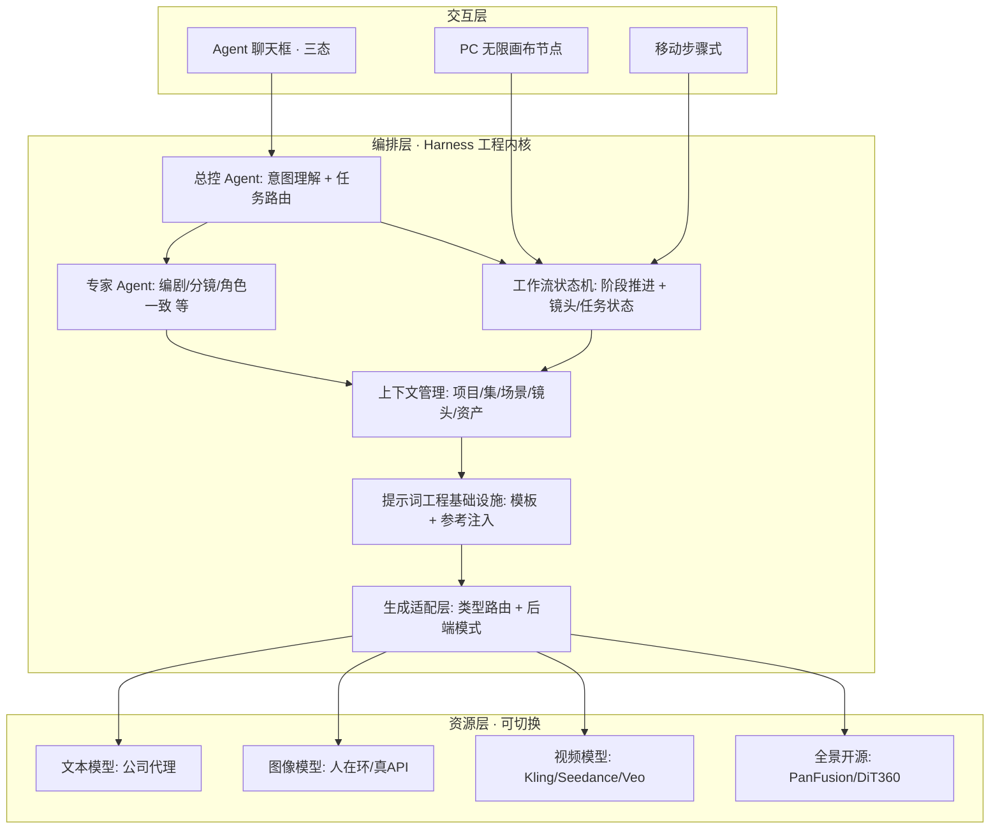

# ActNow 核心PRD

| 字段 | 内容 |
|------|------|
| 版本 | v0.1 |
| 日期 | 2026-06-16 |
| 状态 | 草稿 |

> **读者**：内部（主公自用），对外PRD另行撰写。
> **定位**：产品思考层——背景、用户、目标、哲学。工程细节不在此处。
> **来源**：从 `../PRD.md` v0.30 提取整理，含2026-06-16更新。

---

## 1. 项目背景

### 1.1 产品定位

**ActNow**（暂名）是一款以 **Harness 工程**理念驱动的**多路线 AIGC 内容创作平台**，面向有质量追求、想要精细画面控制的进阶个人创作者。

> **Harness（挽具）**：指围绕 AI 模型构建的工程层——工作流编排、上下文管理、多 Agent 调度、提示词工程基础设施。模型负责"生成"，Harness 负责"让生成在真实创作流程里可控、可用、可复现"。

核心主张：**AI 模型是底层资源，产品价值在于围绕它构建的编排层。** 平台把上述 Harness 这套工程做深，**Agent 聊天框是它最直接的用户侧入口**——用户纯靠对话即可驾驭从一句灵感到成片的完整创作工作流。产品的差异化来自这层工程与交互设计，而非选用了哪个模型。

MVP 先落地**漫剧/短剧**路线，但产品从数据结构与路由骨架上即按多路线设计，创意短片、电商视频作为后续路线，将来扩展不重构。

### 1.2 背景与待解问题

现有 AIGC 创作工具陷入两种极端，都未触及创作流程的本质矛盾：

| 流派 | 代表 | 形态 | 擅长 | 较弱的环节 |
|------|------|------|------|-----------|
| 纯聊天室 | 堆友 / OiiOii / Bloome | 对话即生成 | 创意阶段轻量、易上手 | 进入确定性生产阶段后，结构化管控偏弱 |
| 步骤流水线 | LuxReal / 巨日禄 | 固定步骤推进 | 生产阶段流程清晰、质量稳 | 创意发散阶段受步骤约束，灵感打磨空间小 |
| 无限画布 | LibTV / Lovart | ComfyUI 式节点 | 节点编排灵活、控制力强 | 门槛较高，创意阶段缺启发式引导 |

**本质矛盾**：创意阶段需要**发散**（灵感由模糊到具象），生产阶段需要**确定性**（流程可控、可复现）。两者是不同的创作心智，单一交互形态较难同时服务好。ActNow 的思路是分阶段采用不同形态，而非在某一派上做平替。

ActNow 的两个产品范式决策（详见第4章）正是针对这个本质矛盾：**分水岭交互**（创意=聊天室发散收敛 / 制作=画布+步骤的确定性流程）、**双路径对等**（对话操作与画布操作功能等价，新手用嘴、老手上手）。

> 至于生成后端，做成可切换是务实约束而非创新点：当前缺少便宜的图像/视频 API，所以产品负责产出提示词、由用户拿到外部工具跑（人在环），后续接固定 API；架构预留统一适配层，顺带支持切换模型，仅此而已（详见核心约束 1.5、子PRD [11-human-in-loop.md](11-human-in-loop.md)）。

### 1.3 产品价值定位（2026-06-16 更新）

> ⚠️ 以下替代了原PRD v0.30 中"三位一体"（求职demo/创业验证/能力展示）的旧定位，后者已不准确。

**本质**：这套系统是**漫剧行业的B2B企业工作流方法论**，而非个人求职demo。

核心洞察：精华方法论来自两家公司团队多维探索 + 真金白银 token 烧出的结果。平台打磨好了，**估值几十上百万**没有问题。一人 + AI 协作 = 替代一个团队，这套方法论本身就是产品的核心壁垒。

**近期策略调整**：
- 不再以"尽快找工作"为优先，而是把蓝图和方法论沉淀做扎实
- 外部展示（融资/招商）需另写一套对外PRD，本文档不承担这个职能
- **蓝图就是价值，机会就在困难里**——把产品做深才是正路

**演示诉求（保留）**：从一句剧本 → 生成一段带角色一致性的分镜，并走完整一条龙到成片。这个演示能力仍然是核心，但目的是证明产品能力，不是求职敲门砖。

### 1.4 竞品参照系

| 竞品 | 交互形态 | 核心能力 / 特点（调研发现） | 对 ActNow 的参考价值 |
|------|----------|------------------------------|----------------------|
| **LuxReal** | 步骤流水线 | 自研 Lux3D + 3D Agent；支持整季剧本上传；720° 全景空间管理；制作质量与界面成熟度高 | 整体交互体验、视觉风格、全景空间思路的主要参照 |
| LibTV | 无限画布 | 图生 720° 全景 + 导演台素模摆位；全景能力闭源自研 | 画布节点范式、全景空间思路 |
| Lovart | 无限画布 | ComfyUI 式节点编排，控制力强 | 制作阶段的画布编排范式 |
| OiiOii | 聊天室 | 多 Agent 对话式生成 | 创意阶段对话引导、多 Agent 思路 |
| 堆友 | 聊天室 | 对话式创作、素材生态丰富 | 创意阶段的启发式引导 |
| Bloome | 聊天室 | 对话式内容生成 | 创意阶段交互参考 |
| 巨日禄 | 步骤流水线 | 漫剧/短剧流水线化生产 | 漫剧生产流程参考 |

> 注：LuxReal 的 Lux3D、LibTV 的全景导演台均为闭源自研，我方全景能力采用开源替代方案（PanFusion / DiT360 等，详见子PRD [02-ia-flows.md](02-ia-flows.md)）。

### 1.5 核心约束

| 约束 | 内容 | 影响 |
|------|------|------|
| 不自研底层模型 | 以调 API + 开源项目为主 | 决定"可切换生成后端"架构 |
| 生成后端可切换 | 人在环（开发期，当前缺便宜 API）/ 真实 API（演示·后续固定接入）/ 预置样例（兜底），统一适配层 | 务实过渡方案，非卖点；顺带支持切换模型 |
| 文本类可直接接真 API | 公司代理 `http://120.24.30.8:8098/api/proxy`（OpenAI 兼容，多模型） | 剧本/拆资产/分镜/对话 Agent 等文本任务无需人在环 |
| 图像/视频开发期人在环 | 平台出提示词 → 外部工具跑 → 回传上传 | 决定"人在环交付协议"（详见 [11-human-in-loop.md](11-human-in-loop.md)） |
| 桌面端优先 | Web 应用；移动端适配为最低优先级（Roadmap 垫底） | MVP 不做移动端 |
| 时间优先 | 越快越好，但完整流程必须做扎实 | 范围按 MVP 分期 |
| 规模假设 | MVP 演示目标 = 一集完整短片（数十镜头级）；架构支持整季多集 | demo 不必全跑整季 |

---

## 2. 用户与场景

### 2.1 目标用户分层

用户按**两个轴**划分：主轴是创作路线（决定做什么内容），副轴是能力层级（决定如何服务）。

**主轴 · 创作路线**

| 用户群体 | 典型动机 | 核心诉求 | MVP 状态 |
|----------|----------|----------|----------|
| 短剧/漫剧创作者 | 做剧情向漫剧/短剧 | 角色一致、空间不穿帮、一条龙出片 | ✅ MVP 落地 |
| 创意短片创作者 | 炫技、好玩、做爆款（不一定为盈利） | 自由表达、快速试效果/试爆点 | 二期（Roadmap） |
| 电商创作者 | 卖货/带货/商品展示 | 商品视频高效产出 | 三期（Roadmap） |

**副轴 · 能力层级**

| 层级 | 定位 | 服务方式 |
|------|------|----------|
| **进阶创作者（核心人群）** | 有付费力、有质量追求、要精细画面控制 | 产品价值与付费重心；开放画布手动 + 对话双路径、精控能力 |
| 入门创作者 | 想做但缺乏经验/技术 | 靠预设 / 模板 / 一键同款（创意路线）/ 平台教程接住，非核心但要覆盖 |

> 边界说明：本产品**不以"纯小白傻瓜工具"为定位**，而是服务进阶创作者、把入门用户用预设/模板/教程接住。供给侧（出售 Skill 的资深创作者）属生态层，非付费核心用户，不列入主表（见第3章范围）。

### 2.2 Job Story

| 用户群体 | Job Story |
|----------|-----------|
| 漫剧/短剧（MVP 核心） | 当我有漫剧故事/剧本但没专业团队，我想要一个能从一句灵感/剧本走到成片、每步都能介入精控的 AI 工作台，从而独立做出角色一致、空间不穿帮、画面可控的漫剧，不用组团队、不在零散工具间反复搬运抽卡 |
| 创意短片（Roadmap） | 当我冒出一个脑洞/想炫技/想做爆款（不一定为赚钱），我想把灵感或参考快速变成有视觉冲击的短视频，从而低成本试爆点、表达创意、获得流量与认可 |
| 电商视频（Roadmap） | 当我要给商品产出带货/展示视频，我想低成本批量产出多版本、且商品展示真实可信，从而提升转化、覆盖多平台/多人群 |

### 2.3 四力分析

| 用户群体 | Push（现状痛点） | Pull（新方案吸引力） | Anxiety（顾虑） | Habit（惯性） |
|----------|------------------|----------------------|-----------------|---------------|
| 漫剧/短剧 | 没团队/没预算做不起来；多工具拼接割裂；角色漂移、正反打穿帮；反复抽卡耗时 | 单人一条龙、托管又可随时介入；720° 全景根治穿帮；角色一致锁定；对话式定向改 | 质量够不够；成本（尤其视频）可控吗；改一处会牵连全局吗；进度会丢吗；上手难不难 | 已习惯 MJ/SD/剪映拼接；或找外包；或用巨日禄/OiiOii |
| 创意短片 | 想法多但落地难；手做特效/变装成本高；蹭热点要快；同质化内卷 | 一句灵感/一张参考快速出片；题材模板丰富；低成本高视觉冲击；一键同款蹭热点 | 够不够"爆"/够不够炫；风格稳不稳；会不会一看就 AI 味；热点过期前赶得出吗 | 即梦/可灵/Pika 单点拼接；剪映套模板 |
| 电商视频 | 拍摄/模特/场地成本高；上新快、视频产能跟不上；多平台/多尺寸/多人群要多版本 | 上传商品图自动出片；3D/全景真实展示；AI 模特/虚拟试穿降本；个性化多版本批量 | 商品会不会失真/货不对板（信任·合规）；转化真有提升吗；版权/平台规则；量大成本可控吗 | 找拍摄/模特外包；剪映套模板；数字人工具单点做 |

### 2.4 任务分层

| 用户群体 | 功能任务 | 情感任务 | 社会任务 |
|----------|----------|----------|----------|
| 漫剧/短剧 | 剧本→分镜→分镜图→视频→成片；维护角色/场景/道具资产复用；保一致性 | "一个人也能做专业级漫剧"的掌控感、不被黑盒绑架 | 产出拿得出手、被观众/同行认可 |
| 创意短片 | 灵感/参考→选题材→自由编排→出短视频；快速产多版本试爆 | 炫技爽感、好玩、创意被看见 | 爆款带来的流量、关注、涨粉、人设标签 |
| 电商视频 | 商品图+卖点→选类型→出带货视频；多版本多平台适配 | 省心降本、产能放大 | 业绩/GMV、店铺专业形象 |

### 2.5 MVP 聚焦用户画像

MVP 阶段所有功能设计围绕**漫剧/短剧进阶创作者**：

| 维度 | 描述 |
|------|------|
| 身份 | 独立短剧/漫剧创作者，或小团队核心创作者；有内容经验、缺完整制作团队 |
| 能力 | 懂剧情与分镜，能写或能找到剧本；对画面质量有要求，愿意逐镜调 |
| 痛点 | 角色跨镜漂移、正反打穿帮、多工具搬运、抽卡耗时、改一处牵连全局 |
| 期望 | 一人完成一条龙、关键环节可精控、进度可保存续作、成片质量拿得出手 |
| 付费意愿 | 有——质量与效率达标即愿付费，是产品价值与商业化重心 |

---

## 3. 目标、指标与范围

### 3.1 产品目标

| 层级 | 目标 |
|------|------|
| 北极星 | 让一个进阶创作者，独立、可控地完成一部角色一致、空间不穿帮的漫剧从灵感到成片的全流程 |
| 产品目标 | 用 Harness 工程把 AIGC 创作流程编排成可对话驾驭、可逐步精控的一条龙工作台 |
| MVP 目标 | 跑通漫剧/短剧一条龙 demo，可现场演示"一句剧本 → 角色一致分镜 → 成片"，并预留多路线架构 |
| 演示目标 | 一集完整短片（数十镜头级）端到端贯通，生成环节允许外部回填 |

### 3.2 成功指标（MVP 验收）

| 指标 | 定义 | 目标 | 数据来源 |
|------|------|------|----------|
| 演示核心场景 | 一句灵感/剧本 → 一段角色一致性分镜 | 可现场演示 | 实测演示 |
| 端到端跑通 | 剧本→成片全流程贯通（生成可外置回填） | 完整走完 1 条 | 实测演示 |
| 角色一致性 | 同角色不同镜头外貌相似度 | 目测无明显漂移 | 人工评审 |
| 全景正反打 | 同场景正反打背景空间 | 不穿帮 | 人工评审 |
| 对话式修改 | 单点修改是否牵连其他镜头 | 仅目标镜头重生成 | 实测 |
| 后端可切换 | 人在环/真实 API/样例三模式切换 | 接口预留、可切 | 实测 |
| 断点续作 | 关闭后重进的进度/资产恢复 | 完整恢复 | 实测 |
| 降门槛可用 | 用模板/一键同款能产出可用初稿 | 入门用户可走通 | 实测 |
| 多路线入口可见 | 导航呈现创意短片/电商入口 | 入口可见、引导清晰 | 实测 |

### 3.3 项目范围

> **规划原则**：PRD 完整规划全产品蓝图（广度不偷懒）；深度分层——MVP（漫剧）写到可开发深度，Roadmap 写到规划级。实施 SOP 按 MVP 优先分期。

#### 做（MVP 一期 · 详细规划）

| 类别 | 范围项 |
|------|--------|
| 核心工作流 | 剧本输入（一句灵感起步，也支持上传剧本）；AI 资产提取；分镜脚本生成；批量分镜图（角色跨镜一致）；批量视频片段（语音随模型直出）；合成导出（含音效/BGM） |
| 核心差异能力 | 720° 全景场景管理（能力必做、使用可选，可只做 2D）；角色一致性（多形态/人与非人）；对话式定向修改；进阶画面精控；文生/图生镜头级可选 + 图生首尾 1s 变速 |
| Harness 工程 | 统一生成适配层（人在环/真实 API/样例）；Agent 编排（总控+专家）；生成任务状态机；人在环交付协议 |
| 降门槛辅助 | 预设（风格/镜头/角色模板）；项目模板；**画布组合技按钮（Skill 雏形：预置+自定义，见画布子PRD）** |
| 资产与项目 | 角色/场景/道具入库跨项目复用；项目进度保存、断点续作 |
| 多路线架构 | 项目带"路线类型"字段；导航呈现创意短片/电商入口（引导至 Roadmap，不落地内容） |
| 基础系统 | 基础登录与账号管理 |

#### Roadmap（规划级 · 实施非本期）

> 路线分期：一期=漫剧（MVP）→ 二期=创意短片 → 三期=电商（复用全景空间一致性强项）。

| Roadmap 项 | 期次/优先级 |
|------------|-------------|
| 创意短片路线 | 二期 |
| 电商视频路线（主图视频/3D 预览/种草/AI 模特/虚拟试穿等） | 三期 |
| 发行与投流（一条龙 ⑤） | 随路线推进 |
| 完整 Skill 组件系统 + Skill 市场（创作者付费经济） | 中后期 |
| 教程/课程体系（平台自营，覆盖入门） | 中期 |
| 一键做同款（仅创意视频路线，不覆盖漫剧） | 二期·靠后 |
| 漫剧"二创" | 记录想法·非当期 |
| 团队协作与权限管理 | 后期 |
| 积分/配额商业化体系 | 后期 |
| 外部运镜预设库 | 以后考虑 |
| 版权合规增强（AI 生成标识 / 审核 / 水印溯源） | Roadmap 增强 |
| 移动端适配 | 最低优先级·垫底 |

#### 不做（明确排除）

| 排除项 | 原因 |
|--------|------|
| 自研底层图像/视频大模型 | 坚持调 API + 开源 |
| 面向纯小白的傻瓜工具 | 小白靠预设/模板/教程覆盖，不拉低产品 |

---

## 4. Harness 架构哲学 · 两大范式决策

> 本章是产品思考层核心，架构图与范式决策是所有工程子PRD的根锚。
> 信息架构、页面骨架、技术栈选型见工程子PRD → [02-ia-flows.md](02-ia-flows.md)

### 4.1 Harness 分层架构

产品自上而下分三层：**交互层**（用户怎么操作）、**编排层**（Harness 工程的核心，把意图变成可控可复现的工作流）、**资源层**（可切换的生成能力）。

> 关键点：**交互层的两条入口（对话 / 画布）最终都收敛到同一套编排层**——这是"双路径对等"的架构基础。资源层任意替换不影响上层（生成适配层吸收差异）。

### 4.2 两个产品范式决策

#### 决策一：分水岭交互（按创作心智分阶段切换形态）

| 阶段 | 心智 | 交互形态 | 理由 |
|------|------|----------|------|
| 创意阶段（灵感→大纲→编剧） | 发散 | **聊天室**：AI 启发式提问 + 推荐选项 | 流水线在此段易把灵感框死、难出精彩题材 |
| —— 剧本确定 = **分水岭** —— | —— | —— | 剧本定稿后基本是确定流程 |
| 制作阶段（拆分→资产→分镜→生成→合成） | 确定性 | **PC=无限画布节点 / 移动=步骤式** | 确定流程要可控可复现；画布成功案例可沉淀为工作流模板 |

#### 决策二：双路径对等（对话操作与画布操作功能等价）

- 用户可**纯靠 Agent 对话完成全部编辑动作**（拆资产/改分镜/重生成/设机位/合成…）。
- 也可在**画布上手动操作**——更快、更省 token，适合老手。
- 两条路径**功能完全等价、可混用**，都能到达任意目标状态；不存在"AI 只能做简单操作"的天花板。

> Agent 聊天框三态：全屏 / 侧边栏 / 桌宠悬浮窗，贯穿全程，主战场在创意阶段。

### 4.3 已确认的工程选型（非PRD内容，仅标注）

> 以下是工程侧已落地的选型，PRD v0.29 有部分记录有误，此处以工程事实为准：

| 层 | PRD v0.29 记录 | 工程实际（tech/specs真相） | 备注 |
|----|---------------|--------------------------|------|
| Canvas引擎 | tldraw | **React Flow** | specs s1-s8全部基于React Flow |
| Agent框架 | LangGraph.js | **自建Harness** | PRD明确写了"自建"但v0.29又加回LangGraph，以自建为准 |
| 前端框架 | React | React | 一致 |
| 后端 | NestJS | NestJS | 一致 |
| 数据库 | Prisma + PostgreSQL | Prisma + PostgreSQL | 一致 |
| 存储 | S3 | S3 | 一致 |

---

---

## 修改记录

> 历史行（`来源 PRD.md`）来自原 `../PRD.md` 修改记录，与本文提取内容对应；本文版本号从 v0.1 开始独立计数。

| 日期 | 版本 | 变更 |
|------|------|------|
| 2026-06-09 | 来源 PRD.md v0.1 | 初始化PRD |
| 2026-06-09 | 来源 PRD.md v0.2 | 模块1 项目背景 |
| 2026-06-09 | 来源 PRD.md v0.3 | 模块2 用户与场景 |
| 2026-06-09 | 来源 PRD.md v0.4 | 模块3 目标·指标·范围 |
| 2026-06-09 | 来源 PRD.md v0.5 | 模块4 产品方案·Harness架构（本文提取：4.1 Harness哲学 + 4.2 两大范式决策）|
| 2026-06-09 | 来源 PRD.md v0.25 | 模块3范围 补组合技按钮相关（画布Skill载体）|
| 2026-06-09 | 来源 PRD.md v0.27 | 模块3范围 版权/免责声明更新（免责声明入MVP，去掉无版权剧本边界）|
| 2026-06-16 | v0.1 | 整理搬运到本文件；产品定位从"求职demo"更新为B2B方法论；技术栈冲突记录（tldraw→React Flow / LangGraph→自建Harness）|
