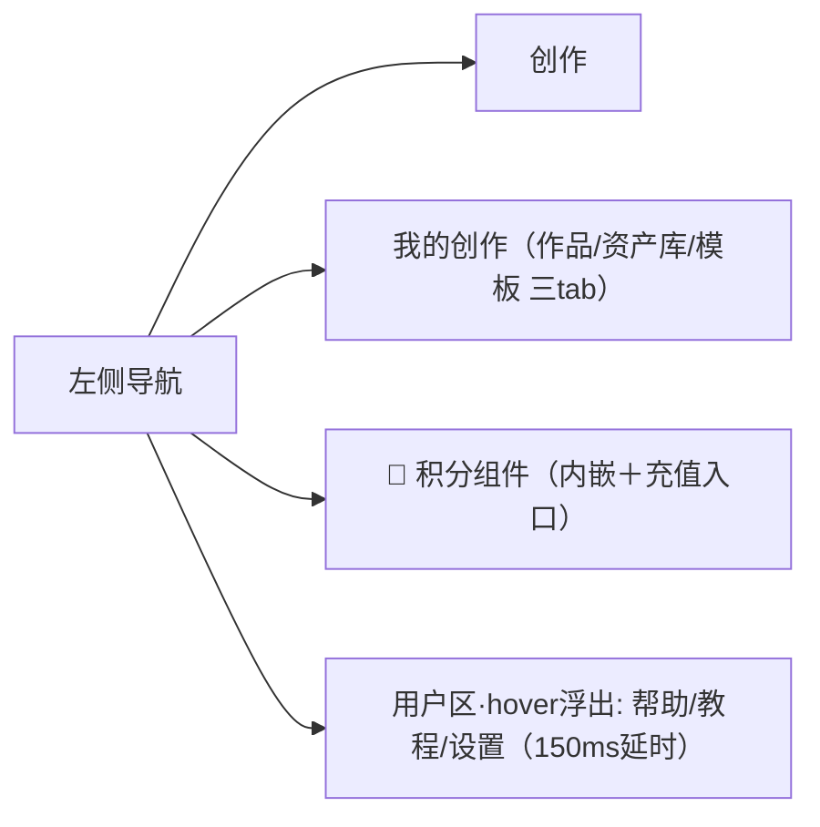
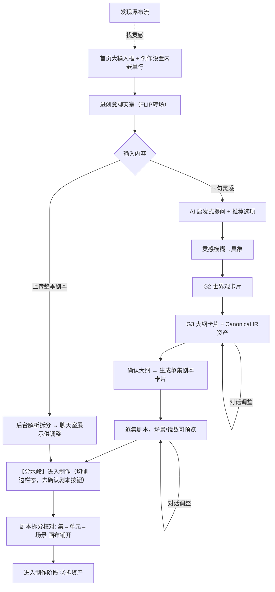
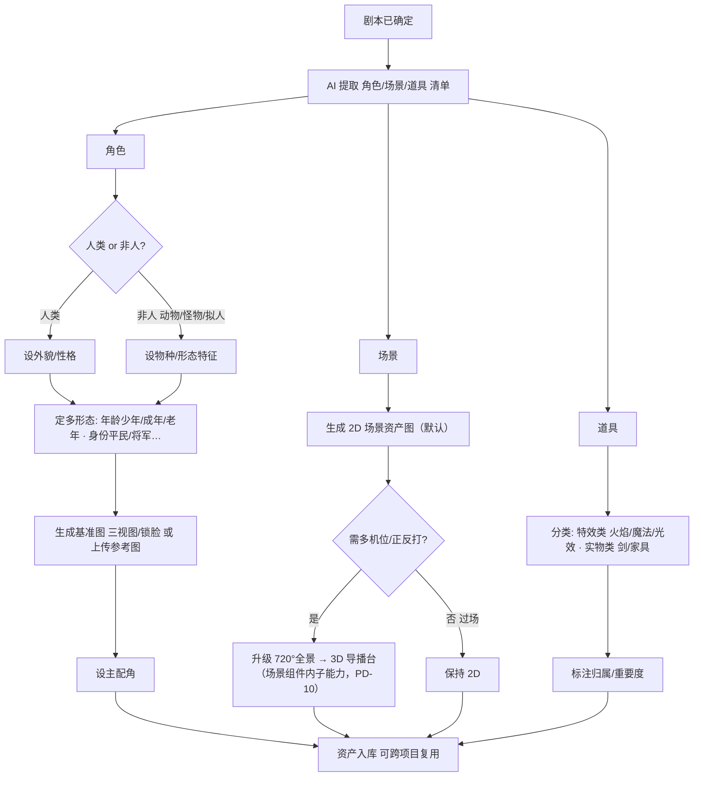
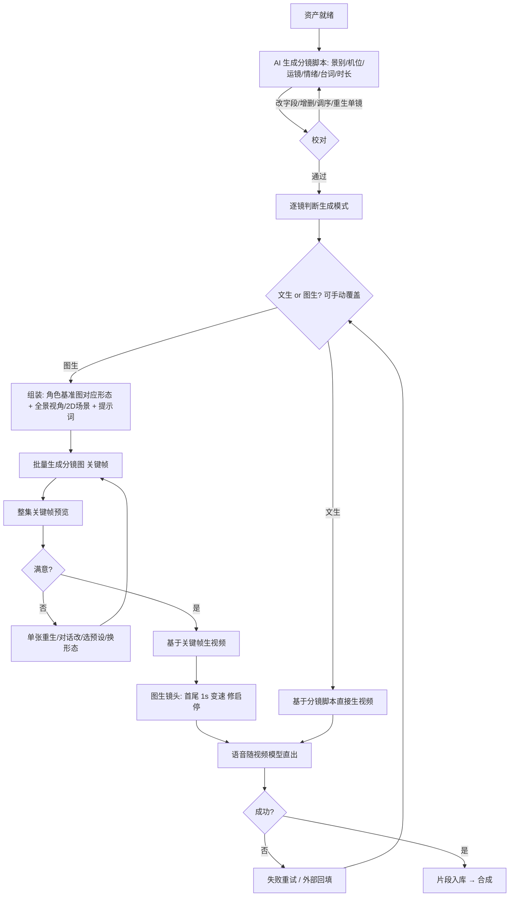
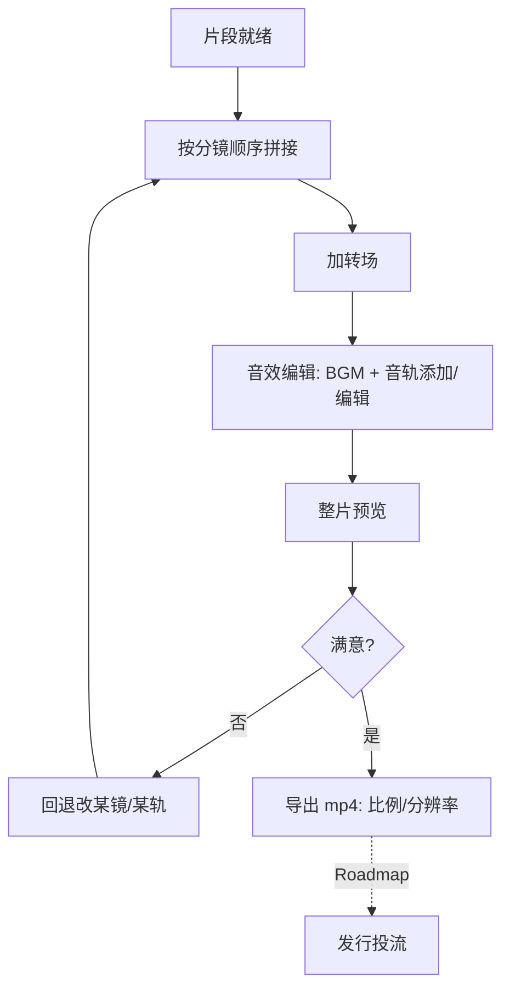
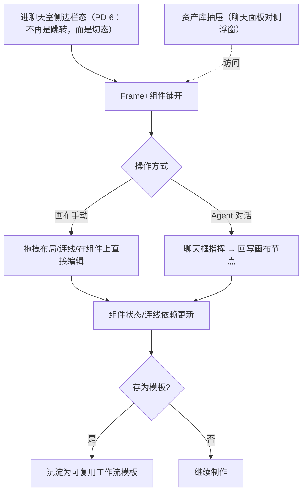

# ActNow 前端 UX 子PRD

| 字段 | 内容 |
|------|------|
| 版本 | v0.6 |
| 日期 | 2026-06-21 |
| 状态 | 草稿 |

> **对应模块**：4.3 信息架构 · 5 功能需求总览 · 6a 创意阶段 · 6b 资产管理 · 6c 分镜与生成 · 6d 合成与导出 · 6f PC无限画布
> **来源**：PRD.md v0.30 搬运整合 + `_prototype-deltas.md` PD-1/2/4/5/6/7/8/9/10/11
> **注**：画布工作台（6f）完整规格见 [Canvas/PRD-Canvas.md](../Canvas/PRD-Canvas.md)（C0-C10已完成），本文只保留摘要与原型更新记录。
> **前端真源 v0**：`../prototype/pages/workspace-v0.html`（v0 设计规格，单页四阶段，所有原型决策以此为准）
> **v1 重建**（[09 §E](09-decisions-log.md)）：`apps/web` 正按 v0 像素/交互规格用 React + React Flow 原地改造为生产前端 v1；其 `api.ts` 为复用契约层。后端能力支撑的就是 v0/v1 这条交互路径。

---

## 4.3 信息架构

### 顶层阶段骨架

**顶层阶段骨架 = 剧本 / 资产 / 制作 / 预览 4 步**（"制作"在画布上展开为 分镜→分镜图→视频 等节点，与 LuxReal 4 步同量级，不强行拆 5 步 tab）。

### 左侧导航

> ⚠️ PRD v0.30 原版：创作/首页、资产库（独立）、个人页、帮助文档、新手教程、充值（Roadmap）

📌 **原型更新 PD-1**（已落原型，待并入）：左侧导航收为两项：



- **资产库**不再独立 → 并入「我的创作」，页内三 tab：作品 / 资产库 / 模板
- **充值入口**改为**积分组件**（💎 积分数 + ＋号即充值入口，内嵌导航底部）
- **帮助/教程/设置**收进底部用户区 hover 浮出列表（150ms延时，防移动到弹层时丢失）

📌 **原型更新 PD-7**（已落原型，待并入）：rail 宽窄两态标准：
- **持久窄 rail（76px）**：贯穿所有内部页（聊天/画布/我的创作）
- **首页宽态（212px）**：仅首页展开，显示品牌 + 文字 + 用户名
- **图标零位移**：水平中心恒钉在 38px，宽窄切换图标不动；文字仅 opacity 显隐，不位移
- **积分特例**：始终竖排（💎 上/数字下），固定宽 60px，数字常驻不随窄态隐藏

### 工作区架构

> ⚠️ PRD v0.30 原版：home / chat / studio / myworks 为独立 html，靠 `location.href` 跳转

📌 **原型更新 PD-6 + PD-9**（已落原型，Playwright实测，待并入）：**单一工作区 `workspace.html`，四 stage**：

| Stage | 对应 | 说明 |
|-------|------|------|
| `stage-home` | 首页 | 问候/最近项目/发现（暂无路线卡，见PD-5） |
| `stage-chat` | 聊天 + 画布 | 工作区三态：全屏 / 侧边栏 / 悬浮球（见PD-6详细）|
| `stage-studio` | 占位 | 画布已并入 stage-chat 的画布区 |
| `stage-myworks` | 我的创作 | 三 tab：作品 / 资产库 / 模板，点击切 stage 不跳转 |

**项目列表数据一致性**：首页“最近项目”和“我的创作 / 作品”必须共用 `/api/projects` 返回的同一份项目数据；最近项目仅取按更新时间排序后的前 3 条，“我的创作”展示全集并在全集上执行名称搜索与状态筛选。任何新建或已推进的项目刷新列表后必须同时出现在两处，禁止在“我的创作”维护静态演示项目。

**资产到分镜顺序**：资产 Agent 完成拆解后，资产卡必须逐项展示名称、可见描述、用途和生图提示词，由用户确认无误。本阶段暂不验证真实生图效果，确认后以占位图模拟资产图生成完成；只有模拟生成完成后才显示“进入分镜稿”按钮并触发分镜 Agent，禁止资产清单生成后直接跳入分镜。

**分镜上下文与完整字段**：触发分镜 Agent 时必须同时传入已确认的第 1 集 `script_card`、本轮 `asset_output` 与 Designer 产出的 `design_prompts`，禁止只依分集 synopsis 推导或另编场景。每个 Shot 必须展示景别、机位、运镜、情绪、台词/声音和时长，缺任一项均不算完整分镜稿。分镜师合并了原 Cinematographer 的职能，景别/运镜/时间码/integrated_prompt 在同一 Agent 内完成。

**旧页保留**：`home.html` / `chat.html` / `studio.html` / `myworks.html` 原样并存，workspace.html 为新迭代版本。

**home→chat FLIP 转场**（已实测）：
- 点「开始创作」→ 首页问候/最近/发现渐隐位移
- 聊天输入框从「首页输入框的位置+宽度」长出，平滑飞到底部（FLIP transform，width 1040→760、top 181→616 平滑过渡）
- 设置条向下淡出；用户输入变第一条气泡；编剧 Agent 开始确认需求并发散方向

**工作区三态（相邻态链）**：

```
全屏（纯聊天+右侧时间轴）
  ⇄ 侧边栏（聊天360px左栏 + 画布展开）
      ⇄ 悬浮球（聊天收球 + 画布全占）
```

- 切换按钮统一在聊天顶栏：全屏态仅「展开画布」→侧边栏；侧边栏态「全屏」「悬浮球」；悬浮球点球→侧边栏
- **全屏↔悬浮球不相邻、不可直跳**（消除闪屏）
- 侧边栏↔悬浮球：聊天栏保持360px宽纯位移；full→side 画布用 `width` 收缩"露出"而非淡入

**分水岭语义**（暂按此默认，待最终确认）：进画布 = 切到侧边栏态；首次进画布锁定创作设置；去掉"确认剧本"按钮。

### 关键页面骨架与控件

#### 首页/创作页

布局（左导航固定，右主区自上而下）：

```
┌────────┬───────────────────────────────────────────┐
│ 左导航  │  [问候标题]（路线卡暂隐，见PD-5）              │
│ ·创作  │                                             │
│ ·我的  │  ┌───────────────────────────────────────┐  │
│ 💎积分 │  │  大输入框                              │  │
│ 用户区 │  │  「一句灵感起步，或粘贴/上传整季剧本…」  │  │
│        │  │  [风格▾ 比例▾ 模型▾ 内嵌单行]  [开始→] │  │
│        │  └───────────────────────────────────────┘  │
│        │ ═══════════════ 下滑分隔 ═══════════════     │
│        │  最近项目  [卡][卡][卡] …（半露出引导下滑）  │
│        │  发现 · 瀑布流  [案例][案例]…               │
└────────┴───────────────────────────────────────────┘
```

> 📌 **PD-4**：创作设置去掉「时长」→ 仅 风格/比例/模型，**内嵌大输入框内、单行**
> 📌 **PD-5**（已决）：路线卡暂隐；MVP首屏聚焦漫剧主线，多路线为Roadmap；模块3"多路线入口可见"指标已相应调整

核心控件清单（更新后）：

| 控件 | 类型 | 候选/默认 | 说明 |
|------|------|-----------|------|
| 大输入框 | 多行文本 + 上传 | 空 | **统一入口**：灵感/上传剧本都先进聊天室 |
| 上传按钮 | 文件上传 | 支持文本/文档 | 上传整季剧本→进聊天室+后台解析 |
| 开始按钮 | 主操作 | — | 进入创意聊天室（FLIP转场） |
| 风格 | 下拉（内嵌输入框） | 国风/写实/日系动漫/3D-CG/水墨/赛博朋克 | — |
| 比例 | 下拉（内嵌输入框） | 9:16（默认）/ 16:9 / 1:1 | — |
| 模型 | 下拉（内嵌输入框） | 智能默认 / 指定 | 进阶用户可指定 |
| 发现瀑布流 | 信息流 | 案例卡 | 下滑区 |

#### 创意聊天台

> ⚠️ PRD v0.30 原版：双栏 `对话流 | 大纲/剧本草稿`，右侧常驻草稿面板

📌 **原型更新 PD-2**（已落原型，待并入）：

```
┌────────┬──────────────────────────┬──────────────┐
│ 左导航  │  对话流                   │ 对话时间轴    │
│(窄rail) │  AI: 气泡内含大纲卡片      │ (68px窄列)   │
│        │  AI: 提问+[推荐选项]       │ 灵感●→       │
│        │  我: …                    │ 方向●→       │
│        │                          │ 大纲◐→       │
│        │  ┌──────────────────────┐│ 剧本○→       │
│        │  │ 输入… [发送]          ││ 角色○→       │
│        │  └──────────────────────┘│ 确认○        │
└────────┴──────────────────────────┴──────────────┘
```

**时间轴双层语义**：
- *进度层*（靛蓝）：由创作状态机决定，current 恒指当前最高进度，**不随滚动变**
- *阅读游标层*（青绿，scrollspy）：随聊天滚动，套在"正在看的阶段"节点上；点击节点平滑跳转

控件：对话输入框、AI 推荐选项按钮组、**大纲卡片（气泡内inline）**、单集剧本卡片（详见PD-11）；三态切换在顶栏（全屏/侧边栏/悬浮球）

📌 **原型更新 PD-11**（已落原型，待并入）— **大纲卡片 + 单集剧本卡片 + 天眼层**：

**大纲卡片（编剧Agent气泡内）**：
- 头部：「《作品名》· 分集大纲 · N集」
- 故事概览（全字段 inline 可编辑，contentEditable）+ 题材标签（只读）
- 逐集列表：`EP01…EPN`，每集 = 集号徽标 + 单集名称（可编辑）+ 单集梗概（可编辑）
- 底部：**天眼层/资产区**（Canonical IR 折叠呈现；`assets` 中角色、场景、道具作为整季资产锚点在卡片内展示）
- 操作：`确认大纲，生成第1集剧本 →`（主按钮）+ `继续调整`；确认后按钮置灰为「✓ 大纲已确认」

**单集剧本卡片（确认大纲后）**：
- 头部「📝 第 N 集 · 标题」+ 草稿徽标；EP tab 切集
- 逐场景：场次号 / 内外景标签 / 时间 / 地点 / 场景描述 / 出场角色chips / 镜数
- 底部统计（场景数/总镜数/预计时长）+ `⚡ 进入制作`（切画布）/ `下一集 →`

**天眼层（暗骨/Canonical IR）**：随 G3 大纲动态填充。`canonical_ir.assets.chars/locs/props` 在大纲卡片内展示；为空时显示明确空态。该展示属于 G3 大纲结果，不新增独立“资产提取”对话步骤。

#### 制作画布工作台（PC · 分水岭后）

```
┌────────┬──────────────────────────────┬──────────┐
│ 左导航  │  无限画布（pan/zoom）          │ Agent聊天 │
│(窄rail) │  Frame①资产→Frame②分镜→③图→④视│ (侧边/可  │
│        │  简单卡片自由浮在画布任意处      │  收为    │
│        │  连线表达素材喂入+工序依赖      │  悬浮球)  │
│        │                              │          │
│        │ [底部工具坞: 资产库抽屉▾ 模板▾ 导出]      │
└────────┴──────────────────────────────┴──────────┘
```

> 画布完整规格见 [Canvas/PRD-Canvas.md](../Canvas/PRD-Canvas.md)；画布引擎用 **React Flow**（非tldraw，以工程事实为准）

#### 画布节点工作流

> ⚠️ PRD v0.30：节点 + 组连线；原型已重构为Frame+两层卡片

📌 **原型更新 PD-10**（已决范式，待落原型完成，待并入）：

**Frame（步骤画板）**：可自由调大小的背景框，带步骤标签+步骤色淡底；`overflow:visible`（连线可穿出）；拖标题头带走框内节点。对应五步骤 = 五 Frame。

**两层卡片范式**：

| 层 | 名称 | 特征 | 清单 |
|----|------|------|------|
| ① | **组件（Component）** | 平台预定义·绑定步骤·不跨步移动·结构复杂·右下角挂组合技⚡·多端口 | Step1: 角色资产组件/场景资产组件/道具资产组件（含3D导演台子能力）；Step2: 分镜脚本组件；Step3: 分镜图组件；Step4: 视频生成组件；Step5: 音视频合成台组件 |
| ② | **简单卡片（Simple Card）** | 通用素材·自由浮在画布任意处·小尺寸·拖入/粘贴自动创建·单输出端口 | 文本卡片 / 图片卡片 / 视频卡片 / 音频卡片 |

**连线语义**：
- 简单卡片 → 组件 = **喂素材**（图片→场景组件=参考图；文本→脚本组件=参考设定）
- 组件 → 组件 = **工序依赖**：系统按 资产→脚本→分镜图→视频→合成 顺序自动连线，用户可手动拉/改

**样式规范**：
- 组件 = `头部(icon+标题+状态+菜单) / 内容区(预览·列表·参数) / 操作区(按钮+组合技⚡)`，左输入右输出端口
- 简单卡片 = `缩略图主体 + 文件名`，右输出端口

**分组框组合技按钮（Skill画布载体）**（原PRD 4.3已有，与PD-10对齐）：

```
╔══ ① 资产 Frame ═════════════════════╗
║ [角色资产] [场景资产] [道具资产]       ║
║                    [⚡一键分镜▾][＋] ║
╚═════════════════════════════════════╝
```

- **预置组合技（MVP）**：平台内置（资产→分镜、分镜→批量分镜图、整集→一键成片）
- **用户自定义**：录制/编排→挂到分组框→跨项目复用（`[＋]` 新增）
- **概念**：组合技 = Skill画布载体 = 把"对Agent说一串指令"固化为画布按钮

#### 3D 导播台（全景 · 场景组件子能力）

> 📌 **PD-10**：3D导播台不再独立漂移，归属于「场景资产组件」内子能力

```
┌─────────────────────────────────┬──────────────┐
│  360° 全景视图（拖拽转视角）       │ 控制面板      │
│                                 │ yaw/pitch/fov │
│   [人物素模可摆位]               │ 机位列表      │
│                                 │ [截视角图]    │
│                                 │ [返回]        │
└─────────────────────────────────┴──────────────┘
```

#### 节点通用结构

```
┌─ [步骤名]            [●状态] ─┐   状态: ○待生成 ⟳生成中 ✓完成 ✗失败
│   缩略内容预览                │
│   [展开] [对话改] [重生/重试] │
└──────────────────────────────┘
```

移动端：节点工作流在移动端**拍平为步骤 tab**（① 资产→②分镜→③分镜图→④视频→⑤合成）。移动端为Roadmap垫底。

📌 **PD-8**（已落原型，可选入PRD）：全局自定义主色箭头鼠标光标；右下角常驻 Figma 式圆角名字框跟随鼠标（hover 到 `data-cursor` 元素时显示提示文字；超屏翻转）。

---

## 5. 功能需求总览

全平台功能区一览（MVP 漫剧落地；标注所属详述模块与期次）。

| # | 页面/功能区 | 阶段·形态 | 用户任务 | 主要操作 | 详述模块 | 期次 |
|---|------------|----------|----------|----------|----------|------|
| 1 | 登录/注册 | — | 进入系统 | 登录、注册 | 模块 12 | MVP |
| 2 | 首页/创作页（含发现） | ① 入口·首页 | 开始创作 + 逛案例找灵感 | 上传剧本/进聊天台/选设置/生成；下滑浏览发现 | 6a | MVP |
| 3 | 创意聊天台 | ① 创意·聊天室 | 灵感→大纲→编剧 / 上传剧本解析 | AI 提问+给选项、发散→收敛、确认剧本 | 6a | MVP |
| 4 | 剧本拆分 | ① 后台自动+画布校对 | 校对/微调拆分 | 合并/拆分单元、改场景边界、确认 | 6a | MVP |
| 5 | 拆资产（项目内） | ② 画布节点+聊天补充 | 校对角色/场景/道具 | 编辑描述、上传参考图、设主配角、加形态、触发全景 | 6b | MVP |
| 6 | 3D 导播台（全景） | ② 场景组件子能力（PD-10更新） | 设机位、画面精控 | 拖拽转视角、摆素模、设机位、截视角图 | 6b | MVP（可选用） |
| 7 | 分镜脚本 | ③ 画布节点/步骤 | 校对分镜表 | 改字段、重生成单镜、调顺序 | 6c | MVP |
| 8 | 分镜图工作区（仅图生） | ③ 画布节点/步骤 | 生成/校对关键帧 | 批量生成、单张重生、对话式改、选预设 | 6c | MVP |
| 9 | 视频片段工作区 | ③ 画布节点/步骤 | 生成/回填视频 | 文生/图生切换、首尾1s变速、逐镜生成、失败重试、外部回填 | 6c | MVP |
| 10 | 合成导出 | ④ 画布节点/步骤 | 出成片 | 拼接、音效编辑（BGM/音轨）、导出 mp4 | 6d | MVP |
| 11 | Agent 聊天面板（核心） | 贯穿·三态 | 对话式完成全部编辑动作 | 对话指挥任意动作；全屏/侧边/悬浮球切换（PD-3/6更新） | 6e（见 03-fullstack-contract） | MVP |
| 12 | PC 无限画布工作台 | ②-④ 画布容器 | 制作主界面（PC） | Frame+两层卡片布局、连线、存工作流模板、资产库入口（PD-10更新） | 6f | MVP |
| 13 | 移动端步骤式工作台 | ②-④ 步骤容器 | 制作主界面（移动） | 顺序推进各步骤 tab | 6f | Roadmap·垫底 |
| 14 | 个人页（作品+账号） | 全局·左导航 | 管理作品/账号 | 打开/重命名/删除项目、模板新建 | 模块 12 | MVP |
| 15 | 资产库（全局复用） | 我的创作 内tab（PD-1更新） | 跨项目复用 | 浏览、复用、存为模板、收藏 | 6b | MVP |
| 16 | 充值/积分 | 积分组件（PD-1更新） | 充值、查积分 | 充值、查账单 | 模块 12 | Roadmap |
| 17 | 发行投流 | ⑤ | （规划级占位） | — | 模块 11 | Roadmap |

---

## 6a 创意阶段（入口 + 创意聊天台 + 剧本拆分）

### 目标

承接"分水岭"之前的全部环节：让用户从一句灵感或一份现成剧本出发，经由聊天室式的发散收敛，得到一份**确定的、结构化拆分好的剧本**，进入制作阶段。

### 用户故事

| 角色 | 场景 | 需求 | 价值 |
|------|------|------|------|
| 有剧本的创作者 | 已有整季剧本 | 上传剧本 → 进聊天室后台自动解析拆分、可对话微调 | 跳过发散创作、快速进制作 |
| 没剧本的创作者 | 只有一个模糊脑洞 | 输入灵感即进聊天室，AI 启发式提问把灵感变具象 | 解决"没有好剧本"痛点 |
| 任意创作者 | 拿不准方向 | 下滑看发现瀑布流找灵感 | 降低冷启动门槛 |

### 流程



### 页面与交互

| 页面/区域 | 核心信息 | 主要操作 | 状态 | 规则 |
|-----------|----------|----------|------|------|
| 首页/创作页 | 大输入框（灵感/上传）+ **内嵌创作设置（风格/比例/模型单行）** | 输入灵感或上传、设置、开始（FLIP转场进聊天室） | 默认页 | **无路线卡（暂隐）**；输入即进聊天室 |
| 创意聊天台 | 对话流 + 世界观/大纲/剧本卡片 + G3内嵌资产区 + **右侧68px对话时间轴** | AI提问/给选项；确认世界观；查看角色/场景/道具锚点；确认大纲；进入制作 | 聊天室·可切全屏/侧边/悬浮球 | G3资产随大纲展示，不新增独立资产提取步骤；时间轴进度层不随滚动变 |
| 剧本拆分 | 集→叙事单元→场景 结构树 | 合并/拆分单元、改场景边界、确认 | 后台自动拆 + 画布铺开 | 拆分自动完成后给"已拆 X 集 Y 单元"摘要 + 跳转 |

### 业务规则

| 编号 | 规则 | 触发条件 | 例外 | 状态 |
|------|------|----------|------|------|
| 6a-R1 | 首页大输入框为统一入口：输入灵感或上传剧本都先进创意聊天室，都必须产出"确定剧本"才能过分水岭 | 进入制作前 | — | ✅ |
| 6a-R2 | 创作设置 风格/比例/模型 与剧本输入同屏内嵌，分水岭前可改、进画布后锁定；**仅 Skill 制作期可挂载/调整**；**时长已删除（PD-4）** | 剧本确认时 | — | ✅（PD-4更新） |
| 6a-R3 | 用户勾选免责声明协议，生成内容版权与合规责任由用户自负 | 注册/创作时 | — | ✅ |
| 6a-R4 | 剧本拆分后台自动完成，画布铺开供校对，不强制逐项确认 | 剧本确定后 | — | ✅ |
| 6a-R5 | 情节/情绪节奏结构在大纲或编剧阶段产出 | 创意阶段 | — | ✅ |
| 6a-R6 | G2 确认后，G3 合并产出 `outline_card + canonical_ir`；`canonical_ir.assets` 内嵌大纲卡片展示 | G3 完成 | 空资产显示空态 | ✅ |
| 6a-R7 | G1～G3 不调用制作期资产 Agent；制作期“拆资产”负责把已确认剧本和资产锚点转成可生产、可入库资产 | Genesis 路由 | 进入制作后可调用资产 Agent 补充 | ✅ |

### 验收标准

- Given 用户只输入一句灵感，When 走完创意聊天台引导，Then 能产出一份结构完整的剧本。
- Given 用户确认 G2 世界观，When G3 完成，Then 同一张大纲卡片展示整季大纲和角色/场景/道具资产锚点，且没有独立资产提取步骤。
- Given G3 未提取到稳定资产，When 大纲卡片渲染，Then 显示明确空态且仍可继续调整或确认大纲。
- Given 用户上传整季剧本，When 确认，Then 直接进入剧本拆分。
- Given 剧本已确定，When 进入制作，Then 系统自动拆分并铺开供校对。
- Given 用户在首页下滑，Then 能看到发现瀑布流。

---

## 6b 资产管理（拆资产 + 3D 导播台 + 全局资产库）

### 目标

把剧本里的角色、场景、道具提取为**可复用、可锁定一致性**的结构化资产；为有多机位/正反打需求的场景提供 720° 全景与 3D 导播台；并让资产跨项目沉淀复用。

### 用户故事

| 角色 | 场景 | 需求 | 价值 |
|------|------|------|------|
| 创作者 | 剧本确定后 | 自动提取角色/场景/道具清单并校对 | 省去手动建档 |
| 创作者 | 角色跨集变化 | 同角色设多形态（年龄/身份） | 一个角色档案覆盖全剧变化 |
| 创作者 | 需要正反打的场景 | 场景升级 720° 全景、3D 导播台设机位 | 根治多机位空间穿帮 |
| 创作者 | 新项目复用老角色 | 从全局资产库调取历史资产 | 跨项目复用、积累资产 |

### 流程（拆资产）



> 📌 **PD-10 对齐**：拆资产对应 Step1 三个组件（角色资产组件/场景资产组件/道具资产组件），3D导播台为场景资产组件的内子能力，不独立漂移。

### 页面与交互

| 页面/区域 | 核心信息 | 主要操作 | 状态 | 规则 |
|-----------|----------|----------|------|------|
| 拆资产（项目内，Step1 Frame内组件） | 角色含人/非人+多形态 | 编辑描述、上传参考图、设主配角、加形态、触发全景 | 画布组件+聊天补充 | AI自动提取后供校对；角色基准图为一致性锚点 |
| 3D 导播台（场景组件内子能力） | 360°全景图、yaw/pitch/fov、素模摆位 | 拖拽转视角、摆人物素模、设机位、截视角图 | 场景组件子面板 | 非必走；过场镜头可跳过 |
| 全局资产库（我的创作 内tab，PD-1更新） | 角色/场景/道具、预设/模板/工作流 | 浏览、复用、存为模板、收藏 | 我的创作内tab | 跨项目复用 |

### 业务规则

| 编号 | 规则 | 触发条件 | 例外 |
|------|------|----------|------|
| 6b-R1 | 角色分人类/非人两类，分别走不同描述维度 | 提取角色时 | — |
| 6b-R2 | 同角色可挂多个形态，每形态有独立基准图；镜头通过 (character_id, form_id) 引用 | 角色有变体时 | — |
| 6b-R3 | 场景默认生成 2D 资产图；仅在需多机位/正反打时升级 720° 全景 | 场景需求判定 | 过场可跳过 |
| 6b-R4 | 道具分特效类/实物类，标注归属与重要度 | 提取道具时 | — |
| 6b-R5 | 3D 导播台对全景做确定性 PTZ 裁切产出视角图，背景空间一致由同一全景源保证 | 设机位时 | — |
| 6b-R6 | 资产可入全局库跨项目复用 | 用户收藏/入库 | — |

### 验收标准

- Given 剧本已确定，When 触发拆资产，Then 自动产出角色/场景/道具清单供校对。
- Given 一个角色有少年与成年两种形态，When 建档，Then 可挂两个形态各带基准图。
- Given 一个对话场景需正反打，When 升级720°全景并设正反两机位，Then 背景空间一致、不穿帮。
- Given 老项目有角色资产，When 新项目从全局资产库调取，Then 可直接复用。

---

## 6c 分镜与生成（分镜脚本 + 分镜图 + 视频片段）

### 目标

把确定的剧本与资产，转化为可控、角色跨镜一致、空间不穿帮的分镜与视频片段。这是产品的**演示核心**。

### 用户故事

| 角色 | 场景 | 需求 | 价值 |
|------|------|------|------|
| 创作者 | 资产就绪 | AI 按叙事生成分镜脚本（景别/机位/运镜/情绪/台词/时长） | 省去逐镜手写 |
| 创作者 | 要预览整集再生视频 | 走图生：先出分镜图关键帧，整集校对后再生视频 | 更可控、降低视频返工成本 |
| 创作者 | 镜头简单、求快 | 走文生：分镜脚本直接生视频 | 更快、无启停慢速 |
| 创作者 | 角色需跨镜一致 | 生成时注入角色基准图（对应形态）+ 场景全景视角 | 角色不漂移、背景不穿帮 |
| 创作者 | 某镜不满意 | 单镜重生 / 对话式定向改，不牵连其他镜头 | 精控 |

### 流程（生成模式分支 → 分镜图 → 视频）



> 📌 **PD-10 对齐**：分镜脚本对应 Step2「分镜脚本组件」；分镜图对应 Step3「分镜图组件」；视频片段对应 Step4「视频生成组件」，均为Frame内绑定步骤的组件。

### 页面与交互

| 页面/区域 | 核心信息 | 主要操作 | 状态 | 规则 |
|-----------|----------|----------|------|------|
| 分镜脚本（Step2 组件） | 逐镜字段表（景别/机位/运镜/情绪/台词/时长） | 改字段、重生成单镜、调顺序 | 画布组件/步骤 | 切镜/运镜由内置提示词规则驱动 |
| 分镜图工作区（Step3 组件，仅图生） | 镜头缩略图网格 = 整集关键帧预览 | 批量生成、单张重生、对话式改、选预设、换形态 | 仅图生镜头走此步 | 文生跳过 |
| 视频片段工作区（Step4 组件） | 片段列表、进度、生成模式 | 文生/图生切换、首尾1s变速、逐镜生成、失败重试、外部回填 | 异步生成 | 语音随模型直出；图生支持首尾变速 |

### 业务规则

| 编号 | 规则 | 触发条件 | 例外 |
|------|------|----------|------|
| 6c-R1 | 生成模式按镜头可选文生/图生，可手动覆盖；二者都注入资产、同样保角色一致 | 每镜生成前 | — |
| 6c-R2 | 图生路径先出分镜图关键帧、整集预览校对后再生视频；文生跳过分镜图 | 选定模式后 | — |
| 6c-R3 | 图生镜头支持首尾各 1s 变速，修正启停慢速 | 图生生视频时 | 文生无此步 |
| 6c-R4 | 生成时注入角色基准图（对应形态）+ 场景全景视角/2D 图，保证角色与空间一致 | 任意图像/视频生成 | — |
| 6c-R5 | 台词语音由视频生成模型直接产出，不做独立 TTS | 视频生成时 | 兜底独立TTS见Roadmap |
| 6c-R6 | 单镜重生/对话式改只影响目标镜头，不牵连其他 | 定向修改时 | — |
| 6c-R7 | 切镜/运镜由内置提示词规则驱动，用户可改 | 分镜生成时 | 外部运镜预设库见Roadmap |
| 6c-R8 | **美术风格一致**：风格在创作设置选定后锁为项目级参数，每次图像/视频生成自动注入统一风格提示词（+风格参考图）；跨镜/跨集继承。与角色一致正交 | 任意图像/视频生成 | 真API期可用风格LoRA强化 |

### 验收标准

- Given 资产就绪，When 触发分镜生成，Then 产出逐镜字段完整的分镜脚本。
- Given 某镜走图生，When 批量生成分镜图，Then 同角色在不同镜头外貌无明显漂移。
- Given 整集关键帧预览满意，When 基于关键帧生视频，Then 视频中角色与背景与关键帧一致。
- Given 某镜走文生，When 直接生视频，Then 跳过分镜图、且角色仍一致。
- Given 用户对第 3 镜做对话式修改，When 重生成，Then 仅第 3 镜更新，其余不变。

---

## 6d 合成与导出

### 目标

把生成好的视频片段按分镜顺序拼成完整成片，加转场与音效，预览后导出。

### 用户故事

| 角色 | 场景 | 需求 | 价值 |
|------|------|------|------|
| 创作者 | 片段就绪 | 按分镜顺序拼接 + 加转场 | 自动成片 |
| 创作者 | 成片缺氛围 | 加 BGM、添加/编辑音轨 | 提升成片质感 |
| 创作者 | 某段不满意 | 回退改某镜/某轨 | 局部修不重来 |
| 创作者 | 要发布 | 按比例/分辨率导出 mp4 | 拿到可用成片 |

### 流程



> Step5「音视频合成台组件」（PD-10对齐）

### 页面与交互

| 页面/区域 | 核心信息 | 主要操作 | 状态 | 规则 |
|-----------|----------|----------|------|------|
| 合成导出（Step5 组件） | 时间线、音效/音轨 | 拼接、音效编辑（含BGM、音轨添加）、导出 mp4 | 画布组件/步骤 | 音效=BGM+音轨；台词语音已由视频模型直出 |

### 业务规则

| 编号 | 规则 | 触发条件 | 例外 |
|------|------|----------|------|
| 6d-R1 | 片段按分镜顺序拼接 | 进入合成 | 用户可手动调序 |
| 6d-R2 | MVP 音效 = BGM 选择 + 音轨增删/音量调节；不做专业混音（Roadmap） | 合成阶段 | — |
| 6d-R3 | 回退修改某镜/某轨不影响其他部分 | 局部返工 | — |
| 6d-R4 | 导出支持选比例/分辨率 | 导出时 | 多版本投流见Roadmap |

### 验收标准

- Given 所有片段就绪，When 触发合成，Then 按分镜顺序拼出完整预览。
- Given 成片需要 BGM，When 添加并编辑音轨，Then 成片含BGM且与画面同步。
- Given 用户改了某一镜，When 重新合成，Then 仅该镜更新、整片其余不变。
- Given 预览满意，When 导出，Then 得到指定比例/分辨率的 mp4。

---

## 6f PC 无限画布工作台

> ⚠️ **完整规格见 [Canvas/PRD-Canvas.md](../Canvas/PRD-Canvas.md)（C0-C10已完成）**，本节为摘要 + 原型更新记录。
> 画布引擎：**React Flow**（以工程事实为准，PRD v0.29 写的 tldraw 已过时）

### 目标

制作阶段（分水岭之后）的 PC 主界面：以**无限画布**承载拆资产→分镜→分镜图→视频→合成的全过程；成功的画布案例可沉淀为**可复用工作流模板**。这是"双路径对等"中老手侧的高效路径。

### 流程



### 业务规则（含PD-10更新）

| 编号 | 规则 | 触发条件 | 状态 |
|------|------|----------|------|
| 6f-R1 | 画布是制作阶段 PC 主界面；移动端对应步骤式 | 进入制作（PC） | ✅ |
| 6f-R2 | 画布操作与 Agent 对话功能对等、可混用，状态同步 | 任意制作操作 | ✅ |
| 6f-R3 | 节点间连线表达制作依赖（组件→组件）+ 素材喂入（简单卡片→组件）（PD-10更新） | 编排节点时 | ✅（PD-10） |
| 6f-R4 | 成功画布可存为工作流模板，跨项目复用 | 用户存模板 | ✅ |
| 6f-R5 | 画布内资产库入口：聊天面板对侧浮窗 + 底部工具坞快捷入口（两者并存） | 访问资产库 | ✅ |
| 6f-R6 | 前端画布选型：**React Flow**（工程已落地，非tldraw） | 实现期 | ✅（工程已定） |
| 6f-R7 | 分组框/Frame 右下角可挂组合技按钮（⚡），一键多步：建下游节点+连线+按上下文预填+触发生成 | 点击组合技 | ✅ |
| 6f-R8 | 组合技分预置（MVP内置）+ 用户自定义；自定义可沉淀为工作流模板/轻量Skill | 用户编排/保存 | ✅ |
| 6f-R9 | 组合技 = Skill画布载体，与对话路径对等 | — | ✅ |
| 6f-R10 | **Frame+两层卡片范式（PD-10定型）**：Frame可resize；组件绑步骤；简单卡片自由浮 | 画布架构 | 📌 待落原型 |

### 验收标准

- Given 剧本确定，When 进入 PC 制作，Then 各制作环节以Frame+组件形式铺在画布上、连线表达依赖。
- Given 用户在画布上手动操作，When 同时用聊天框下指令，Then 两者结果一致、状态同步。
- Given 用户做出一套满意流程，When 存为工作流模板，Then 新项目可复用该模板。
- Given 拖入图片/粘贴文本，When 落在画布，Then 自动创建对应简单卡片。

---

## 修改记录

> 历史行（`来源 PRD.md`）来自原 `../PRD.md` 修改记录，与本文提取内容对应；本文版本号从 v0.1 开始独立计数。

| 日期 | 版本 | 变更 |
|------|------|------|
| 2026-06-09 | 来源 PRD.md v0.5 | 模块4 信息架构/主流程（本文提取：4.3 信息架构）|
| 2026-06-09 | 来源 PRD.md v0.6 | 模块5 功能需求总览 |
| 2026-06-09 | 来源 PRD.md v0.7 | 模块6a 创意阶段 |
| 2026-06-09 | 来源 PRD.md v0.8 | 模块6b 资产管理 |
| 2026-06-09 | 来源 PRD.md v0.9 | 模块6c 分镜与生成 |
| 2026-06-09 | 来源 PRD.md v0.10 | 模块6d 合成与导出 |
| 2026-06-09 | 来源 PRD.md v0.12 | 模块6f PC无限画布 |
| 2026-06-09 | 来源 PRD.md v0.21 | 模块4.3 补关键页面骨架与控件 |
| 2026-06-09 | 来源 PRD.md v0.22 | 统一首页入口（去独立"进创意聊天"，输入即进聊天室）同步5/6a |
| 2026-06-09 | 来源 PRD.md v0.23 | 4.3 补画布节点工作流（ComfyUI式分组）+ 6步骤节点展开骨架 |
| 2026-06-09 | 来源 PRD.md v0.24 | 3D导播台并入①资产框（场景资产升级），主步骤重排为①资产②分镜③分镜图④视频⑤合成 |
| 2026-06-09 | 来源 PRD.md v0.25 | 新增画布分组框组合技按钮（Skill画布载体，预置+自定义，沉淀工作流模板），同步4.3/6f |
| 2026-06-09 | 来源 PRD.md v0.26 | 明确6a-R2：风格/比例/时长/模型剧本确定后锁定，仅Skill制作期可改 |
| 2026-06-09 | 来源 PRD.md v0.27 | 版权改为免责声明用户自负，同步6a（去无版权剧本边界纠结）|
| 2026-06-09 | 来源 PRD.md v0.28 | 查漏收口：详设级待确认给定工程默认值（引用/版本/重试/降级/回传/容差）|
| 2026-06-09 | 来源 PRD.md v0.30 | Q17风格一致机制收口（6c-R8：风格锁定+统一注入，与角色一致正交）|
| 2026-06-16 | v0.1 | 整理搬运到本文件；合并 _prototype-deltas.md PD-1/2/4/5/6/7/8/9/10/11；补充 apps/web ≠ 产品前端声明 |
| 2026-06-20 | v0.2 | G3 大纲卡内嵌展示 Canonical IR 角色/场景/道具资产锚点；补资产空态、Genesis 与制作期资产 Agent 边界及验收标准 |
| 2026-06-21 | v0.3 | 打通首页最近项目与“我的创作 / 作品”：统一使用 `/api/projects` 数据源，最近项目取前 3 条，我的创作展示全集并支持真实搜索/状态筛选及打开项目 |
| 2026-06-21 | v0.4 | 补资产确认门：名称/描述/用途/生图提示词核对 → 占位模拟资产图生成完成 → 用户点击进入分镜稿；现阶段不测试真实生图效果 |
| 2026-06-21 | v0.6 | Agent 系统重构：新增 Designer 到资产到分镜流程；分镜上下文补 design_prompts；新增 PD-12 可编辑气泡通用规范 |
| 2026-06-21 | v0.5 | 修复分镜 Agent 丢失剧本上下文：注入已确认 script_card + asset_output；分镜稿补齐景别/机位/运镜/情绪/台词或声音/时长字段与前端展示 |
