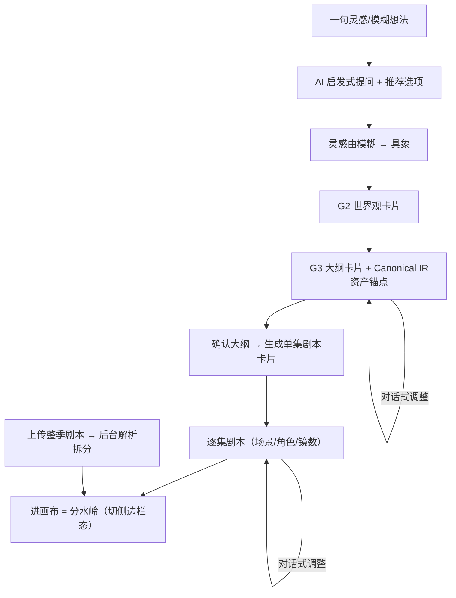
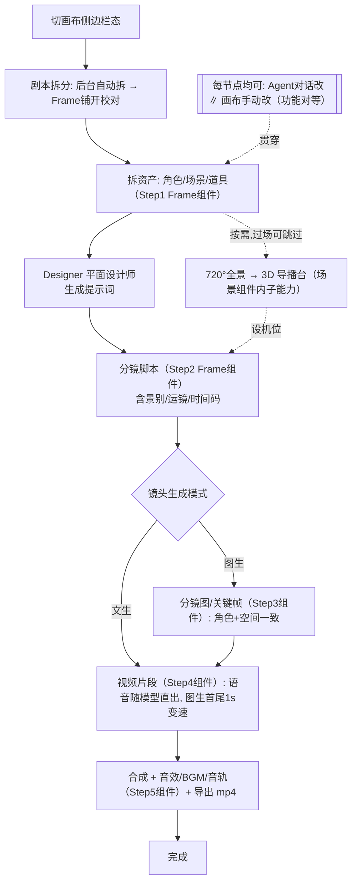
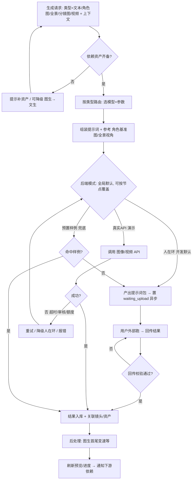
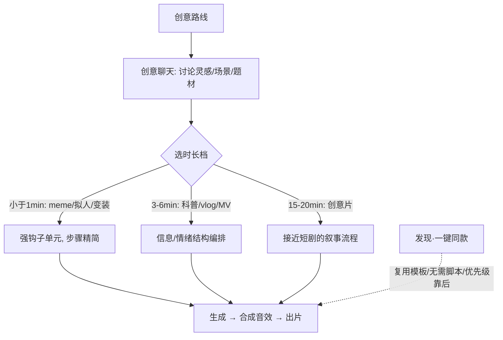
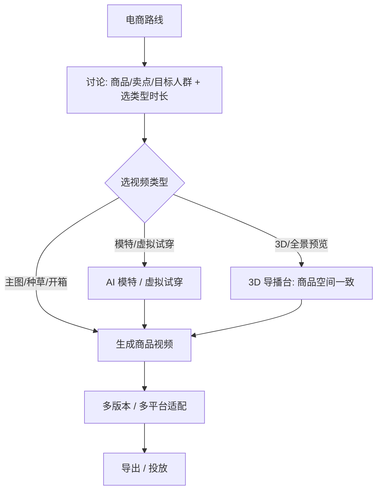
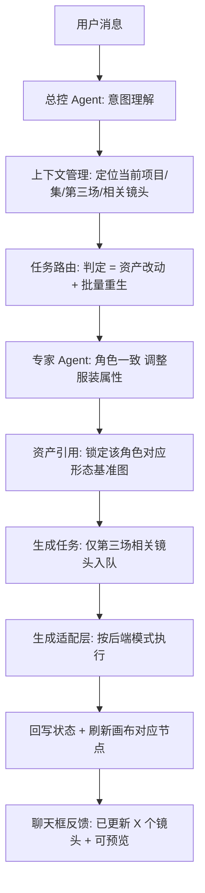
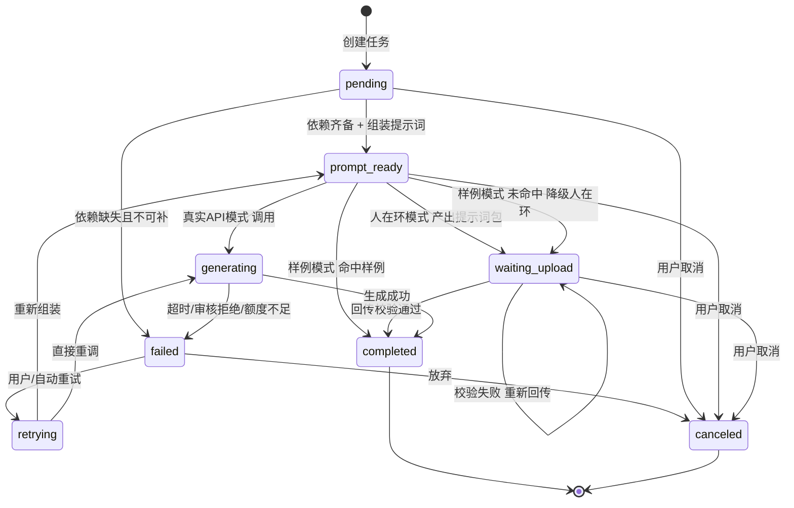
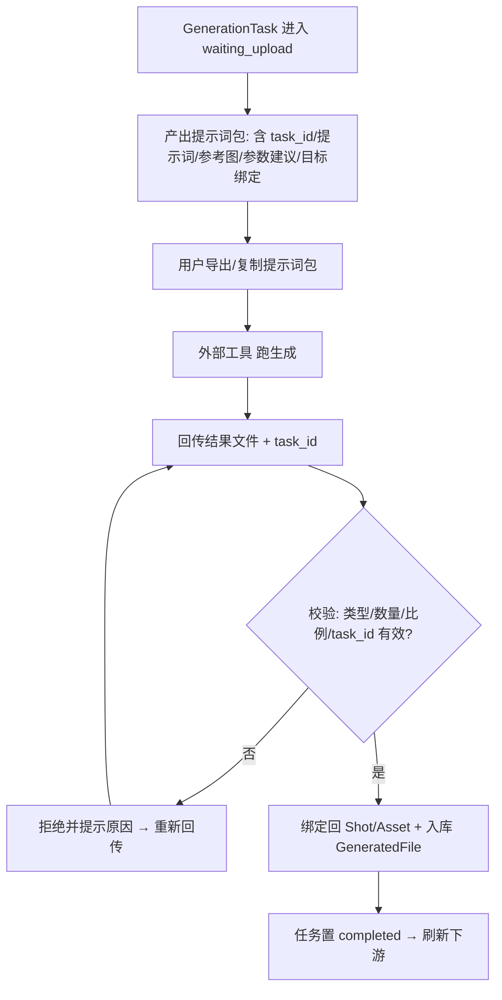

# ActNow 前后端协作契约子PRD

| 字段 | 内容 |
|------|------|
| 版本 | v0.3 |
| 日期 | 2026-06-20 |
| 状态 | 草稿 |

> **对应模块**：4.4 主流程 · 6e Agent聊天框 · 8 生成任务状态机 · 9 人在环交付协议
> **来源**：PRD.md v0.30 搬运整合 + `_prototype-deltas.md` PD-3/6/11（后端出参契约部分）
> **定位**：前后端协作的"接缝层"——这里的内容既不是纯UI也不是纯后端，是两侧必须对齐的协议、状态机、流程契约。

---

## 4.4 主流程

### 流程一：总览（两入口 → 分水岭 → 制作）

> 📌 **PD-6更新**：原版 home/chat/studio 分页跳转已改为单一工作区状态转场，流程图语义更新如下：

```mermaid
flowchart TD
    Start[新建项目·选路线] --> Home[首页大输入框 + 创作设置内嵌]
    Home --> Chat[进创意聊天室（FLIP转场，同一工作区）]
    Chat -->|一句灵感| Dev[发散→大纲→编剧（大纲气泡内inline编辑）]
    Chat -->|上传整季剧本| Parse[后台解析拆分·可对话调整]
    Dev --> WS[【分水岭】切画布侧边栏态（去"确认剧本"按钮）]
    Parse --> WS
    WS --> Make[制作: 拆分→资产→分镜→生成→合成→导出]
    Make -.Roadmap.-> Pub[发行投流]
    Discover[首页·发现瀑布流] -.浏览找灵感.-> Home
```

### 流程二：创意阶段（聊天室，发散→收敛）



### 流程三：制作阶段（画布，确定流程）



### 流程四：生成适配层（每个生成节点共用 · Harness核心）



> 生成适配层是 Harness 工程的核心枢纽，状态机详见本文第3章，人在环交付协议详见本文第4章。

### 流程五：创意短片路线（Roadmap·规划级）



### 流程六：电商视频路线（Roadmap·规划级）



---

## 6e Agent 聊天框（Harness 用户侧核心）

### 目标

让用户**纯靠对话即可驾驭完整创作工作流**——这是 Harness 工程的用户侧入口。聊天框不是旁挂的助手，而是把"自然语言意图"翻译成"工作流上的可控操作"的中枢。它与画布手动操作**功能对等**：新手用嘴、老手上手。

### 一句话指令背后发生了什么（设计核心）

以"把第三场的角色服装改成红色，重新生成这组分镜图"为例：



> 体现 Harness 四要素：**上下文感知**、**任务路由**、**资产引用**、**任务编排**。详见后端子PRD → [04-backend-harness.md](04-backend-harness.md) 模块10。

### 用户故事

| 角色 | 场景 | 需求 | 价值 |
|------|------|------|------|
| 新手 | 不会用画布 | 用自然语言完成任意编辑 | 零门槛驾驭全流程 |
| 老手 | 追求效率 | 画布手动操作、聊天框做复杂批量指令 | 双路径混用、更省 token |
| 任意用户 | 不确定 AI 做了什么 | 聊天框反馈做了哪些改动、可预览 | 调度透明、可控可信 |

### 三态形态

> ⚠️ PRD v0.30 原版：全屏 / 侧边栏 / 桌宠悬浮窗（悬浮窗仍展示对话）

📌 **原型更新 PD-3 + PD-6**（已落原型，待并入）：

| 形态 | 场景 | 原版 | 原型现状 |
|------|------|------|---------|
| 全屏 | 创意阶段主战场 | 沉浸式对话 | 沉浸式对话 + 右侧时间轴（PD-2） |
| 侧边栏（360px左栏） | 制作阶段配合画布 | 一边看画布一边对话 | 常驻agent面板（360px）+右侧画布展开 |
| **悬浮球专注模式** | 专注画布时 | 桌宠悬浮窗（仍显示对话） | **纯悬浮球，不显示对话内容**，点击唤回侧边栏 |

- **创意阶段**（stage-chat）：全屏 ↔ 悬浮球 两态
- **制作阶段**（stage-chat画布展开后）：侧边栏 ↔ 悬浮球 两态
- **全屏↔悬浮球不相邻、不可直跳**（消除闪屏，见PD-6）
- 切换不丢上下文（6e-R5保留）

### 页面与交互

| 区域 | 核心信息 | 主要操作 | 状态 | 规则 |
|------|----------|----------|------|------|
| Agent 聊天面板 | 当前上下文、消息流、操作反馈 | 对话指挥任意动作；切换三态 | 贯穿全程 | 与画布手动功能对等；操作有反馈与可预览入口 |

### 灵感 Agent 出参分层契约

📌 **原型更新 PD-11**（已落原型，供后端Agent开工，待并入模块10）：

**出参三层结构**（字段随提示词演进，当前参照旧版 `灵感agent1a_v1.2`）：

**① 正面层（用户可读可编辑）** — 大纲卡片直接渲染：
```
work_title        作品名
overview          故事概览（用户向表述）
genre             题材标签（只读）
episodes[]:
  ep_no           集号
  title           单集名称（inline可编辑）
  synopsis        单集梗概（inline可编辑）
```

**② 天眼层（暗骨/Canonical IR，G3 分阶段生成并合并，驱动后续制作）**：

> 资产出参变更（v0.3）：Asset 层只输出纯结构化数据（id/name/vis/voice/usage/status），不再包含 generation_prompt。提示词美学由 Designer agent 独立产出。
```
logic.ct:
  mix             logline/des/cst/emo_hook/prms
  rules           world/phys/power_scaling/anomaly_matrix/epistemic_cover（认知防火墙）/taboos
  arc             flaw/turn/stages S1-S5
  pressure        src/methods/continuity
  struct          nodes（付费点/midpoint/crisis/climax）+ node_tasks + constraints
assets:
  chars[]         id/name/role/gender/appearance_stages（多形态）
  locs[]          id/name/tags
  props[]         id/name/vis/usage（稳定道具锚点）
logic.thd[]       线程账本（T1主线/T2+副线，含carrier/upgrade_axis/win/payoff_slots）
logic.evidence_seeds[]   证据种子
logic.arc_track_type     弧线轨道
logic._cot_*             AI推理日志（反套路/结构自检等）
```

**③ 剧本层（编剧Agent，单集剧本卡片渲染）**：
```
ep_no / ep_title
scenes[]:
  scene_no        场次号
  int_ext         内/外景标签
  time            时间
  location        地点
  description     场景描述
  characters[]    出场角色
  est_shots       镜数
统计：场景数 / 总镜数 / 预计时长
```

> 前端渲染逻辑见 [02-frontend-ux.md](02-frontend-ux.md) PD-11章节；后端编排细节见 [04-backend-harness.md](04-backend-harness.md) 模块10。
> G3 契约：后端阶段 1 生成完整 `outline_card`，阶段 2 基于该大纲生成 `canonical_ir`，合并后通过同一个 `multi_agent.final_message_created` 事件返回；`canonical_ir.assets.chars/locs/props` 内嵌大纲卡片展示，其他内部推理字段默认不展开。
> 流式契约：G3 执行期间通过 `director.progress` 依次发送 `outline`、`canonical`、`finalizing` 阶段；前端复用同一张导演卡片增量展示大纲生成进度，不等待最终事件后一次性出现。

### 业务规则

| 编号 | 规则 | 触发条件 | 例外 |
|------|------|----------|------|
| 6e-R1 | 对话可完成全部编辑动作（拆资产/改分镜/重生成/设机位/合成…），与画布功能对等 | 任意阶段 | — |
| 6e-R2 | 聊天框感知当前上下文（项目/集/场景/镜头/资产）；无法唯一定位时列候选或反问一个澄清问题，不猜测执行 | 用户发指令 | — |
| 6e-R3 | 每次执行操作后反馈"改了什么、影响哪些对象"，并给预览入口 | 操作完成 | — |
| 6e-R4 | 复杂指令由总控Agent拆解、路由给专家Agent，对用户保持单一对话界面 | 多步骤指令 | 编排细节见04-backend-harness |
| 6e-R5 | 三态可随时切换，状态与上下文不丢失 | 用户切换形态 | — |
| 6e-R6 | G1～G3 的 `selected_agents` 必须为空；G3 两阶段任一失败都需保留可观测错误，禁止退化为资产 Agent 说明文字 | Genesis 阶段 | — |
| 6e-R7 | 审批仅接受服务端明确支持的 `action_type + target_type` 组合；未知动作必须丢弃并令 `needs_approval=false`，禁止映射成其他可执行动作 | 生产期写操作 | — |

### 验收标准

- Given 新手用户，When 全程只用对话操作，Then 能完成从拆资产到合成的全部动作。
- Given 用户说"把第三场角色服装改成红色重生成"，When 执行，Then 仅第三场相关镜头按新服装重生成、并反馈影响范围。
- Given 用户在画布专注操作，When 把聊天框收为悬浮球，Then 不影响画布操作、上下文保留。
- Given 指令存在指代歧义，When Agent无法确定目标，Then 反问澄清而非误操作。
- Given 用户确认 G2 世界观，When G3 完成，Then 前端从同一最终事件取得大纲与角色/场景/道具资产锚点；无资产时显示空态。

---

## 8. 生成任务状态机

> 对应原PRD模块8。GenerationTask 是 Harness 编排异步生成的核心载体，三种后端模式共用一套状态机。

### 8.1 状态机



### 8.2 状态转移条件

| 状态 | 含义 | 进入条件 | 可去往 |
|------|------|----------|--------|
| pending | 已创建、等依赖/排队 | 任务创建 | prompt_ready / failed / canceled |
| prompt_ready | 提示词包就绪 | 依赖资产齐备、提示词组装完成 | waiting_upload / generating / completed / canceled |
| waiting_upload | 人在环：等外部回传 | 人在环模式产出提示词包 | completed / waiting_upload(重传) / canceled |
| generating | 真实API：生成中 | 真实API调用发起 | completed / failed |
| retrying | 重试中 | failed后触发重试 | prompt_ready / generating |
| completed | 完成 | 校验通过/生成成功/命中样例 | 终态 |
| failed | 失败 | 超时/审核/额度/依赖缺失 | retrying / canceled |
| canceled | 取消 | 用户主动取消 | 终态 |

### 8.3 异步体验设计

| 场景 | 设计 |
|------|------|
| 排队 | 任务进队列，显示队列位置/预计等待；视频片段耗时最久，单列进度 |
| 进度 | 节点上显示 pending/生成中/完成/失败 状态徽标；画布与聊天框同步刷新 |
| 单镜失败 | 标红该镜，提供"重试/降级文生/外部回填"操作，不阻塞其他镜头 |
| 批量部分完成 | 整批显示"成功 X / 失败 Y"，失败项可单独重跑；已成功项可继续下游 |
| 长耗时 | 允许离开页面，完成后通知；断点续作恢复任务状态 |

### 8.4 业务规则

| 编号 | 规则 | 待确认 |
|------|------|--------|
| 8-R1 | 后端模式为全局默认、可按节点覆盖 | — |
| 8-R2 | 真实API失败默认**不自动降级**：提示用户选择 重试/降级人在环/用样例；设置可开启自动降级 | 默认手动，详设可调 |
| 8-R3 | 默认自动重试2次，超限转failed待人工处理 | 重试次数详设可调 |
| 8-R4 | 部分完成批次中，成功项不因失败项回滚 | — |
| 8-R5 | 任务状态持久化，支持断点续作恢复 | — |

---

## 9. 人在环交付协议

> 对应原PRD模块9。开发期（当前缺便宜图像/视频 API）的实际生产方式：平台产出提示词包 → 用户拿到外部工具跑 → 回传绑定。当下最常走的路径，必须做扎实。

### 9.1 人在环全流程



### 9.2 提示词包结构

| 字段 | 说明 | 必填 |
|------|------|------|
| task_id | 任务唯一标识，回传据此绑定 | 是 |
| gen_type | 角色图/全景/分镜图/视频 | 是 |
| prompt | 组装好的完整提示词（含风格/Skill注入） | 是 |
| reference_files | 参考图引用（角色基准图、全景视角图等，附下载链接） | 视类型 |
| params | 参数建议（模型、比例、分辨率、时长、首尾变速等） | 是 |
| target_binding | 目标绑定（shot_id / character_form_id / scene_id） | 是 |
| tool_hint | 外部工具说明（推荐工具/操作要点） | 否 |

### 9.3 回传与绑定规则

| 编号 | 规则 | 待确认 |
|------|------|--------|
| 9-R1 | 回传必须携带有效 task_id，据此绑定回原目标 | — |
| 9-R2 | 一个 task 可回传多文件（如多版本），按 version 入库，默认上限5版 | 上限详设可调 |
| 9-R3 | 绑定后自动关联回 Shot/Asset 并刷新下游依赖 | — |
| 9-R4 | 支持批量回传：zip包 + manifest.json（task_id ↔ 文件映射） | 打包格式详设可调 |

### 9.4 校验规则

| 校验项 | 规则 | 失败处理 |
|--------|------|----------|
| task_id 有效性 | 存在且处于 waiting_upload | 拒绝、提示无效 |
| 文件类型 | 与 gen_type 匹配（图/视频） | 拒绝、提示类型错误 |
| 比例/分辨率 | 比例须与 params 一致，分辨率不低于建议 | 比例不符**强制拒绝**；分辨率偏低**警告可继续** |
| 文件数量 | 与预期一致 | 拒绝、提示数量不符 |
| 内容绑定 | target_binding 目标仍存在 | 拒绝、提示目标已删除 |

### 9.5 业务规则

| 编号 | 规则 |
|------|------|
| 9-R5 | 提示词包对文本任务不适用（文本直接走公司API，无需人在环） |
| 9-R6 | 演示期切真实API后，人在环路径作为降级兜底保留 |
| 9-R7 | 提示词包结构与生成适配层、状态机解耦——切换后端不改协议本身 |

---

## 修改记录

> 历史行（`来源 PRD.md`）来自原 `../PRD.md` 修改记录，与本文提取内容对应；本文版本号从 v0.1 开始独立计数。

| 日期 | 版本 | 变更 |
|------|------|------|
| 2026-06-09 | 来源 PRD.md v0.5 | 模块4 主流程（本文提取：4.4 主交互流程）|
| 2026-06-09 | 来源 PRD.md v0.11 | 模块6e Agent聊天框 |
| 2026-06-09 | 来源 PRD.md v0.14 | 模块8 生成任务状态机 |
| 2026-06-09 | 来源 PRD.md v0.15 | 模块9 人在环交付协议 |
| 2026-06-09 | 来源 PRD.md v0.22 | 统一首页入口，同步4.4主流程 |
| 2026-06-09 | 来源 PRD.md v0.28 | 查漏收口：生成任务状态机默认值收口（重试次数/降级策略/批量回传/校验容差）|
| 2026-06-16 | v0.1 | 整理搬运到本文件；合并 _prototype-deltas.md PD-3/6/11 |
| 2026-06-21 | v0.3 | Agent 系统重构：新增 Designer agent 到流程三；Asset 出参去掉 generation_prompt；可编辑气泡升级审批门 |
| 2026-06-20 | v0.2 | 新增 G2→G3 两阶段流式生成与单事件合并契约；Canonical IR assets 补 props 并持久化恢复；补 Genesis worker 禁令、失败可观测规则及审批动作白名单 |
