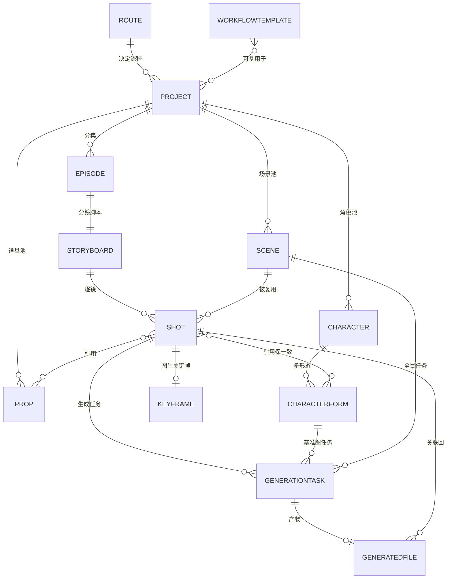
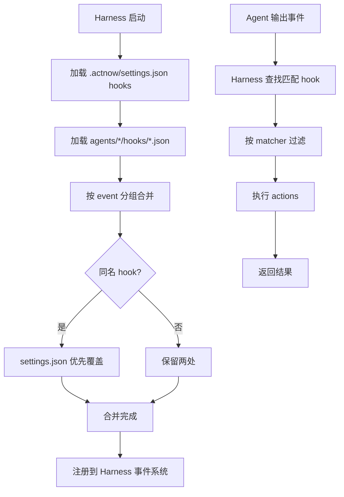
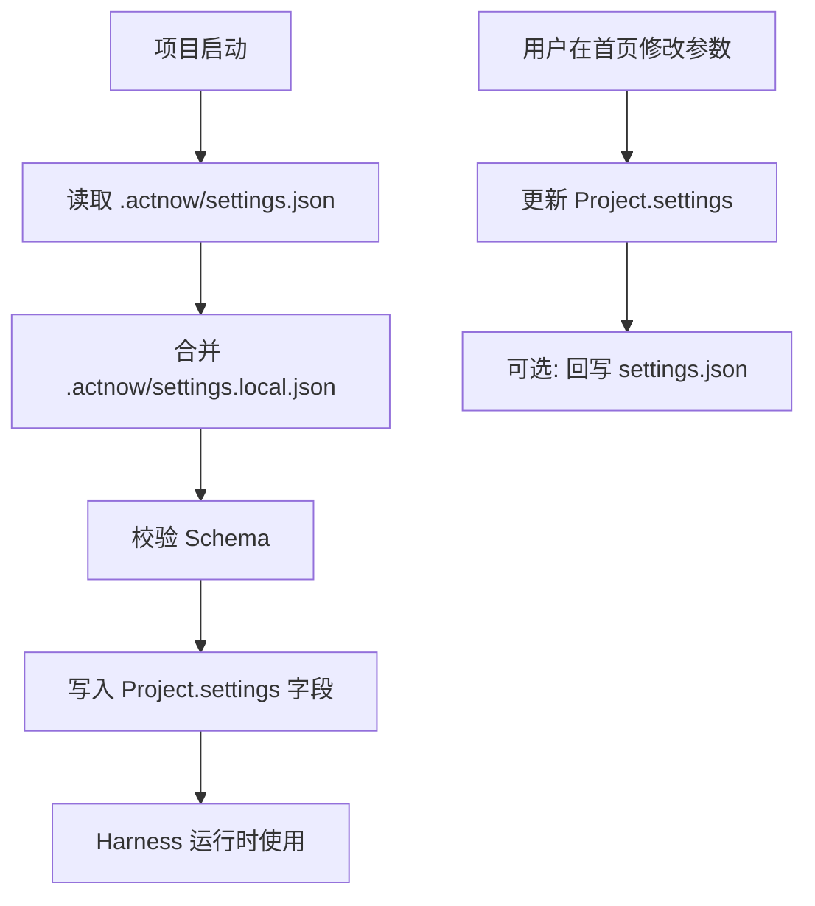
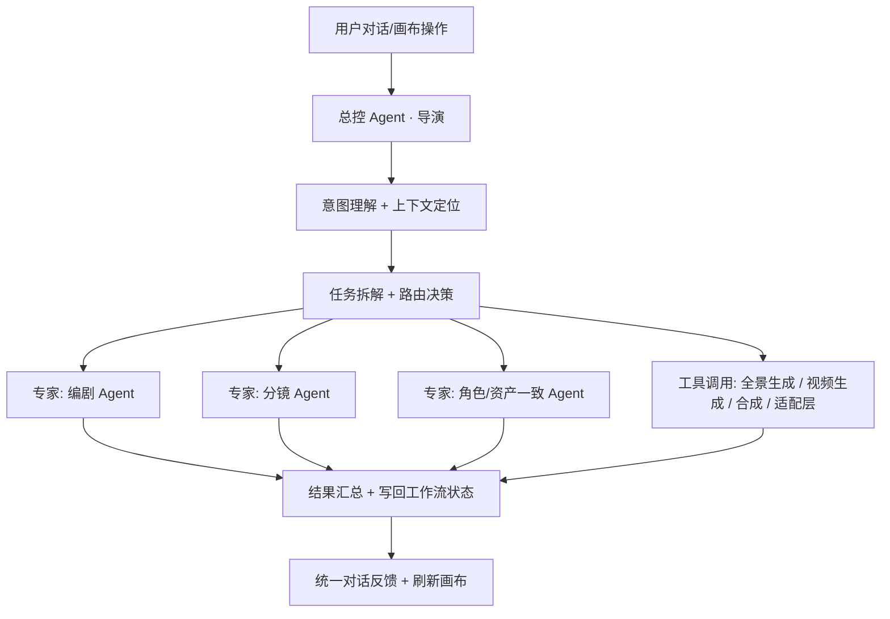

# ActNow 后端 Harness 子PRD

| 字段 | 内容 |
|------|------|
| 版本 | v0.6 |
| 日期 | 2026-06-20 |
| 状态 | 草稿 |

> **对应模块**：4.5 技术栈选型 · 7 数据模型与对象关系 · 10 Agent编排
> **来源**：PRD.md v0.30 搬运整合
> **工程真相层**：`../tech/specs/s1-s8`（React Flow、自建Harness，以specs为准）
> **注意**：PRD v0.29 技术栈有两处记录已过时，本文已按工程事实修正，见各节标注。

---

## 4.5 技术栈选型

> 原则：前后端统一 TypeScript（一人维护成本低）；模型层可切换、与框架解耦。

| 层 | 选型 | 说明 | 状态 |
|----|------|------|------|
| 前端框架 | **React + TypeScript** | — | ✅ |
| 无限画布 | **React Flow** | ⚠️ PRD v0.29 写的 tldraw 已过时，工程specs s1-s8全部基于React Flow | ✅ 工程已定 |
| UI/样式 | Tailwind CSS（建议） | 详设可调 | 待定 |
| 后端框架 | **Node.js + NestJS（TypeScript）** | 与前端同语言栈 | ✅ |
| ORM / 数据库 | **Prisma + PostgreSQL** | 结构化数据，支持 JSON 字段 | ✅ |
| Agent 编排 | **自建 Harness**（轻量编排） | ⚠️ PRD v0.29 写的 LangGraph.js 已过时，以自建为准；总控+专家图状编排（见本文模块10） | ✅ 工程已定 |
| 生成适配层 | 自研统一适配层 | 三模式切换（人在环/真API/样例），见 [03-fullstack-contract.md](03-fullstack-contract.md) | ✅ |
| 文本模型 | 公司代理 API（OpenAI 兼容多模型）`http://120.24.30.8:8098/api/proxy` | 剧本/拆资产/分镜/对话Agent等文本任务直接调用 | ✅ |
| 图像/视频模型 | 人在环（开发期）→ Kling/Seedance/Veo（真 API） | 开发期无需付费，演示期接入 | 待接入 |
| 全景生成 | PanFusion / DiT360 等开源 | 待实测选型（Q3） | 待验证 |
| 对象存储 | S3 兼容 + CDN | 生成产物冷热分层 | ✅ |
| 部署 | Docker 容器化（建议） | 详设可调 | 待定 |

---

## 7. 数据模型与对象关系

> 对应原PRD模块7。本章给出对象、关键字段、关系、数据来源与写入时机；字段为 PRD 级建议，详设阶段可微调。

### 7.1 ER 图



> Asset（资产）是 Character / Scene / Prop / 基准图 / 全景 的统称（项目内 + 全局库两层），不是独立实体表，而是资产库的聚合视图。

### 7.2 对象字段表

| 对象 | 关键字段 | 关系 | 数据来源 | 写入时机 |
|------|----------|------|----------|----------|
| **Project** | id, name, route_type, settings(风格/比例/模型/Skill), status, created_at | 属于 Route；含 Episode/Scene/Character/Prop | 用户新建 | 新建项目 |
| **Route** | type(漫剧/创意/电商), flow_config | 决定 Project 流程与题材 | 系统预置 | 内置 |
| **Episode** | id, project_id, index, title, narrative_units | 属 Project；1:1 Storyboard | 剧本拆分 | 剧本确定后 |
| **Scene** | id, project_id, desc, mode(2D/全景), pano_file_id | 属 Project；被多 Shot 复用 | 拆资产提取 | 拆资产 |
| **Shot** | id, episode_id, scene_id, 景别, 机位, 运镜, 情绪, 台词, 时长, gen_mode(文生/图生), status | 属 Storyboard/Scene；引用 CharacterForm/Prop | 分镜生成 | 分镜脚本阶段 |
| **Character** | id, project_id, name, type(人类/非人), 描述, role(主/配) | 属 Project；含多 CharacterForm | 拆资产提取 | 拆资产 |
| **CharacterForm** | id, character_id, label(年龄/身份), base_image_file_id | 属 Character；被 Shot 引用 | 用户建形态 | 拆资产/按需 |
| **Prop** | id, project_id, type(特效类/实物类), 归属, 重要度 | 属 Project；被 Shot 引用 | 拆资产提取 | 拆资产 |
| **GenerationTask** | id, target(shot/asset), gen_type(文本/角色图/全景/分镜图/视频), backend_mode, status, prompt_pkg_id, retry_count | 挂 Shot/Asset/CharacterForm/Scene | 生成请求 | 触发生成时 |
| **GeneratedFile** | id, task_id, file_type(图/视频/成片), uri, model_meta, version | 由 Task 产出；关联回 Shot/Asset | 生成完成/回传 | 生成成功 |
| **Storyboard** | id, episode_id | 属 Episode；含多 Shot | 分镜生成 | 分镜脚本阶段 |
| **Keyframe** | id, shot_id, file_id | 属 Shot（仅图生） | 图生分镜图 | 分镜图阶段 |
| **WorkflowTemplate** | id, name, node_graph, params | 可复用于多 Project | 用户存模板 | 画布存模板 |

### 7.3 关键引用关系（一致性来源）

| 关系 | 机制 | 作用 |
|------|------|------|
| Shot → CharacterForm | 镜头持有 (character_id, form_id) 引用列表，可引多角色多形态 | 角色跨镜一致的源头 |
| Shot → Scene(全景) → 视角图 | 同一全景确定性 PTZ 裁切 | 背景空间一致、不穿帮 |
| GeneratedFile → version | 同一 Shot 多次生成按版本保留，默认保留最近5版可回退、超出滚动清理 | 结果可追溯、可回退 |

> 完整存储方案（GeneratedFile落地存储、CDN/对象存储生命周期）见 [05-ops-governance.md](05-ops-governance.md) 模块12。

### 7.3.1 文件级配置系统（settings.json）

> 参考 Claude Code 的 `.claude/settings.json` 分层配置架构。

#### 配置文件位置

```
项目根目录/
├── .actnow/settings.json         ← 项目级配置（git提交，团队共享）
├── .actnow/settings.local.json   ← 本地覆盖（gitignore，个人调试用）
└── agents/
```

#### 配置层级与优先级

| 层 | 路径 | 用途 | Git |
|----|------|------|-----|
| 项目级 | `.actnow/settings.json` | 项目共享配置（风格/画风/比例/模型/全局hooks） | ✅ 提交 |
| 本地级 | `.actnow/settings.local.json` | 本地覆盖（调试/测试用） | ❌ gitignore |
| 数据库 | `Project.settings` | 运行时状态（从文件加载+用户操作合并） | — |

优先级：`local > project`（数据库是运行时状态，不是配置真源）

#### settings.json 完整 Schema

```json
{
  "project": {
    "style": "2d_korean",
    "aspect_ratio": "9:16",
    "model": "auto",
    "language": "zh-CN"
  },
  "hooks": {
    "on_genesis_complete": [
      {
        "matcher": "director.g3.*",
        "actions": [
          { "type": "db_write", "target": "Project.canonicalIrJson" },
          { "type": "emit_event", "event": "project.canonical_ir.updated" }
        ]
      }
    ],
    "on_approval_created": [
      {
        "matcher": "*",
        "actions": [
          { "type": "emit_event", "event": "ui.approval_card.show" }
        ]
      }
    ],
    "on_approval_resolved": [
      {
        "matcher": "*",
        "actions": [
          { "type": "conditional", "condition": "resolution=='confirmed'",
            "then": [
              { "type": "db_write" },
              { "type": "emit_event", "event": "agent.action.confirmed" }
            ],
            "else": [
              { "type": "emit_event", "event": "agent.action.rejected" },
              { "type": "notify_agent", "agent": "$source_agent" }
            ]
          }
        ]
      }
    ],
    "on_script_draft": [
      {
        "matcher": "screenwriter.*",
        "actions": [
          { "type": "db_write", "target": "ScriptDraft" },
          { "type": "parallel_invoke", "agents": [
            { "agent": "asset", "intent": "asset_extraction" },
            { "agent": "designer", "intent": "design_prompt" }
          ]}
        ]
      }
    ],
    "on_script_revision": [
      {
        "matcher": "screenwriter.*",
        "actions": [
          { "type": "db_write", "target": "ScriptDraft" },
          { "type": "notify_downstream", "affected": ["asset", "designer", "storyboard"] }
        ]
      }
    ]
  },
  "permissions": {
    "allow": [],
    "deny": []
  }
}
```

#### Hook Action 类型定义

| Action 类型 | 参数 | 说明 |
|------------|------|------|
| `db_write` | target, source | 写入数据库指定表 |
| `emit_event` | event, payload | 发送事件到前端/事件总线 |
| `invoke_agent` | agent, intent, background | 调用指定 Agent |
| `parallel_invoke` | agents[] | 并行调用多个 Agent |
| `conditional` | condition, then, else | 条件分支 |
| `notify_agent` | agent, message | 通知指定 Agent |
| `notify_downstream` | affected[] | 通知所有下游 Agent |
| `check_gate` | gate, conditions, on_ready | 等待多个条件满足后触发 |
| `create_generation_tasks` | source, mode | 创建生成任务 |
| `webhook` | url, method, headers | 调用外部 HTTP 接口 |

#### Hook 加载与合并流程



#### settings.json 与 Agent hooks 的职责划分

| Hook | 归属 | 理由 |
|------|------|------|
| `on_genesis_complete` | settings.json | Harness 层编排逻辑 |
| `on_approval_created` | settings.json | Harness 层 UI 交互 |
| `on_approval_resolved` | settings.json | Harness 层审批流 |
| `on_script_draft` | settings.json | Harness 层并行编排 |
| `on_script_revision` | settings.json | Harness 层下游通知 |
| `on_asset_complete` | agent/asset/hooks/ | Asset 自己的生命周期 |
| `on_design_complete` | agent/designer/hooks/ | Designer 自己的生命周期 |
| `on_storyboard_complete` | agent/storyboard/hooks/ | Storyboard 自己的生命周期 |

#### 加载流程



#### 与现有设计的关系

| 现有设计 | 配置系统补充 |
|---------|------------|
| 首页风格/比例/模型控件 | 值写入 settings.json + Project.settings |
| `inject_project_params` tool | 从 Project.settings 读取（已从 settings.json 加载） |
| Agent hooks（各agent/hooks/目录） | 保留，agent自己声明生命周期 |
| 全局hooks | 新增：settings.json 的 hooks 字段，跨agent的全局事件处理 |
| `on_approval_created/resolved` | 从agent目录移到settings.json（属于Harness层，不属于agent） |

### 7.4 工程现状 vs PRD 数据模型的差距（来源：tech/10-prototype-flow-alignment.md v0.2）

> ⚠️ 以下是 PRD 规划模型与当前 schema.prisma 之间的实际差距，进入研发前需补齐。

**当前 schema.prisma 实际有的表**：
User / Workspace / Project / Episode / ScriptDraft / Scene / Shot / CanvasDocument / AgentThread / AgentMessage / AgentEvent

**需要新增的表**：

| 表 | 字段 | 原因 |
|----|------|------|
| `Asset` | `id, projectId, kind(character/scene/prop), name, tagsJson, status, createdAt, updatedAt` | T3 资产拆解落库；当前完全没有 |
| `Approval` | `id, threadId, runId, status, actionsJson, resolvedAt` | 当前 approval 状态塞在 AgentEvent.payloadJson，确认动作靠全表扫；性能差且状态机难维护 |

**需要在现有表新增的字段**：

| 表 | 新增字段 | 原因 |
|----|---------|------|
| Project | `logline String?`, `genreTags Json?`, `canonicalIrJson Json?` | 正面层（剧名/概览/题材）+ 天眼层 Canonical IR 存储 |
| Episode | `synopsis String?` | 分集大纲（导演产出，可改集数） |
| ScriptDraft | `contentJson Json?` | 结构化剧本（叙事单元/场景头/动作行/台词行），现有 content 保留纯文本镜像 |

**当前实现的已知 bug 修复**（tech/10 §6 记录）：

| # | 问题 | 状态 |
|---|------|------|
| 3 | `lockScript` 把 `settings` 对象 `String()` 转换为 `"[object Object]"` 写入 ScriptDraft | ✅ 已修（`9448482`）|
| 4 | 模型名 `deepseek-v4-pro/flash` 硬编码 fallback 散落多处 | 待收敛到 TextModelService / env |

**实施切片（来自 tech/10 §7）**：

| 切片 | 范围 | 依赖 |
|------|------|------|
| S-A | 数据地基：Asset + Approval 表 + Project/Episode/ScriptDraft 新增字段 + migration | — |
| S-B | 导演路由改造：接灵感提示词 + create_outline action | S-A |
| S-C | 大纲落库：outline.generated + create_outline 确认写入 | S-A, S-B |
| S-D | 第1集剧本：script.generated + draft_script 写入结构化 ScriptDraft | S-A, S-C |
| S-E | 第1集资产：asset.extracted + create_asset 写入 Asset | S-A, S-D |
| S-F | 推入画布：canvas 初始化对齐 studio | S-E |
| S-G | 前端工程化：workspace.html → React 真前端（工作量最大，可 S-A~F 完成后并行）| S-A~F |

---

## 10. Agent 编排（自建 Harness）

> 对应原PRD模块10。架构已定：混合制 = 1 总控（导演）+ 少量专家 Agent；视频/合成等为工具调用。
> **框架**：自建 Harness（非 LangGraph，PRD v0.29 有误，以工程事实为准）

### 10.1 编排架构



### 10.2 Agent 清单与职责边界

| Agent | 角色 | 职责 | 边界（不做） |
|-------|------|------|--------------|
| **Director 导演** | 灵感大脑 + 总控 | **创意阶段直接生成**（G1 发散、G2 创世、G3 大纲）+ 制作阶段意图识别与路由协调 | 不做分镜/资产/提示词 |
| **Screenwriter 编剧** | 创作专家 | 按 Canonical IR 骨架起草/修改剧本 | 不做分镜/资产 |
| **Asset 资产师** | 数据专家 | 从大纲/剧本中收集解耦结构化资产数据（纯数据，不含提示词） | 不做提示词美学 |
| **Designer 平面设计师** | 美学专家 | 从资产结果生成角色/场景/道具/封面的 generation_prompt | 不做分镜提示词 |
| **Storyboard 分镜师** | 制作专家 | 分镜脚本 + 景别/机位/运镜/情绪/时间码 + integrated_prompt（分镜+摄影合并） | 不做资产/提示词 |
| 工具调用（非 Agent） | 执行 | 全景生成、图像/视频生成、合成、生成适配层 | 无自主决策，受编排驱动 |

> 设计取舍：比单 Agent 更有"团队感"（呼应"一人顶团队"），又比 OiiOii 七 Agent 更轻、更可控、更省 token。MVP 先落地总控 + 这三个专家，其余能力以工具调用承接。

### 10.3 编排与路由

| 指令类型 | 路由 | 示例 |
|----------|------|------|
| 创意类 | 总控 → 编剧 Agent | "把结局改得更反转" |
| 分镜类 | 总控 → 分镜 Agent | "第三场多给两个特写" |
| 资产/一致类 | 总控 → 角色资产 Agent | "把女主改成成年形态" |
| 生成类 | 总控 → 工具调用（经适配层） | "重生成这组分镜图" |
| 复合类 | 总控拆解 → 多 Agent/工具串行/并行 | "改服装并重生成第三场" |

> Genesis 路由硬约束：`genesis_step=expand/params/create/outline` 时 `selected_agents=[]`。G3 由 Harness 分两次模型调用：阶段 1 只生成完整 `outline_card`，阶段 2 基于该大纲生成 `canonical_ir`，后端合并为一个大纲结果，避免长 JSON 截断。
> G3 流式可观测性：Harness 在两阶段执行中发送 `director.progress`，阶段顺序固定为 `outline → canonical → finalizing`；最终 Canonical IR 写入 `Project.canonicalIrJson`，重进项目后自动注入后续对话上下文。

### 10.4 上下文交接与记忆

| 机制 | 设计 | 待确认 |
|------|------|--------|
| 上下文定位 | 总控维护当前焦点（项目/集/场景/镜头/选中资产），专家按焦点层级 + 选中对象取切片 | 切片粒度详设可调 |
| 跨阶段记忆 | 项目级持久化全量结构化状态；长对话按窗口 + 摘要裁剪 | 裁剪策略详设可调 |
| 专家间交接 | 经总控汇总，MVP **不允许**专家直接链式调用，避免失控 | 链式协作留迭代 |
| 编排动态性 | MVP 静态规则路由；动态规划留 Roadmap | — |

### 10.5 可回滚点

| 回滚点 | 机制 |
|--------|------|
| 单镜生成 | 保留版本，可回退到上一版（见模块7 version字段，默认5版） |
| 资产改动 | 资产变更不自动覆盖已用镜头，提示影响范围后再批量重生 |
| 剧本/分镜定稿 | 分水岭与定稿为关键检查点，可回退重做 |

### 10.6 灵感 Agent 出参分层契约

> 对应PD-11后端部分，完整字段见 [03-fullstack-contract.md](03-fullstack-contract.md) 6e章节。

编剧 Agent（灵感Agent）输出三层结构：
- **① 正面层**：用户可读可编辑，渲染为大纲卡片（前端）
- **② 天眼层（Canonical IR）**：AI 暗骨推理，包含五大契约（mix/rules/arc/pressure/struct）+ assets + 线程账本 + 证据种子 + 推理日志；驱动后续制作，其中 `assets.chars/locs/props` 在 G3 大纲卡片内展示
- **③ 剧本层**：编剧 Agent 输出单集剧本，渲染为单集剧本卡片（前端）

### 10.7 业务规则

| 编号 | 规则 |
|------|------|
| 10-R1 | 对用户始终是单一对话界面，内部多 Agent 调度透明可见（反馈做了什么） |
| 10-R2 | 复合指令由总控拆解，执行前可向用户确认影响范围 |
| 10-R3 | 专家不直接互调，统一经总控汇总，保证可控可回滚 |
| 10-R4 | MVP 落地总控 + 编剧/分镜/角色资产三专家；编排细化与动态性留迭代 |
| 10-R5 | Genesis 阶段由导演独立生成结构化卡片，不得调用制作期 worker；代码层覆盖模型路由结果 |
| 10-R6 | G3 大纲与 Canonical IR 分阶段调用、统一合并；任一阶段错误必须进入可观测报告，不得伪装成资产 Agent 文本回复 |
| 10-R7 | 审批动作按服务端支持矩阵严格校验；未知 `action_type` 或 `target_type` 不得降级映射为其他写操作，也不得创建审批单 |

---

---

## 附：研发前需决策的开放问题（来源：tech/10-prototype-flow-alignment.md OQ1-OQ6）

| 编号 | 问题 | 影响 |
|------|------|------|
| OQ1 | **Asset 建模**：单一 `Asset(kind=character/scene/prop)` 表 vs Character/Scene/Prop 分表？ | S-E create_asset 落库结构 |
| OQ2 | **剧本存储**：`ScriptDraft.contentJson` 结构化存储 vs 约定 markdown 文本格式？ | S-D draft_script 写入 |
| OQ4 | **天眼层接入时机**：`canonicalIrJson` 字段本期建（空结构占位）还是等提示词定稿再建？ | S-C 大纲落库；PD-11 建议先预留不写死 |
| OQ5 | **画布 studio 完整度**：S-F 仅初始化资产框+剧本节点，还是含分镜/分镜图/视频/合成全套？ | S-F 画布初始化范围 |
| OQ6 | **上传整季剧本入口**：本期实现（整季解析拆分），还是先只做一句话灵感入口？ | T0 前端入口实现 |

---

## 修改记录

> 历史行（`来源 PRD.md`）来自原 `../PRD.md` 修改记录，与本文提取内容对应；本文版本号从 v0.1 开始独立计数。

| 日期 | 版本 | 变更 |
|------|------|------|
| 2026-06-09 | 来源 PRD.md v0.13 | 模块7 数据模型与对象关系 |
| 2026-06-09 | 来源 PRD.md v0.16 | 模块10 Agent编排 |
| 2026-06-09 | 来源 PRD.md v0.28 | 查漏收口：编排策略/上下文裁剪等默认值收口 |
| 2026-06-09 | 来源 PRD.md v0.29 | ⚠️ 模块4.5 技术栈选型（原文tldraw+LangGraph.js，**本文已按工程事实修正为 React Flow + 自建Harness**）|
| 2026-06-16 | v0.1 | 整理搬运到本文件；修正技术栈冲突 |
| 2026-06-16 | v0.2 | 补充 §7.4 数据模型差距（来源：tech/10-prototype-flow-alignment.md）+ 实施切片 S-A~G + OQ1-OQ6 开放问题 |
| 2026-06-20 | v0.3 | 新增 Genesis worker 代码层禁令、G3 outline/Canonical IR 两阶段流式调用与统一合并、项目持久化恢复、错误可观测及审批动作严格校验规则 |
