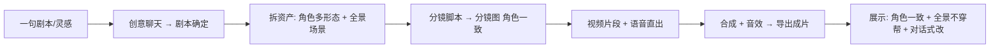

# ActNow 运营与治理子PRD

| 字段 | 内容 |
|------|------|
| 版本 | v0.1 |
| 日期 | 2026-06-16 |
| 状态 | 草稿 |

> **对应模块**：11 业务规则与异常 · 12 数据埋点权限账号 · 13 上线与运营 · 14 风险待决自检
> **来源**：PRD.md v0.30 搬运整合

---

## 11. 业务规则与异常

### 11.1 全局业务规则

| 编号 | 规则 |
|------|------|
| G-R1 | 项目带"路线类型"字段，全流程按路线分流；MVP 仅漫剧落地，创意/电商入口引导至 Roadmap |
| G-R2 | 分水岭（剧本确定/进画布）是关键检查点：之前=聊天室发散，之后=确定性制作流程 |
| G-R3 | 对话操作与画布操作功能对等、状态同步，任意时刻可互换 |
| G-R4 | 所有图像/视频生成经统一生成适配层，后端模式全局默认可按节点覆盖 |
| G-R5 | 项目进度持久化，支持断点续作，关闭重进恢复进度与资产 |

### 11.2 版权与合规（以免责声明为核心，轻量）

> 策略：平台不承担内容版权审查，通过**免责声明协议**把版权与合规责任转移给用户自负。

| 议题 | 方案 | 期次 |
|------|------|------|
| 免责声明（核心） | 用户注册/创作时勾选免责协议，生成内容的版权与合规责任由用户自负；平台不做版权审查 | MVP |
| 上传素材版权 | 用户上传参考图的版权由用户自负（含于免责协议） | MVP |
| AI 生成标识 | 输出可注明"AI 生成"（合规友好） | Roadmap 增强 |
| 平台审核 / 水印溯源 | 违规拦截、水印溯源等 | Roadmap 增强 |

> 注：免责协议具体条款属法务范畴，PRD 不拟定文本，只定"注册/创作时勾选、用户自负"的产品机制。

### 11.3 异常处理总览

| 异常 | 触发 | 处理 |
|------|------|------|
| 依赖资产缺失 | 生成时依赖不齐 | 提示补资产；可降级（图生→文生） |
| 生成失败 | 超时/审核/额度 | 重试 / 降级人在环或样例 / 报错（见 [03-fullstack-contract.md](03-fullstack-contract.md) 模块8） |
| 回传校验失败 | 人在环回传不合规 | 拒绝并提示原因，要求重传（见同文件模块9） |
| 外部依赖不可用 | 公司API/全景/视频模型故障 | 切兜底模式（样例）保证流程可演示 |
| 部分批次失败 | 批量生成部分失败 | 成功项保留、失败项单独重跑，不整批回滚 |
| 指代歧义 | Agent 无法定位目标 | 反问澄清，不误操作 |
| 进度丢失风险 | 异常关闭 | 状态持久化 + 断点续作恢复 |

---

## 12. 数据、埋点、权限与账号

> MVP 为单人创作场景，权限从简；团队协作与商业化（积分/配额）见 Roadmap。

### 12.1 账号与权限

| 项 | MVP | Roadmap |
|----|-----|---------|
| 账号 | 基础登录/注册（**注册勾选免责声明协议**）；账号管理（个人页）| 第三方登录、组织账号 |
| 权限 | 单人=自己项目全权限 | 团队协作与角色权限管理 |
| 资产归属 | 资产归账号，可跨自己项目复用 | 团队共享资产库、Skill 市场授权 |

### 12.2 存储

| 数据 | 方案 | 待确认 |
|------|------|--------|
| 结构化数据（Project/Episode/Shot/资产元数据等） | PostgreSQL（关系型，支持 JSON 字段存灵活属性） | 详设可调 |
| GeneratedFile（图/视频/成片） | S3 兼容对象存储 + CDN；产物冷热分层 | 生命周期策略详设可调 |
| 项目状态/上下文 | 持久化，支持断点续作 | — |

### 12.3 关键埋点（围绕 MVP 验收与体验）

| 埋点 | 目的 |
|------|------|
| 端到端完成率 | 进入制作 → 导出成片的漏斗 |
| 各生成节点成功率/耗时 | 定位瓶颈（视频片段预计最久） |
| 重试/失败/降级次数 | 评估外部依赖与后端稳定性 |
| 对话 vs 画布操作占比 | 验证双路径对等的实际使用 |
| 一致性主观评分入口 | 角色一致/全景不穿帮的人工评审记录 |
| 后端模式切换 | 人在环/真API/样例使用分布 |
| 断点续作触发 | 进度恢复成功率 |

---

## 13. 上线与运营

### 13.1 后端三模式切换（开发→演示→兜底）

| 模式 | 用途 | 切换时机 |
|------|------|----------|
| 人在环 | 开发期默认（当前缺便宜 API） | 日常开发/内测 |
| 真实 API | 现场演示/上线 | 演示前接入图像/视频真 API |
| 预置样例 | 兜底演示 | 网络/额度异常时保证流程可跑通 |

> 文本任务始终走公司代理真 API；切换主要针对图像/视频节点。统一适配层保证切换零重构（见 [03-fullstack-contract.md](03-fullstack-contract.md) 生成适配层流程图）。

### 13.2 Demo 演示路径

| 演示要点 | 对应能力 |
|----------|----------|
| 一句剧本生成角色一致分镜 | 核心演示场景（6a/6c） |
| 正反打不穿帮 | 720° 全景 + 3D 导播台（6b） |
| 对话式定向改 | Agent 聊天框（6e） |
| 后端可切换 | 演示接真 API / 兜底样例（模块8） |

### 13.3 移动端（最低优先级）

| 项 | 说明 |
|----|------|
| 形态 | 制作阶段走步骤式 tab（确定流程适合步骤引导） |
| 创意阶段 | 进入即聊天，与桌面一致 |
| 优先级 | Roadmap 垫底，MVP 不实现 |

---

## 14. 风险、待决事项与自检

### 14.1 风险登记

| 风险 | 等级 | 现状/缓解 |
|------|------|-----------|
| 全景→分镜图→视频 空间一致 pipeline | 高 | 已调研可行（ERP 确定性裁切 + i2v 锁机位）；待落地实测 |
| 视频模型直出中文台词+对口型 | 高 | 已调研可行（Kling 3.0/Seedance 2.0/Veo 3.1）；闭源付费 |
| 全景开源选型落地 | 高 | PanFusion/DiT360/SD-T2I-360 候选；待实测选型（Q3） |
| 异步生成体验复杂度 | 中 | 状态机+部分失败处理已设计（模块8）；细节待打磨 |
| 外部依赖稳定性（API/额度/审核） | 中 | 三模式切换+兜底样例 |
| Agent 编排复杂度 | 中 | MVP 收敛为总控+3专家+工具调用，控制复杂度 |
| 美术风格跨镜/跨集一致 | 中 | 机制已定（6c-R8：风格锁定+统一注入）；一致性强度真 API 期验证 |

### 14.2 待决事项

**需外部动作/实测（PRD 无法纯文档解决，保留）**

| 编号 | 事项 | 归属 |
|------|------|------|
| Q3 | 全景开源模型选型实测 | 技术验证 |
| Q4 | LuxReal 界面抓取做视觉对标 | 设计 |

**已收口项（不再阻塞）**

> 原各模块 `[待确认]` 已收口为工程默认值：形态引用 (character_id,form_id) 多对多 / 版本保留5版 / 自动重试2次 / 降级默认手动 / 批量回传=zip+manifest / 校验容差=比例强制/分辨率警告 / 存储=PostgreSQL+S3 / 上下文裁剪/编排策略。详设阶段可微调，不再阻塞。

**技术栈冲突已解决**（见 [04-backend-harness.md](04-backend-harness.md)）：
- tldraw → **React Flow**（工程已定）
- LangGraph → **自建 Harness**（工程已定）

### 14.3 自检结果

| 自检项 | 结果 |
|--------|------|
| 目标、范围、功能需求是否一致 | ✅ 模块3 范围 ↔ 模块5/6 功能一一对应 |
| 用户角色、权限、状态名称全文一致 | ✅ 进阶/入门用户、生成任务状态名（pending/prompt_ready/waiting_upload/generating/completed/failed/canceled）全文统一 |
| 每个核心流程是否覆盖成功/失败/空/等待 | ✅ 生成链路覆盖成功/失败/重试/部分完成/等待 |
| 规则是否能落到触发条件、处理结果、例外 | ✅ 各模块业务规则表含触发/例外/待确认 |
| 数据来源、字段含义、写入时机是否明确 | ✅ 模块7 对象字段表含来源/写入时机；存储选型已定 PostgreSQL+S3 |
| 待确认项是否收口 | ✅ 详设参数已收口为工程默认值并标"详设可调"；仅Q3/Q4/风格一致强度+免责条款保留 |

### 14.4 待完善（进入研发前需收口）

1. **技术实测类**：Q3 全景选型、全景→视频 pipeline、中文对口型真机验证
2. **设计类**：Q4 界面对标（LuxReal 截图/录屏）
3. **法务类**：免责协议条款文本（机制已定，条款由法务拟定）

---

## 修改记录

> 历史行（`来源 PRD.md`）来自原 `../PRD.md` 修改记录，与本文提取内容对应；本文版本号从 v0.1 开始独立计数。

| 日期 | 版本 | 变更 |
|------|------|------|
| 2026-06-09 | 来源 PRD.md v0.17 | 模块11 业务规则与异常 |
| 2026-06-09 | 来源 PRD.md v0.18 | 模块12 数据·埋点·权限·账号 |
| 2026-06-09 | 来源 PRD.md v0.19 | 模块13 上线与运营 |
| 2026-06-09 | 来源 PRD.md v0.20 | 模块14 风险·待决·自检 |
| 2026-06-09 | 来源 PRD.md v0.22 | 统一首页入口，同步模块11业务规则 |
| 2026-06-09 | 来源 PRD.md v0.27 | 版权/免责声明更新，同步11/12/14（免责声明入MVP，平台不做版权审查）|
| 2026-06-09 | 来源 PRD.md v0.28 | 查漏收口：存储方案/待确认项全部收口为默认值 |
| 2026-06-16 | v0.1 | 整理搬运到本文件 |
