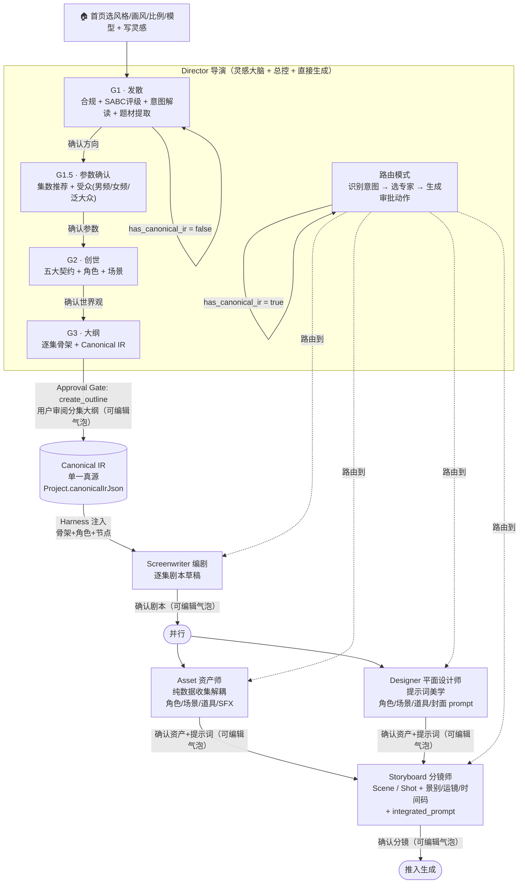
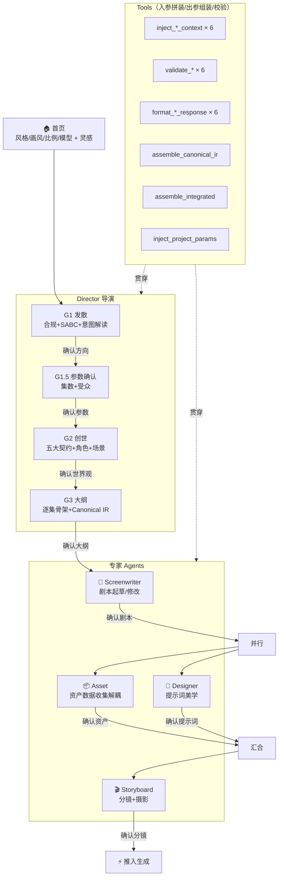

# ActNow Multi-Agent 系统子PRD

| 字段 | 内容 |
|------|------|
| 版本 | v0.6 |
| 日期 | 2026-06-21 |
| 状态 | 草稿 |

> **来源**：`agents/AGENTS-PRD.md` v0.3（2026-06-15）+ `prd/Multi-Agent-Chatroom/PRD-Multi-Agent-Chatroom.md` v0.4（2026-06-14）
> **工程骨架文件**：`apps/api/src/services/multi-agent-orchestrator.service.ts` / `agent-registry.service.ts` / `agent-events.service.ts`
> **Schema真相**：`packages/db/prisma/schema.prisma`（部分字段与PRD module 7有出入，见本文末节）

---

## 1. 系统定位

ActNow Multi-Agent 系统承担"灵感 → 世界观 → 剧本 → 分镜 → 资产"全链路。每个环节由专职 Agent 处理，通过 Harness 协调调用、传递上下文、管理审批门。

**设计原则**：导演就是灵感大脑，世界观（Canonical IR）由导演亲自在 G2 创世阶段生成，不另设 World Builder。

---

## 2. 架构总图



**关键约束**：
- Canonical IR 只由 Director G2 生成，每项目一次
- 所有专家 Agent 只读 Canonical IR，不能写
- 任何写库动作都必须经过用户审批门（Agent 零直接写库权限）

---

## 2.1 完整 Agent 编排流程

```mermaid
sequenceDiagram
    participant U as 用户
    participant FE as 前端
    participant H as Harness
    participant D as Director
    participant SW as Screenwriter
    participant AS as Asset
    participant GD as Designer
    participant SB as Storyboard
    participant DB as 数据库

    rect rgb(40, 40, 60)
    Note over U,DB: ═══ 首页 ═══
    U->>FE: 选风格/画风/比例/模型 + 写灵感
    FE->>H: {settings, user_input}
    H->>H: 保存settings到project
    end

    rect rgb(50, 40, 40)
    Note over U,DB: ═══ G1 发散 ═══
    H->>H: inject_director_context
    H->>D: G1调用
    Note over D: ★ 合规+SABC+意图解读<br/>+性别判定+题材提取<br/>生成差异化方向
    D-->>H: direction JSON
    H->>H: format_director_response
    H->>FE: DirectionCard(可编辑)
    U->>H: 确认方向
    end

    rect rgb(50, 50, 40)
    Note over U,DB: ═══ G1.5 参数确认 ═══
    H->>D: G1.5调用
    Note over D: ★ 推荐集数+理由<br/>受众(男频/女频/泛大众)
    D-->>H: param_collection JSON
    H->>FE: ParamCard(集数可自定义, 受众3选1)
    U->>H: 确认参数
    end

    rect rgb(40, 50, 40)
    Note over U,DB: ═══ G2 创世 ═══
    H->>H: inject_director_context(+params)
    H->>D: G2调用
    Note over D: ★ precheck+signal<br/>+contracts+anchors
    D-->>H: world_card JSON
    H->>H: format_world_card
    H->>FE: WorldCard(可编辑:<br/>title/logline/角色/机制/红线)
    U->>H: 确认世界观
    end

    rect rgb(40, 50, 50)
    Note over U,DB: ═══ G3 大纲 ═══
    H->>H: inject_director_context(+canonical_ir_so_far)
    H->>D: G3-骨架调用
    Note over D: ★ spine+ep123
    D-->>H: spine[] JSON
    H->>H: assemble_canonical_ir<br/>(tool: contracts+anchors+spine+meta→完整IR)
    H->>H: validate_canonical_ir<br/>(tool: 结构校验)
    H->>D: G3-自检调用
    Note over D: ★ selfcheck
    D-->>H: 自检结果
    H->>H: format_outline_card
    H->>FE: OutlineCard(可编辑:<br/>逐集synopsis/hook/资产锚点)
    H->>DB: on_genesis_complete<br/>写入canonicalIrJson
    U->>H: 确认大纲
    end

    rect rgb(60, 40, 40)
    Note over U,DB: ═══ 编剧 ═══
    H->>H: inject_screenwriter_context<br/>(tool: spine+chars+locs+meta+rules)
    H->>SW: script_draft(第1集)
    Note over SW: ★ writing_rules<br/>+dialogue_spec
    SW-->>H: script JSON
    H->>H: validate_script<br/>(tool: 字数/台词/句长/禁词)
    H->>H: format_script_response<br/>(tool: →ScriptCard)
    H->>FE: ScriptCard(可编辑:<br/>场景/台词/动作)
    U->>H: 确认剧本
    H->>DB: 写入ScriptDraft
    end

    rect rgb(40, 40, 60)
    Note over U,DB: ═══ 资产 + 平面设计（并行） ═══

    par 资产师
        H->>H: inject_asset_context<br/>(tool: outline+script+chars/locs)
        H->>AS: asset_extraction
        Note over AS: ★ extraction_rules
        AS-->>H: asset JSON(纯数据, 无prompt)
        H->>H: validate_asset<br/>(tool: 字段/ID/去重)
        H->>H: format_asset_response<br/>(tool: →AssetCard)
        H->>FE: AssetCard(可编辑:<br/>角色/场景/道具/SFX各项)
    and 平面设计师
        H->>H: inject_designer_context<br/>(tool: asset预览+meta.style+settings)
        H->>GD: design_prompt
        Note over GD: ★ prompt_structure<br/>+visual_tags+character_prompt<br/>+scene_prompt+cover_design
        GD-->>H: prompts JSON
        H->>H: validate_prompt<br/>(tool: 字数/禁词/结构)
        H->>H: format_prompt_response<br/>(tool: →PromptCard)
        H->>FE: PromptCard(可编辑:<br/>各角色/场景/道具/封面提示词)
    end

    U->>H: 确认资产+提示词
    H->>DB: 写入Asset + DesignPrompt
    end

    rect rgb(50, 40, 60)
    Note over U,DB: ═══ 分镜 ═══
    H->>H: inject_storyboard_context<br/>(tool: script+asset+design_prompts+meta)
    H->>SB: storyboard_breakdown
    Note over SB: ★ shot_spec+camera_spec<br/>+group_spec+style_route
    SB-->>H: scenes/shots JSON
    H->>H: validate_storyboard<br/>(tool: 8项校验)
    H->>H: assemble_integrated<br/>(tool: →integrated_prompt)
    H->>H: format_storyboard_response<br/>(tool: →StoryboardCard)
    H->>FE: StoryboardCard(可编辑:<br/>景别/运镜/时长/转场<br/>+integrated_preview)
    U->>H: 确认分镜
    H->>DB: 写入Scene/Shot
    H->>H: on_storyboard_complete<br/>→ 推入生成
    end
```



## 2.2 全局视图（简化版）



## 3. 各 Agent 规格

### 3.1 Director（导演）

| 项目 | 值 |
|------|----|
| 文件 | `agents/director/system.md` |
| 模型 | `deepseek-v4-pro` |
| 触发时机 | 用户每次发消息 |
| maxTurns | 1 |
| background | false |
| Tools | []（Phase 2 可选 search_trends）|

**四个创世阶段 + 路由模式**（详见 §4 genesis_step 状态机）：

| 阶段 | genesis_step | 触发条件 | 产物 | 状态 |
|------|-------------|----------|------|------|
| G1 发散 | `"expand"` | `has_canonical_ir=false` | expansion / option_cards / quick_poll | ✅ 已实现 |
| G1.5 参数收集 | `"params"` | 用户点击方向卡 | `param_collection`（集数/画风/节奏/受众）| ✅ 已实现 |
| G2 世界观草稿 | `"create"` | 用户确认参数 | `world_card`（title/logline/角色/机制/红线）| ✅ 已实现（同步） |
| G3 正式大纲 | `"outline"` | 用户确认世界观 | 两阶段生成并合并：分集骨架 + Canonical IR（含角色/场景/道具资产） | 🟡 生成、事件与前端展示已实现；项目持久化待补 |
| 路由模式 | N/A | `has_canonical_ir=true` | planned_actions + selected_agents | ✅ 框架已有 |

**路由意图枚举**：

| intent | 说明 | selected_agents |
|--------|------|----------------|
| `script_draft` | 起草某集剧本 | [screenwriter] |
| `script_revision` | 修改已有剧本 | [screenwriter] |
| `storyboard_breakdown` | 拆分/生成分镜 | [storyboard] |
| `shot_revision` | 修改某个 Shot | [storyboard] |
| `asset_extraction` | 提取资产数据 | [asset] |
| `design_prompt` | 生成提示词（角色/场景/道具/封面） | [designer] |
| `generation_prep` | 准备生成任务参数 | [storyboard] |
| `canvas_operation` | 画布结构操作 | [] |
| `clarification` | 追问用户意图 | [] |

**导演必须只输出 JSON 格式**（不输出 Markdown 或解释文字）：

```json
{
  "intent": "shot_revision",
  "selected_agents": ["storyboard"],
  "needs_approval": true,
  "planned_actions": [
    {
      "action_type": "update_shot_description",
      "target_type": "shot",
      "target_id": "shot_xxx",
      "summary": "把第 8 镜改得更压迫一点",
      "diff": { "before": "当前描述或null", "after": "新描述" }
    }
  ],
  "director_message": "我会让分镜和摄影/机位先给出修改方案，确认后再写入。"
}
```

`planned_actions[].action_type` 的规划集合：`update_shot_description` / `create_scene` / `create_shot` / `draft_script` / `create_asset` / `create_generation_task` / `update_canvas`。当前执行器实际仅开放 `update_shot_description + shot`；其他组合在执行器落地前必须被 Harness 丢弃并清除审批标记，禁止静默映射为已开放动作。

---

### 3.2 Screenwriter（编剧）

| 项目 | 值 |
|------|----|
| 文件 | `agents/screenwriter/system.md` |
| 模型 | `deepseek-v4-flash` |
| 触发时机 | Director 路由 `script_draft` / `script_revision` |
| maxTurns | 1 |
| background | false |

**Harness 注入（调用前）**：当前集 `spine[ep]`、上集钩子 `spine[ep-1].hk`、相关角色锚点、场景锚点、ratio

**产物**：剧本草稿（横屏 500-700 字 / 竖屏 350-500 字），格式 `集数-场次 日/夜 内/外 地点`

**究极plus 核心标准**：
- 台词武器化：每条台词都是压力升级一步，禁闲话铺垫
- 动作只写结果，不写过程
- 集尾停在最高压力前一帧（损失框架）
- 内嵌 EP1/EP2/EP3 三阶段专项执行协议（CoT 内嵌示例）
- 集尾悬念必须开 ≥2 个新问题

**Harness 侧轻量自检**（规则判断，不需额外 LLM）：
1. hk 字段非空？
2. 有可拍的戏剧动作（非纯心理描写）？
3. 集尾用损失框架（非收益框架）？

三项中有不通过 → 审批卡标注 ⚠️ 警告，用户选择"直接确认"或"让编剧修改"。

---

### 3.3 Storyboard（分镜）

| 项目 | 值 |
|------|----|
| 文件 | `agents/storyboard/system.md` |
| 模型 | `deepseek-v4-flash` |
| 触发时机 | Director 路由 `storyboard_breakdown` / `shot_revision` |
| maxTurns | 1 |
| background | true（与 Asset 并行）|

**Harness 注入**：已确认 `script_card` 剧本全文、已确认 `asset_output`（资产名称/描述/提示词）、角色锚点（外形描述）、场景锚点（vibe 词）、ratio。若缺 `script_card` 必须报告 `missing_context`，禁止仅依 synopsis 生成分镜。

**产物**：Scene/Shot 候选清单，每 Shot 含：标题、画面描述（可拍无抽象情绪词）、镜头功能（剧情/情绪/信息/节奏）、时长建议、景别/运镜方向

**审批交互**：Harness 以「分镜树」展示（Scene 层 + Shot 子列表），用户可展开修改单个 Shot 再确认。

---

### 3.4 Asset（资产）

| 项目 | 值 |
|------|----|
| 文件 | `agents/asset/system.md` |
| 模型 | `deepseek-v4-flash` |
| 触发时机 | Director 路由 `asset_extraction` |
| maxTurns | 1 |
| background | true（与 Storyboard 并行）|

**Harness 注入**：剧本草稿全文、当前项目 Asset 库（去重）、角色锚点（外形基准）

**产物**：本集新增资产清单
- Character：首次出场新角色 / 外形变化角色
- Location：本集新出现的空间
- Prop：有叙事功能的道具（非装饰性）
- SFX/BGM：有情绪锚点功能的声音设计节点

---


---

### 3.5 Designer（平面设计师）🆕

| 项目 | 值 |
|------|----|
| 文件 | `agents/designer/system.md` |
| 模型 | `deepseek-v4-flash` |
| 触发时机 | Director 路由 `design_prompt`；剧本确认后与 Asset 并行 |
| maxTurns | 1 |
| background | true（与 Asset 并行）|

**Harness 注入**：Asset 结构化输出（characters/locations/props）、`meta.style`、`project.settings`（风格/画风/比例）

**Skills**：
- `prompt_structure`：五板块公式（主体/光线/镜头/细节/情绪）+ 语序原则 + 剪词三法则
- `visual_tags`：色调/质感/风格标签枚举 + 选型规则
- `character_prompt`：desc 一字不改 + 状态词/姿态词/FACS 表情编码
- `scene_prompt`：vibe 扩展 + 材质 + 空间描述规范
- `cover_design`：四层路由 + 变量槽 + HC 硬约束

**产物**：各资产的 generation_prompt + 封面提示词
- 角色提示词（角色设定图）
- 场景提示词（场景设定图）
- 道具提示词（道具设定图）
- 封面提示词（3:4 竖版封面）

**职责边界**：只做提示词美学，不做分镜/视频提示词（那是 Storyboard 的 integrated_prompt）

### 3.6 调用参数汇总

| Agent | model | maxTurns | background | tools |
|-------|-------|----------|------------|-------|
| director | deepseek-v4-pro | 1 | false | []（Phase 2 可选 search_trends）|
| screenwriter | deepseek-v4-flash | 1 | false | [] |
| asset | deepseek-v4-flash | 1 | true | [] |
| designer | deepseek-v4-flash | 1 | true | [] |
| storyboard | deepseek-v4-flash | 1 | true | [] |

---

## 4. Harness 核心价值

### 4.1 Canonical IR 单一真源注入

导演 G3 完成后，Harness 获得合并后的 `canonical_ir`；下游每次调用专家 Agent 时，Harness **自动注入**必要的 Canonical IR 摘要：

| 注入字段 | 使用方 |
|----------|--------|
| `meta`（集数/风格/ratio/语言） | 全部专家 |
| `ct.rules`（世界规则/禁区） | Screenwriter / Storyboard |
| `assets.chars[]`（角色锚点+外形） | Screenwriter / Storyboard / Asset / Designer |
| `assets.locs[]`（场景锚点） | Storyboard |
| `assets.props[]`（道具锚点） | Screenwriter / Storyboard / Asset / Designer |
| `meta.nodes`（节点坐标） | Screenwriter |
| `spine[ep]`（当前集骨架） | Screenwriter |
| `spine[ep-1].hk`（上集钩子） | Screenwriter |

**效果**：角色外形永远来自创世锁定值，不会出现跨集漂移或 LLM 幻觉覆盖。

### 4.2 结构化审批门（Approval Gate）

```
Agent 输出 planned_actions[]（needs_approval=true）
      │
      ▼
Harness 按 action_type + target_type 白名单校验
      │（无可执行动作则不创建审批）
      ▼
Harness 渲染审批卡（前端）
      │
  ┌───┴───┐
  ▼       ▼
确认      拒绝
  │       │
  ▼       ▼
写入DB   AgentEvent(action.rejected)
         → Director 收到后决策重试
```

效果：Agent 零直接写库权限；每次确认记录 audit trail，创作历史可回溯。

### 4.3 并行执行

当前产品顺序为：用户确认剧本 → Asset 输出名称/描述/用途/`generation_prompt` → 用户确认资产文本 → 前端占位模拟资产图生成完成 → 用户点击进入分镜稿 → Storyboard 执行。真实生图 API 暂不接入，Storyboard 不得早于资产确认与模拟生成完成启动。

### 4.4 会话状态管理

Agent 本身无状态（`maxTurns=1`），Harness 负责：
- 维护 `projectId / episodeId / sceneId / shotId` 的多轮引用
- 每次调用注入正确的"当前操作目标"
- 防止跨集污染

### 4.5 Tool 权限隔离

按 Agent 配置按需注入 Tools，不共享超级权限集：
- Director（发散阶段）：可选挂载 `search_trends`（Phase 2）
- 其余 Agent：Phase 1 均为 `tools: []`

---

## 5. genesis_step 状态机

### 已实现的实际状态值（v0.3）

```
has_canonical_ir = false
      │
      ├─ genesis_step = "expand"（默认）
      │   Director → G1 发散：response_type = expansion / option_cards / quick_poll
      │   用户点击方向卡 → 前端发送 genesis_step="params"
      │   ✅ 已实现
      │
      ├─ genesis_step = "params"
      │   Director → G1.5 参数收集：response_type = "param_collection"
      │   前端渲染 ParamCollectionMessage（集数/画风/节奏/受众四行选择器 + 确认按钮）
      │   用户确认 → 前端发送 genesis_step="create" + clientContext.params
      │   ✅ 已实现
      │
      ├─ genesis_step = "create"
      │   Director → G2 世界观同步输出：response_type = "world_card"
      │   前端渲染 WorldCardMessage
      │   用户点击「确认，开始拆整季大纲」→ 发送 genesis_step="outline"
      │   ✅ 已实现（同步，非后台进程）
      │
      └─ genesis_step = "outline"
          阶段1：Director 生成完整 outline_card
          阶段2：Director 基于大纲生成 Canonical IR（spine + chars/locs/props）
          Harness 合并为一个 outline_card 事件 → 前端展示大纲与资产锚点
          ✅ 两阶段流式生成、事件展示、Project canonicalIrJson 持久化与重进恢复已实现
```

### PRD 原始设计 vs v0.3 实际差异

| PRD 原始值 | PRD 含义 | v0.3 实际值 | v0.3 含义 |
|-----------|---------|------------|----------|
| `"expand"` | G1 发散 | `"expand"` | G1 发散（一致）|
| `"params"` | G1.5 参数收集 | `"params"` | G1.5 参数收集（一致）|
| `"worldcard"` | G2 世界观草稿 | `"create"` | G2 世界观草稿（名称不同，行为已对齐）|
| `"create"` | G3 六步创世 + Canonical IR | `"outline"` | G3 两阶段生成并合并（名称与执行方式不同） |

**差异原因**：实现时直接用 `"create"` 驱动 G2 world_card 输出，保留了 G3 的实现空间在 `"outline"` 阶段。

---

## 6. G3 Canonical IR 创世流水线（六步）

> 来源：`agents/director/skills/g2_precheck.md` / `g2_signal.md` / `g2_five_contracts.md` / `g2_anchors.md` / `g2_spine.md` / `g2_selfcheck.md`

内嵌于 `director/system.md`，顺序执行。所有 Step 完成后生成 **Canonical IR**：
`ct`（五大契约）+ `assets.chars[]` + `assets.locs[]` + `assets.props[]` + `threads` + `spine[]`（逐集骨架）+ `meta`

### Step 0 · 预检（g2_precheck）

**集数决议**（写入 `meta.nodes`）：

| policy | N 的取值 |
|--------|---------|
| `CUSTOM_EXACT` | `episode_count_custom` |
| `RANGE` | 区间中位整数 |
| `AUTO` | 短剧 15-30 集；中剧 31-60 集（按题材密度判断）|

节点坐标公式：
```
paywall_ep : N≤20 → max(3, round(N×0.35))；N=21~40 → 10；N≥41 → round(N×0.20)
midpoint   : round(N×0.50)
crisis     : floor(N×0.85)
climax     : N
```

**红线扫描**（命中即替换，记录写入 `_cot_redline`）：

| 红线 | 处理 |
|------|------|
| 知名 IP / 四大名著 / 革命历史人物直接入主线 | 替换为原创架空设定 |
| 未成年卷入成人化暴力/色情 | 主角年龄改成年 |
| 反派是真实当代机构/人物 | 替换为虚构组织 |
| 金手指无代价/限制 | 强制绑定不可逆代价 |

**画风读取**（按 `meta.style` 决定角色外形描述词规范）：

| style | 规范 |
|-------|------|
| `realistic` | 五官结构词（颧骨/眼距/肤色/发型结构），禁"帅气/美丽/温柔" |
| `2d_korean` | 漫画夸张词（眼型/脸型/头身比），禁写实皮肤描述 |
| `3d_animation` | 材质渲染词（光泽度/骨骼线条/特效元素）|

---

### Step 1 · 信号提取（g2_signal）

只提取，不扩写。三组信号必须全部完成：

**商业信号**：核心爽点类型（打脸逆袭/身份反转/信息差/权力博弈/情感代价/规则颠覆/复仇清算/悬疑揭底）+ 情绪主轴 + 追看动机原型

**冲突种子**：欲望对象（可拍的行动目标）+ 阻力来源（有代价且不可逆）+ 稀缺资源（时间/信息/盟友/体力）+ 信息不对称

**视听落点**：可落地场景（具体物理空间，禁"某处"）+ 可执行动作（摄影机能拍到的）+ 可视化道具/符号 + 金手指机制（边界/触发条件/不可逆代价）

---

### Step 2 · 五大契约装配（g2_five_contracts）

#### Mix Contract
- `logline`：20-30字，主角身份＋核心机制＋最直接代价，禁抽象修辞
- `des`：主角行动目标，电报体≤15字
- `cst`：不可逆核心代价，≤15字（物理/关系/身份，禁"心理受挫"）
- `prms`：商业承诺数组，每条可拍＋可重复＋可升级，必含：反转类×1 ＋ 压迫升级类×1 ＋ 关系裂变类×1

#### Rules Contract
- `world`：2-5条规则，格式"触发条件→可见结果"，至少1条反常识
- `phys`：物理铁律（表层伪装→承压时显现破坏痕迹，不可逆损耗）
- `red_herring`：`{ fake_villain, fake_purpose, fake_disaster }`——crisis前主角推演必须在此掩体内
- `anomaly_matrix`：底层真相的异象如何用局内人视角降维表达（禁写终极真相词汇）
- `taboos`：2-5条禁区，触发即惩罚且可视化，至少1条与主角欲望强绑定

#### Arc Contract
- `flaw`：初始缺陷（导致策略失败的具体缺陷，禁"善良/热血"泛词）
- `turn`：旧策略→新策略的触发类型
- `stages`：[S1表象期, S2误判期, S3偏执补天期, S4觉醒破局期, S5终局清算期]
  - S4 只在 crisis_ep 触发；S5 只在 climax

#### Pressure Contract
- `src`：核心压力源
- `methods`：4-8条手段，含制度类＋资源类＋关系类各≥1条，每条可拍
- `continuity`：压力无法消失的机制理由（1-2句，可检验）

#### Structure Contract
- `nodes`：`{ ep1:1, paywall_ep, midpoint, crisis, climax }`
- `node_tasks`：
  - ep1：规则＋代价上桌，金手指预告，前15秒用公式A或B（A=极端视觉冲击+反差+觉醒信号；B=安全感→骤变→规则建立）
  - paywall_ep：首次不可逆损耗，集尾停危机前一帧，严禁完结感
  - midpoint：主角基于 red_herring 发起最大行动，不揭终极真相
  - crisis：伪解答崩溃，核心资源清零，此刻才允许揭底牌
  - climax：清算终极真凶，ep1 镜像呼应

---

### Step 3 · 线程账本 + 角色/场景锚点（g2_anchors）

**线程账本（Thread Ledger）**：
- 主线 T1：必须1条，在 climax 集关闭
- 副线上限：N=1-14→最多1条；N=15-29→最多2条；N≥30→最多3条
- 每条副线有 win 窗口，climax 前必须 open＋close（next_season 例外）

**角色锚点（4-7人，必须覆盖 protagonist + antagonist + deuteragonist）**：
- 外形描述严格按 Step 0 确定的 style；禁"帅气/美丽/温柔"等泛词
- 命名：已给名直接用；未给按反套路命名（避免林/苏/顾/陆/戚高频姓）
- 每个角色字段：`id / name / role / vis（外形，style专用词）/ arc_stage / func（叙事功能）`

**场景锚点（3-5个）**：
- 每个：`id / name / vibe`（2-3电报短语，固有材质/基调，禁动态光影/天气）`/ tags`
- vibe 用于所有下游 Agent 保持场景一致性，禁止在分镜/剧本中重新生成

---

### Step 4 · 认知防火墙 + 逐集骨架（g2_spine）

**认知防火墙（全局铁律）**：
ep < crisis_ep 的任何集：`a / res / wc` 禁止出现终极真相词汇；主角推演100%指向 `red_herring`。

**爽点铁律**：
```
每集    ≥1个 C级（有戏剧动作的受挫或小胜，禁空集）
每5集   ≥1个 B级（阶段BOSS击败 / 金手指大升级 / 情感重要转折）
每10集  ≥1个 A级（重大反转 / 全场震惊 / 情感确认）
midpoint   强制 A级
paywall_ep A级苗头＋强钩子
crisis     A级（伪高潮崩溃）
climax     A级
```
禁止：连续2集爽点等级相同；ep1爽点超过ep5；金手指ep1全力爆发。

**成瘾机制（W1-W7，逐集骨架时同步应用）**：
```
W1 50%确定性：每个爽点有意外细节≥1，观众猜对一半猜不到另一半
W2 损失框架：集尾用"失去/死亡/被夺走"框架，非"即将获得"
W3 蔡格尼克：每关闭1个悬念→打开≥2个新悬念
W4 好奇心缺口：前3秒有信息缺口；集尾保留≥1个未解缺口
W5 寄生情感绑定：ep1前30秒建立第一人称感；ep3前角色死亡观众会痛
W6 沉没成本：≥2条独特规则让观众理解代价积累；三集有可见进度递进
W7 近似失败钩子：每集≥1次"差一点成功"结构
```

**逐集骨架字段**（严格 N 条，不省略不跳号）：
`ep / sf / arc / cast / a（电报体行动）/ res（不可逆后果）/ cst（本集代价）/ hk（集尾悬念≤15字）/ prm / dopamine（C/B/A）/ wc（场景物理状态）`

---

### Step 5 · 自检（g2_selfcheck）

输出前逐项检查，任一不通过则回对应 Step 修正：

```
[ ] spine 条数 = N？
[ ] 每集 dopamine ≥ C？
[ ] paywall_ep / midpoint / crisis / climax 爽点等级满足铁律？
[ ] ep < crisis_ep 的每集 a/res/wc 无终极真相词汇？
[ ] T1 在 climax.tcl 里关闭？
[ ] 所有副线在 win 窗口内 open＋close？
[ ] climax 有 ep1 镜像元素？
[ ] 所有角色外形词符合 style 规范？
[ ] red_herring 三项全部填写？
```

---

## 7. SABC 用户输入质量分级

**设计目标**：核心战场是 B 级和 C 级，让 80 分的用户做到 90 分，不及格的能到及格。Director 隐式评分，不呈现给用户，只影响内部行为路径。

### 多维判断矩阵（5 个维度）

| 判断维度 | **S 级** 剧本就绪型 | **A 级** 有设定型 | **B 级** 情绪驱动型 | **C 级** 极简/否定型 |
|---------|-----------------|-----------------|-----------------|-----------------|
| ① 具象化程度 | 场景/处境可直接写台词 | 有轮廓需补细节 | 只有类型标签或情绪词 | 完全抽象或仅有否定 |
| ② 机制独特性 | 金手指/世界规则具体有新意 | 有机制方向但不完整 | 无具体机制，题材词隐含类型 | 无机制或只有排除项 |
| ③ 情感共鸣深度 | 触到可命名的人性原型 | 有情感方向停在表面 | 情绪强度代替共鸣 | 无任何情感指向 |
| ④ 观众体验精确度 | 有具体时机和强度描述 | 有情绪方向无时机节点 | 只有强度词无时机 | 无任何体验设计意识 |
| ⑤ 字数与内容密度 | ≥120字，成句叙述，信息密集 | 50-120字，有实质描述 | 15-50字，碎片化关键词 | <15字，单词/短语/纯否定 |

**评级逻辑**：
- **S**：①②③全达标 且 ⑤≥120字，④有则可直接跳过G1进G2
- **A**：①②有其一达标，③有方向，⑤在50-120字
- **B**：①②③几乎为空，只有情绪/类型词，⑤<50字
- **C**：⑤<15字 且 ①②③=0

### 各级 Director 应对策略

| 等级 | Director 行为 | Harness 策略 |
|------|-------------|-------------|
| **S** | 跳过或极简 G1（≤1 个确认问题），直接进入 G2 | `genesis_step` 可快速跳转 expand→create（单轮）|
| **A** | G1 发散推 2 个聚焦方向，每卡末尾嵌 1 个收敛追问 | 展示 2 卡 + 追问句 |
| **B** | 先抛 3 个差异化方向（爽点类型必须不同），每卡含前3秒钩子+核心看点+1个追问 | 展示 3 卡，用户选卡+回答追问触发 G2 |
| **C** | 先问 1 个最高价值问题（只问情感/目标，不问细节），收到回答后升级为 B | 渲染单问题卡，等待回答后重新评级 |

**提问模式推荐配置（C + D 混合）**：

| 模式 | 触发 | 行为 |
|------|------|------|
| A · 直接展开 | S 级 | 无追问，直接推方向 |
| B · 先问再展 | C 级 | 1 个高价值问题 → 收回答 → 重新评级 → 推方向 |
| C · 先展后引 | A/B 级（核心策略）| 先推方向卡，每卡末嵌 1 个追问句 |
| D · 自适应密度 | 全部等级兜底 | 追问密度随输入丰富度调整 |
| E · IP参考转化 | 用户提到作品名 | 拆解爽点，转化为新机制 |

---

## 8. response_type 规格

| response_type | 触发阶段 | Director 输出核心字段 | 前端组件 | 状态 |
|--------------|---------|-------------------|---------|------|
| `expansion` | G1 | `expansion.options[]`（name/hook_3s/core_appeal/why_binge）| `ExpansionMessage` | ✅ |
| `option_cards` | G1 | `option_cards.options[]`（id/label/hook）| `OptionCardsMessage` | ✅ |
| `quick_poll` | G1 | `poll_script_id` | `QuickPollMessage` | ✅ |
| `param_collection` | G1.5 | `param_collection.{selected_direction, fields[]}` | `ParamCollectionMessage` | ✅ 已实现 |
| `world_card` | G2 | `world_card.{title, logline, characters[], mechanism, visual_style, red_lines[]}` | `WorldCardMessage` | ✅ 已实现 |
| `null` | 路由/澄清 | `director_message` 纯文本 | 普通文本气泡 | ✅ |

**`param_collection` 字段规格**（v0.3 已实现）：

```typescript
type ParamCollection = {
  selected_direction: string;  // ≤20字
  fields: Array<{
    id: "episodes" | "visual_style" | "pace" | "audience";
    label: string;
    type: "select";
    options: string[];
  }>;
};
// 用户确认后发送 client_context.params = { episodes, visual_style, pace, audience }
// + genesis_step = "create"
```

**`world_card` 字段规格**（v0.3 已实现）：

```typescript
type WorldCard = {
  title: string;          // 4-10字项目标题
  logline: string;        // ≤40字剧情一句话
  characters: Array<{ name: string; role: string; trait: string }>;  // 3-5个
  mechanism: string;      // ≤30字核心机制（触发+代价）
  visual_style: string;
  red_lines: string[];    // 3条限制规则（≤20字/条）
};
```

---

## 9. 流式思维链架构（SSE，v0.3 新增）

### 设计目标

每个 Agent 运行时在前端实时展示流式输出卡片（类 Oii 思维链效果），不再只显示转圈动画。

### 事件协议

新增端点：`POST /api/agent/threads/:id/messages/stream`（返回 `text/event-stream`）

```typescript
type OrchestratorStreamEvent =
  | { type: "director.progress"; run_id: string; stage: "outline" | "canonical" | "finalizing"; message: string; completed?: number; total?: number }
  | { type: "director.route"; run_id: string; intent: string; selected_agents: string[]; director_message: string; used_model: boolean; parse_error?: string | null }
  | { type: "agent.start"; run_id: string; agent_id: string; agent_name: string }
  | { type: "agent.token"; run_id: string; agent_id: string; token: string }
  | { type: "agent.done"; run_id: string; agent_id: string; content: string; model: string; used_model: boolean }
  | { type: "run.done"; run_id: string; route: object; agents: object[]; approval: object | null; final: object; model_provider: string; model_routing: object }
  | { type: "error"; message: string };
```

### 事件流顺序

```
director.progress → G3 大纲/Canonical IR/收尾阶段增量进度
director.route    → 导演完成最终路由决策
agent.start      → 某 worker agent 开始
agent.token ×N   → 该 agent LLM 流式输出 token
agent.done       → 该 agent 完成
（repeat for each selected agent，顺序执行）
run.done         → 所有 agent 完成，前端 loadEvents() 拉 DB 最终事件
```

### 存储时机

流式过程中**不写 DB**；后端完成流式生成后，先执行一次 `$transaction` 批量写入所有事件，事务提交成功后再发送 `run.done`。前端以 `run.done` 作为数据已可读取的一致性边界，随后调用 `loadEvents()` 拉取最终事件并清空 `streamingCards`。

### 已实现的后端改动

| 文件 | 改动 | 状态 |
|------|------|------|
| `TextModelService` | 新增 `stream()` AsyncGenerator，解析 SSE chunks yield token | ✅ |
| `MultiAgentOrchestratorService` | 新增 `runStream()` AsyncGenerator；Director 路由保持非流式（JSON 输出） | ✅ |
| `AgentEventsService` | 新增 `streamThreadMessage()`，stream 完成后一次性 `$transaction` 保存所有 DB 事件 | ✅ |
| `AgentController` | 新增 `POST threads/:id/messages/stream` | ✅ |

### 已实现的前端改动

| 文件 | 改动 | 状态 |
|------|------|------|
| `api.ts` | 新增 `streamAgentMessage()` AsyncGenerator | ✅ |
| `App.tsx` | `handleSendMessage` 改用 `streamAgentMessage`；新增 `streamingCards` state；AbortController 防并发 | ✅ |
| `ChatStage.tsx` | 新增 `streamingCards` prop；新增 `AgentThinkingCard` 组件 | ✅ |

---

## 10. 事件流（Multi-Agent-Chatroom PRD v0.4）

### 10.1 后台审计事件（完整记录）

- `message.created`
- `multi_agent.run_started`
- `multi_agent.route_decided`
- `multi_agent.agent_started`
- `multi_agent.agent_completed`
- `multi_agent.approval_required`
- `multi_agent.final_message_created`
- `multi_agent.approval_confirmed`
- `multi_agent.approval_rejected`
- `tool.started` / `tool.completed` / `tool.failed`

### 10.2 用户可见事件（前端聊天室）

**可见**：
- `message.created`
- `ui.director_joined`（本地临时，不写后端）
- `ui.director_planning`（本地临时，不写后端）
- `ui.director_failed`（本地临时，不写后端）
- `multi_agent.final_message_created`
- `multi_agent.approval_required` / `confirmed` / `rejected`
- `tool.completed` / `tool.failed`

**默认不可见**（进后台审计，不进聊天时间线）：
- `multi_agent.run_started`
- `multi_agent.route_decided`
- `multi_agent.agent_started`
- `multi_agent.agent_completed`
- `tool.started`

### 10.3 聊天体验时序

1. 用户点击发送 → 用户消息立即出现在时间线
2. 前端追加"导演进入聊天室"状态
3. 前端追加"导演正在规划..."状态
4. 后端编排完成 → 用真实事件替换本地临时状态
5. 展示导演用户可读回复 + 产品化卡片（如需）
6. 请求失败 → 保留用户消息 + 显示失败提示，允许重试

---

## 11. 关键约束与红线

1. **导演亲自创世**：Canonical IR 在 Director G3 阶段生成，不存在独立"World Builder Agent"
2. **专家 Agent 只读 Canonical IR**：禁止自行写入或覆盖
3. **审批门不可跳过**：任何 `planned_actions` 必须经用户确认才执行写库
4. **审批动作不可猜测转换**：未知动作或目标类型必须拒绝，不得改写成其他可执行动作
5. **天眼层分级展示**：`canonical_ir.assets.chars/locs/props` 作为整季资产锚点在 G3 大纲卡片内展示；其他内部推理字段默认折叠或仅在 Harness 内流转
6. **角色外形唯一来源**：所有 Agent 的角色外形描述必须来自 `assets.chars[].vis`，禁止重新生成
7. **认知防火墙**：注入 Canonical IR 时同步注入当前 ep 号和 crisis_ep，ep < crisis_ep 时禁止泄露终极真相
8. **CoT 在 system.md 内嵌**：每个 Agent 的推理示例（Few-Shot）直接写在 `system.md` 里
9. **专家不直接互调**：统一经总控汇总，保证可控可回滚

---

## 12. 版本规划

### Phase 1（当前 MVP）

- [x] director/system.md：G1 发散 + G2 世界观 + G3 两阶段大纲/Canonical IR + 路由模式，含内嵌 CoT
- [ ] screenwriter/system.md：究极plus 重构（EP123 三阶段 + 成瘾机制 + 台词武器化 + CoT）
- [ ] storyboard/system.md：究极plus（横屏 Shot 格式 + Location Anchor 对齐 + CoT）
- [ ] asset/system.md：究极plus（资产去重 + 角色外形锁定 + CoT）
- [ ] Harness 侧：genesis_step 两阶段流式生成、Canonical IR 项目持久化/恢复及审批动作白名单已接；仍需扩展完整审批执行器与并行任务管理
- [ ] 各 Agent 的 skills/ 和 templates/ 填充

### Phase 2

- [ ] 热点包 CronJob + `Project.trendingTopics` 注入
- [ ] Harness 侧：成瘾机制三项轻量校验
- [ ] Director 可选 `search_trends` Tool
- [ ] 世界观局部修改流程（`worldview_revision` 审批流）

### Phase 3

- [ ] RAG 注入机制（车间E/F 片段动态注入 Screenwriter 上下文）
- [ ] 多集并行生成（批量出剧本）

---

## 13. 待决策事项

| ID | 问题 | 当前决策方向 | 优先级 |
|----|------|------------|--------|
| D1 | 热点感知：API搜索 or 每周静态包 | ✅ 已决：Phase 1 静态包；Phase 2 加可选搜索 | 高 |
| D2 | 导演 G2 创世可否被重新触发？ | 仅用户主动"重写世界观"时；局部改动由路由模式处理 | 高 |
| D3 | 多集并行生成是否支持？ | MVP 不支持，Phase 3 | 中 |
| D4 | 车间E/F 知识库注入架构？ | 关键规则内联进 screenwriter；完整内容 Phase 3 RAG | 中 |
| D5 | 大纲某集改写如何同步 Canonical IR？ | 只更新 `showBibleLite.episodes[ep]`，记录 diverge_notes | 低 |

---

## 13. Skills / Tools / References / Hooks 分层架构

### 13.1 分层定义

| 层 | 定位 | 内容 | 注入方式 | 大小约束 |
|----|------|------|---------|---------|
| **Skills** | 精华规则 | LLM 必须遵守的执行规则、约束、映射表 | `inject_skills` 写在 system.md 里，每次调用注入 | ≤22KB/agent |
| **Tools** | 确定性处理 | 入参拼装 / 出参组装 / 前后端中间件 | Harness 按流程调用 | 无限制 |
| **References** | 完整知识库 | 旧公司 RAG / KUAIGE 架构包 / 车间规范库 | Harness 按需注入上下文 | 单文件 5-130KB |
| **Hooks** | 事件钩子 | Agent 完成后的触发动作 | 事件驱动 | — |

### 13.2 分层原则

- **Skills 只放精华**：从 250KB+ 旧公司知识中提炼 ≤10% 核心规则，不堆砌
- **References 放完整库**：按题材/画风动态注入，不常驻
- **Tools 做中间件**：不做判断/分类（那是 LLM 的事），只做拼装/组装/校验
- **每个 Agent 输出都有对应的 Tool**：`inject_*_context`(入参) + `validate_*`(校验) + `format_*_response`(出参)

## 14. 全 Agent Tools 清单

### Director Tools（8个）

| Tool | 类型 | 功能 |
|------|------|------|
| `inject_director_context` | 入参拼装 | project_state + genesis_step + canonical_ir + trending_topics → Director 调用 payload |
| `format_director_response` | 出参组装 | LLM JSON → DirectionCard / OptionCardsMessage / QuickPollMessage 组件格式 |
| `format_param_collection` | 出参组装 | param_collection JSON → ParamCard(集数推荐+受众) 组件格式 |
| `format_world_card` | 出参组装 | world_card JSON → WorldCard(可编辑) 组件格式 |
| `assemble_canonical_ir` | 出参拼装 | contracts + anchors + spine + meta → 完整 Canonical IR JSON |
| `validate_canonical_ir` | 结构校验 | 必填字段 / 类型 / 取值范围 / spine 条数 |
| `validate_planned_actions` | 白名单校验 | action_type / target_type 合法性 |
| `format_route_response` | 出参组装 | director_message + planned_actions → ApprovalCard 组件格式 |

### Screenwriter Tools（5个）

| Tool | 类型 | 功能 |
|------|------|------|
| `inject_screenwriter_context` | 入参拼装 | spine[ep] + chars + locs + meta + ct.rules → Screenwriter 调用 payload |
| `validate_script` | 出参校验 | 字数(350-500) / 台词占比(≥70%) / 单句字数(≤20) / 禁词 / 无台词秒数 |
| `extract_dialogue_lines` | 出参处理 | 提取台词行 → 统计行数/均长/占比 |
| `format_script_response` | 出参组装 | script JSON → ScriptCard(可编辑) 组件格式 |
| `format_script_for_asset` | 出参组装 | script JSON → Asset 可读格式 |

### Asset Tools（4个）

| Tool | 类型 | 功能 |
|------|------|------|
| `inject_asset_context` | 入参拼装 | outline + script + chars/locs + settings → Asset 调用 payload |
| `validate_asset` | 出参校验 | 字段完整性 / ID 格式(c_\*/l_\*/p_\*/sfx_\*) / 去重 |
| `diff_assets` | 出参处理 | 新旧 asset JSON → 新增/修改/删除 diff |
| `format_asset_response` | 出参组装 | asset JSON → AssetCard(可编辑) 组件格式 |

### Designer Tools（6个）

| Tool | 类型 | 功能 |
|------|------|------|
| `inject_designer_context` | 入参拼装 | asset output + meta.style + project.settings → Designer 调用 payload |
| `validate_prompt` | 出参校验 | 字数(80-200) / 禁词(留白/--ar) / 结构块数 |
| `format_prompt_response` | 出参组装 | prompts JSON → PromptCard(可编辑) 组件格式 |
| `inject_project_params` | 入参拼装 | project.settings(风格/画风/比例/模型) → 拼到需要的 agent 入参 |
| `format_cover_prompt` | 出参组装 | cover prompt → 封面预览卡片格式 |
| `check_prompt_coverage` | 出参校验 | prompt 列表 vs 角色列表 → 覆盖率检查 |

### Storyboard Tools（9个）

| Tool | 类型 | 功能 |
|------|------|------|
| `inject_storyboard_context` | 入参拼装 | script + asset + design_prompts + meta → Storyboard 调用 payload |
| `count_elements` | 出参处理 | 画面描述 → 独立视觉元素数 + 是否全身位移 → 推荐景别 |
| `lookup_emotion_shot` | 出参处理 | 情绪关键词 → {景别, 运镜, 时长参考} |
| `assemble_camera` | 出参拼装 | {速度,方向,角度,核心运镜} → 运镜字符串 |
| `calculate_timeline` | 出参处理 | shots[] + 对白字数 → 带绝对时间码的 shots[] |
| `assemble_integrated` | 出参拼装 | 分镜 JSON → integrated_prompt 文本 |
| `validate_storyboard` | 出参校验 | 8 项校验(场景隔离/时间轴/内容一致性/零遗漏/景别连续性/台词时长/景别分布/固定镜头比例) |
| `calculate_shot_distribution` | 出参处理 | 各景别占比 → 对比横竖屏基线 |
| `format_storyboard_response` | 出参组装 | scenes/shots JSON → StoryboardCard(可编辑) 组件格式 |

## 15. Hooks 清单

| Hook | 触发时机 | 动作 |
|------|----------|------|
| `on_genesis_complete` | G3 完成 | Canonical IR 写入 DB，前端刷新项目状态 |
| `on_approval_created` | 审批卡创建 | 前端渲染可编辑气泡 |
| `on_approval_resolved` | 审批确认/拒绝 | 确认→写 DB；拒绝→通知 Director |
| `on_script_draft` | 剧本确认 | 并行启动 Asset + Designer |
| `on_script_revision` | 剧本修改确认 | 通知下游 Asset/Designer/Storyboard |
| `on_asset_complete` | Asset 确认 | 通知 Designer |
| `on_design_complete` | Designer 确认 | 与 Asset 汇合后触发 Storyboard |
| `on_storyboard_complete` | 分镜确认 | 推入生成 |

## 14. 工程真相层：schema.prisma vs PRD 数据模型差异

> 真相来源：`packages/db/prisma/schema.prisma`（2026-06-16 读取）
> 与 PRD `04-backend-harness.md` 模块7 ER 图存在以下出入：

### 14.1 实际 schema 有，PRD ER 图有遗漏

| 实际存在的模型 | 说明 |
|-------------|------|
| `ScriptDraft` | 剧本草稿版本管理（projectId + episodeId? + version + content + source + lockedAt），PRD ER 图未收录 |
| `CanvasDocument` | 画布持久化（nodesJson / edgesJson / viewportJson），PRD ER 图未收录 |
| `AgentThread` | 对话线程（projectId / mode / focusType / focusId / summary），PRD 数据模型未收录 |
| `AgentMessage` | 线程消息（role / content / modelMetaJson），PRD 数据模型未收录 |
| `AgentEvent` | 事件流水（eventType / actor / payloadJson / taskId），PRD 数据模型未收录 |
| `RunReport` | 每轮 Director/worker prompt、原始输出、解析错误、耗时与结果的可观测报告 |

### 14.2 PRD ER 图有，实际 schema 尚未建立

| PRD 规划的模型 | 状态 | 备注 |
|-------------|------|------|
| `Character` / `CharacterForm` | ⏳ 未建表 | 当前资产提取结果可能在 `AgentEvent` 事件里临时存放 |
| `Prop` | ⏳ 未建表 | 同上 |
| `GenerationTask` / `GeneratedFile` | ⏳ 未建表 | 人在环阶段暂时不需要 |
| `Storyboard` | ⏳ 未建表 | 分镜通过 Scene/Shot 直接关联 Episode |
| `Keyframe` | ⏳ 未建表 | — |
| `WorkflowTemplate` | ⏳ 未建表 | 画布模板功能 Roadmap |
| `Route`（独立模型）| ⏳ 未建表 | 当前 Project 的 `route` 字段是 String，非关联表 |

### 14.3 字段名差异

| 对象 | PRD 字段 | 实际 schema 字段 |
|------|---------|----------------|
| Project | `route_type` | `route` (String, unique) |
| Project | `currentStage` | `currentStage` (String, default "chat") ✅ |
| Project | `canonicalIrJson` | **已建列并迁移** — G3 完成后事务写入，项目重进及后续消息自动恢复 |
| Shot | 多个分散字段（景别/机位/运镜/情绪/台词/时长）| `cameraJson Json`（合并存储）+ `emotion String?` + `duration Int?` |

### 14.4 小结

当前 schema 是 MVP 骨架：优先把对话/事件/分镜/剧本骨干建上，资产/生成/引用关系在确认方案后再迁移补表。PRD 模块7的完整 ER 图是**目标设计，非当前实现**。

---

## 修改记录

> 历史行（`来源 AGENTS-PRD.md`）来自 `../../agents/AGENTS-PRD.md` 变更摘要，与本文来源版本对应；本文版本号从 v0.1 开始独立计数。

| 日期 | 版本 | 变更 |
|------|------|------|
| — | 来源 AGENTS-PRD.md v0.1 | 初始版：Director总控+3专家+工具调用架构；genesis_step初版状态机；SABC分级体系 |
| — | 来源 AGENTS-PRD.md v0.2 | G1→G1.5→G2分阶段流程；response_type体系初版 |
| 2026-06-15 | 来源 AGENTS-PRD.md v0.3 | 修复genesis_step分阶段流程Bug；实现param_collection/world_card前端组件；新增SSE流式思维链架构；同步genesis_step实际值与PRD原始定义偏差说明 |
| 2026-06-14 | 来源 Multi-Agent-Chatroom PRD v0.4 | 聊天体验与事件可见性基线：后台审计事件/用户可见事件分层；思考链边界；确认写入链路 |
| 2026-06-16 | v0.1 | 初始创建本文件：归档以上来源 + director/skills 全部五大契约/锚点/脊柱/信号/预检/自检；schema.prisma vs PRD差异对照（§14）|
| 2026-06-18 | v0.2 | 修正 SSE 完成时序：Agent 消息与事件事务提交后再发送 `run.done`，保证前端收到完成信号后可立即读取本轮最终事件。|
| 2026-06-20 | v0.3 | G3 改为 outline/Canonical IR 两阶段流式生成并合并；补 director.progress、props 资产、Genesis worker 禁令、前端资产与可折叠调试详情；Canonical IR 项目持久化/恢复及审批动作白名单已落地 |
| 2026-06-21 | v0.4 | 资产阶段补 generation_prompt 契约与用户确认门；流程调整为资产文本核对 → 占位模拟生图完成 → 分镜 Agent，现阶段不接真实生图 API |
| 2026-06-21 | v0.5 | 修复 Storyboard 上下文断层：Harness 注入已确认 script_card/asset_output；每镜输出与前端展示补齐景别、机位、运镜、情绪、台词或声音、时长 |
| 2026-06-21 | v0.6 | Agent 系统重构：新增 Designer agent；Storyboard+Cinematographer 合并；Director 定义修正(协调+生成)；G1/G1.5 合并+参数简化；首页参数前置；可编辑气泡；新增 §13 Skills/Tools/Refs/Hooks 分层架构 + §14 Tools 清单 + §15 Hooks 清单（决策 F1-F8） |：Harness 注入已确认 script_card/asset_output；每镜输出与前端展示补齐景别、机位、运镜、情绪、台词或声音、时长 |
