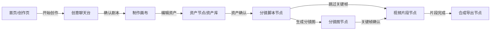

# 流转交互

## 关键交互

| 触发 | 来源页面 | 目标页面/状态 | 反馈 | 风险 |
| --- | --- | --- | --- | --- |
| 开始创作 | home | chat | 进入对话 | 上传失败时留在 home |
| 确认剧本 | chat | canvas | 进入制作画布 | 剧本不完整时进入待确认 |
| 编辑资产 | canvas | assets | 打开资产节点 | 缺引用时提示补齐 |
| 资产确认 | assets | storyboard | 进入分镜脚本 | 角色形态缺失时阻断 |
| 生成分镜图 | storyboard | keyframes | 显示生成进度 | 部分失败允许单张重试 |
| 跳过关键帧 | storyboard | videos | 进入片段生成 | 提示质量风险 |
| 关键帧确认 | keyframes | videos | 进入视频片段 | 外部工具回传需绑定 task_id |
| 片段完成 | videos | export | 进入合成导出 | 缺片段时进入待回传 |
