# 页面与流程

> 交互范式（详见 01 产品形态）：**创意阶段=聊天室**，**剧本确定=分水岭**，**制作阶段 PC=无限画布节点 / 移动=步骤式**。
> **Agent 聊天=核心交互**：可纯对话完成全部编辑动作；画布手动是老手高效路径，二者功能对等、可混用。
> 制作阶段的「剧本拆分/资产/分镜/分镜图/视频/合成」在 PC 上是**画布节点**，移动端**拍平成步骤 tab**——下表「阶段·形态」列标明。
> **顶层阶段骨架 = 剧本 / 资产 / 制作 / 预览 4 步**（"制作"内在画布上展开为 分镜→分镜图→视频 等节点；与 LuxReal 4 步同量级，不强行拆成 5 步 tab）。
> **画布上的资产库**：画布铺不下资产库，入口候选——(a) 聊天面板对侧的**资产库浮窗** / (b) 底部**工具栏入口**（**待定**，见 05）；画布上素材可点击**收藏入库**。

## 页面 / 功能区清单

| 页面/功能区 | 阶段·形态 | 用户任务 | 核心信息 | 主要操作 | 入口/出口 |
|------------|----------|----------|----------|----------|-----------|
| 登录/注册 | — | 进入系统 | 账号 | 登录、注册 | 入口 → 首页 |
| 首页/创作页（**含发现**） | ① 入口·首页 | 开始创作 + 逛案例找灵感 | 路线卡（漫剧✅/创意【二期】/电商【三期】）、入口A 剧本上传框 + 创作设置条（风格/比例/时长/模型/Skill）、入口B「没剧本？进创意聊天」、**下滑：最近项目 + 发现瀑布流** | 上传整季剧本/进聊天台/选设置/生成；浏览发现案例找灵感（一键同款仅创意视频·二期） | 登录后默认页 → 工作台 |
| 创意聊天台（入口B） | ① 创意·**聊天室** | 灵感→大纲→编剧 | 对话流、AI 推荐选项、大纲/剧本草稿 | AI 提问+给选项、发散→收敛、对话式调大纲/剧本、确认剧本 | 首页入口B → 剧本拆分 |
| 剧本拆分 | ① **后台自动拆 + 画布铺开校对** | 校对/微调拆分 | 集→叙事单元→场景 结构 | 合并/拆分单元、改场景边界、确认 | 剧本确定 → 制作画布（聊天末尾给"已拆 X 集 Y 单元"摘要+跳转） |
| 拆资产（项目内） | ② 画布节点 + 聊天补充 | 校对角色/场景/道具 | 资产卡片（角色含**人/非人分类 + 多形态：年龄/身份**） | 编辑描述、上传参考图、设主配角、加角色形态、（按需）触发全景图；**对话式补充改资产** | ← 拆分 → 分镜 |
| 3D 导播台（全景场景） | ② **单独页面·可选** | 设机位、画面精控 | 360°全景图、yaw/pitch/fov、素模摆位 | 拖拽转视角、摆人物素模、设机位、截视角图 | 入口=画布节点 / 场景资产跳转；**非必走**（可只用 2D 资产图）；返回工作台 |
| 分镜脚本 | ③ 画布节点/步骤 | 校对分镜表 | 逐镜头字段表 | 改字段、重生成单镜、调顺序 | ← 资产 → 分镜图 |
| 分镜图工作区（**仅图生**） | ③ 画布节点/步骤 | 生成/校对分镜图（**演示核心**；=整集**关键帧预览**，图生前置；文生镜头跳过此步） | 镜头缩略图网格 | 批量生成、单张重生、对话式改、选预设 | ← 分镜脚本 →（图生）视频 |
| 视频片段工作区 | ③ 画布节点/步骤 | 生成/回填视频 | 片段列表、进度、生成模式 | **文生/图生切换**、**首尾 1s 变速**、逐镜生成、失败重试、外部回填 | ← 分镜图 → 合成 |
| 合成导出 | ④ 画布节点/步骤 | 出成片 | 时间线、音效/音轨 | 拼接、**音效编辑（含 BGM、音轨添加）**、导出 mp4 | ← 视频 → 完成/发行 |
| PC 无限画布工作台 | ②-④ **画布**（容器） | 制作主界面（PC） | 节点画布、连线（**tldraw / React Flow**） | 自由布局节点、连线；成功案例**存为工作流模板**；**资产库浮窗/工具栏入口**（待定）；画布素材**收藏入库** | 承载制作各节点 |
| 移动端步骤式工作台 | ②-④ **步骤**（容器） | 制作主界面（移动） | 阶段 tab | 顺序推进各步骤 | 承载制作各节点（移动） |
| **Agent 聊天面板（核心）** | 贯穿·**三态** | **对话式完成全部编辑动作** | 当前上下文、消息流 | 对话指挥任意动作（拆资产/改分镜/重生成/设机位/合成…）；全屏/侧边/桌宠悬浮切换 | 嵌全程；与画布手动**功能对等** |
| 个人页（作品 + 账号） | 全局·**左侧导航** | 管理作品/账号 | 项目卡片、进度、封面；账号信息 | 打开/重命名/删除项目、模板新建（一键同款仅创意视频·二期） | 左侧导航 → 工作台 |
| 资产库（全局复用） | 全局·**左侧导航** | 跨项目复用 | 角色/场景/道具、预设/模板/工作流 | 浏览、复用、存为模板、收藏 | **左侧导航独立入口**；画布内经浮窗/工具栏访问（待定） |
| 充值/积分 | 全局·左侧导航·**Roadmap** | 充值、查积分 | 余额、套餐、消费记录 | 充值、查账单 | 左侧导航（商业化，非 MVP） |
| 发行投流 | ⑤ Roadmap | （规划级占位） | 分发/多版本/数据 | — | Roadmap |

> **左侧导航（对标 LuxReal）**：创作（首页）/ 发现（并入首页下滑）/ **资产库** / **个人页（作品+账号）** / 帮助文档 / 新手教程 / **充值（Roadmap·商业化）**。
> **发现不单开页**：作为首页下滑区的瀑布流（案例 + 一键同款·**仅创意视频**）。
> **资产两层**：①「拆资产」是项目内提取（画布节点 + 聊天补充）；②「全局资产库」沉淀历史资产跨项目复用（**左侧导航独立入口**）。

## 主流程

### 流程一：总览（两入口 → 分水岭 → 制作）

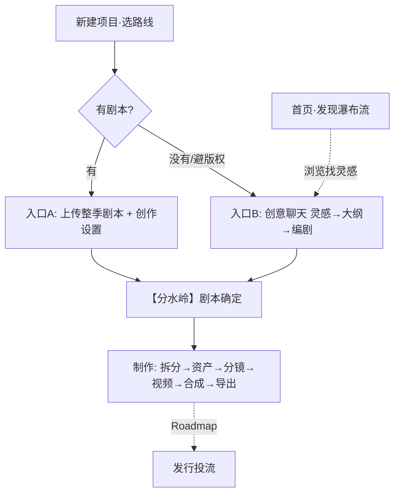
> 注：漫剧 MVP **不做一键同款**（抄同款≠精品）；漫剧的"同款"本质是二创（相同灵感/叙事节奏/设定），属 Roadmap，故不入流程一。一键同款仅创意视频路线（见流程五）。

### 流程二：创意阶段（编剧之前 · 聊天室，发散→收敛）

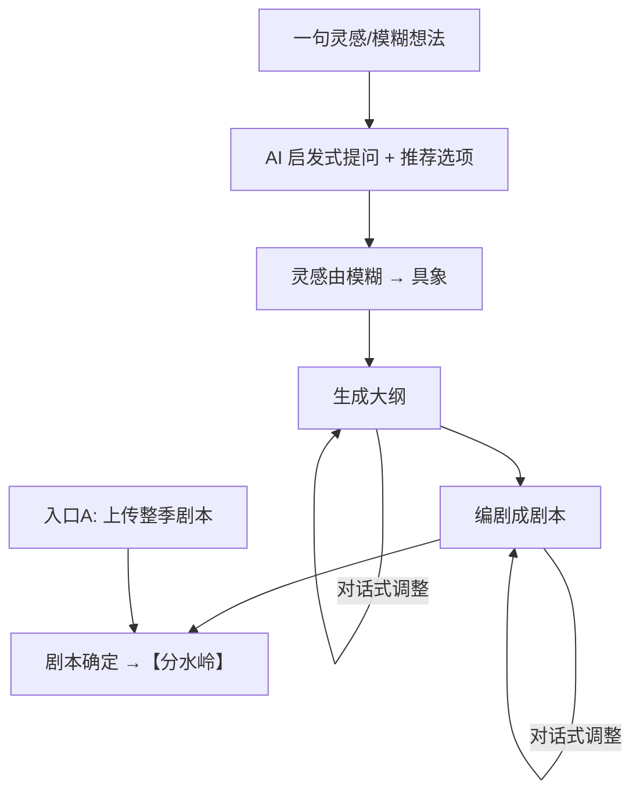

### 流程三：制作阶段（编剧之后 · 画布/步骤，确定流程）

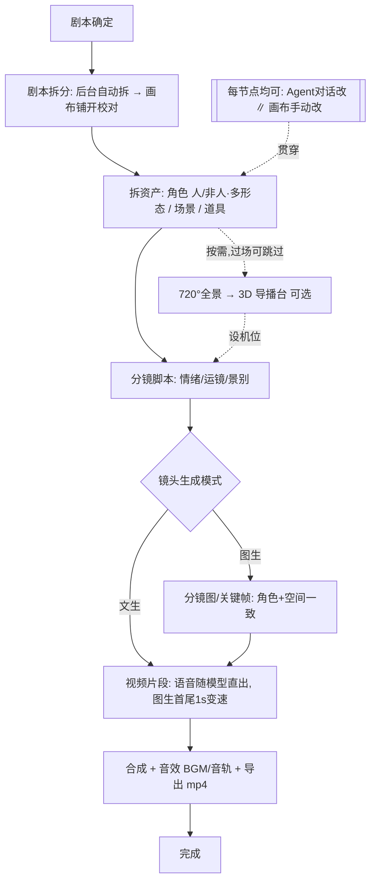

**制作阶段子步骤详图**（编剧之后·确定流程，每子阶段一张细图）

#### 流程三-② 拆资产

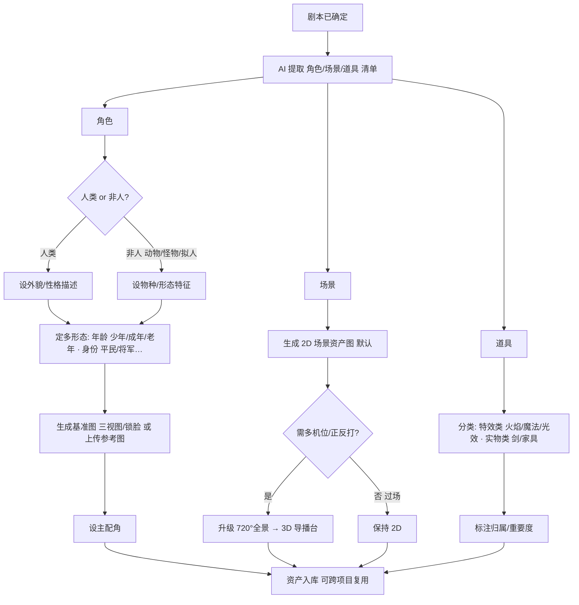

#### 流程三-③ 分镜脚本

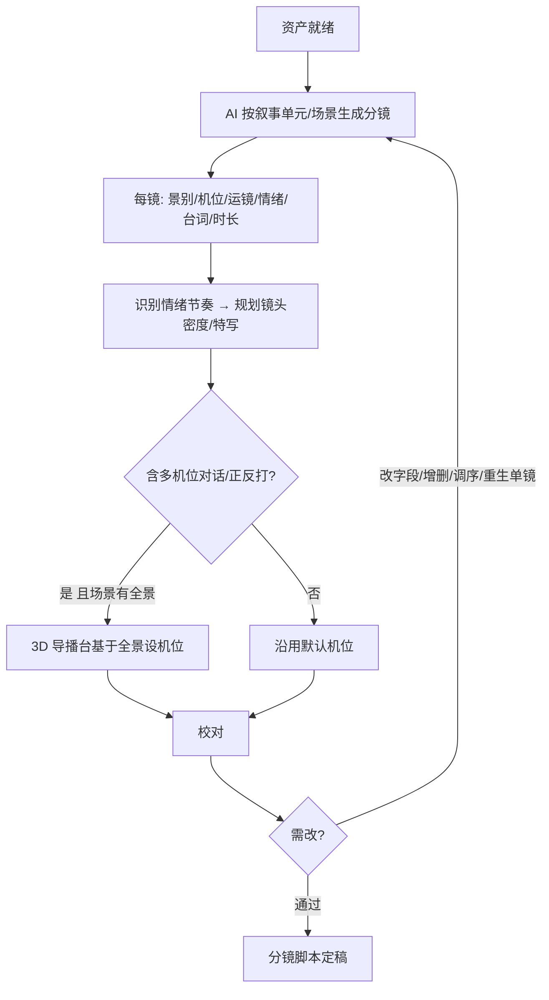
> **切镜/运镜由内置提示词规则驱动**（AI 按规则规划，用户可改）；外部运镜预设库见 Roadmap。

#### 流程三-③/④ 镜头生成模式分支

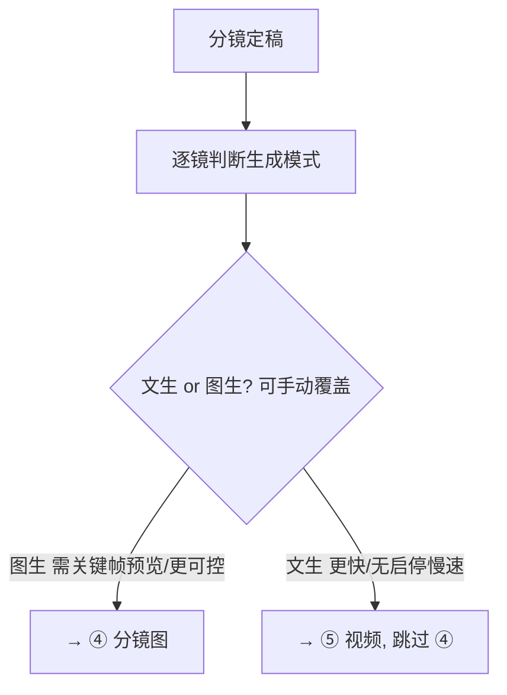

#### 流程三-④ 分镜图（关键帧）— 仅图生镜头

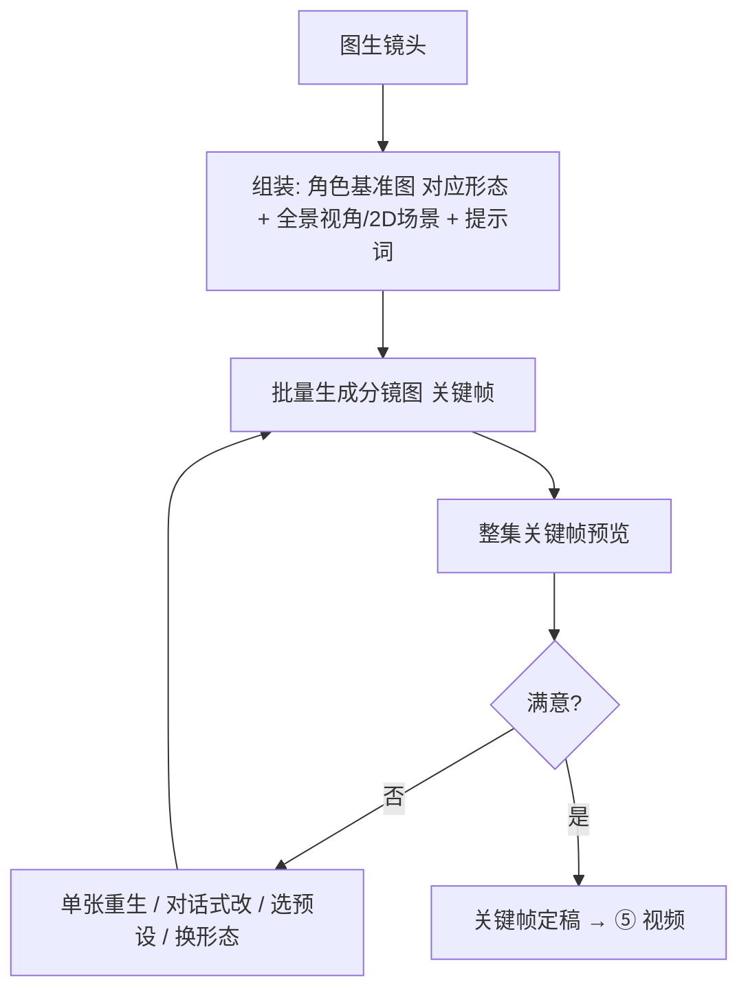

#### 流程三-⑤ 视频片段

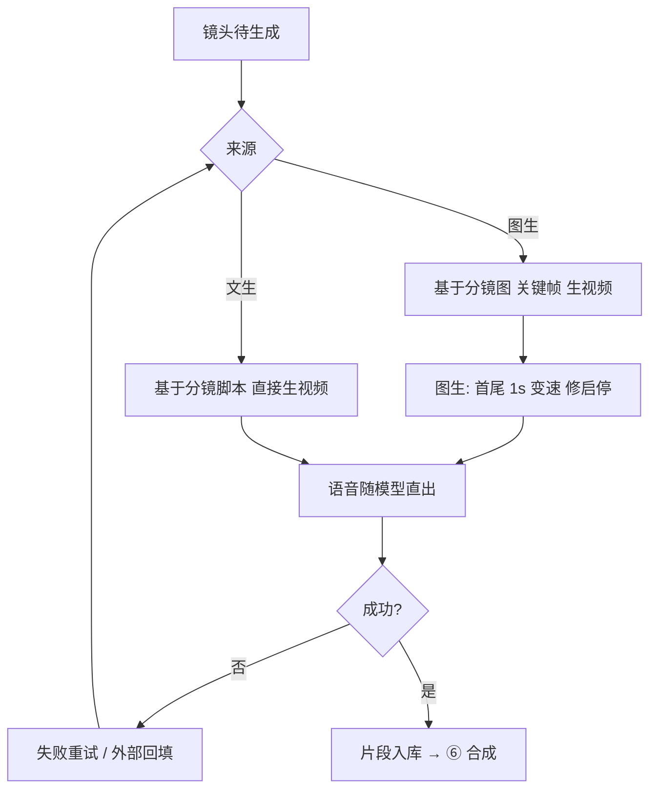

#### 流程三-⑥ 合成与导出

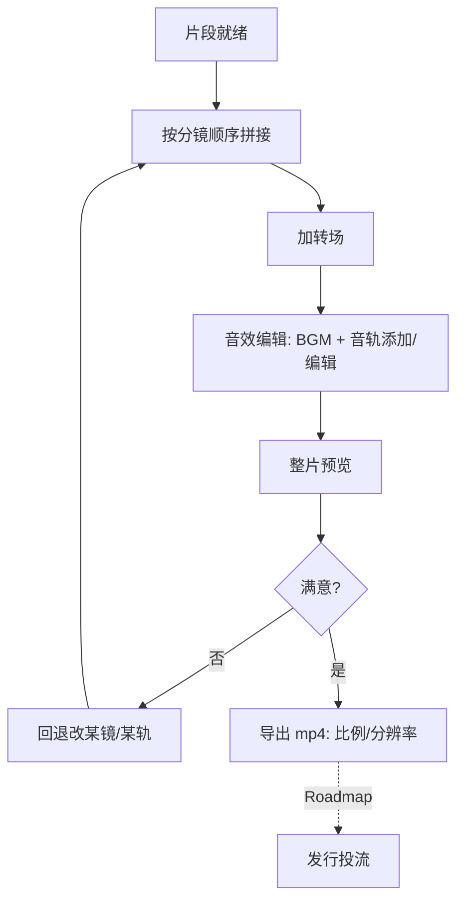

### 流程四：生成适配层（每个生成节点共用）

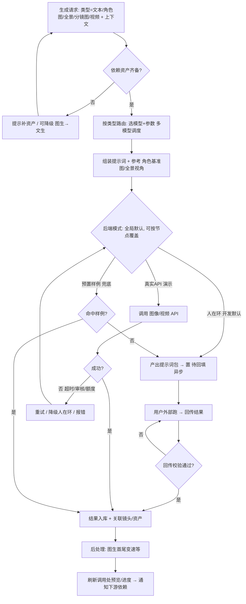

### 流程五：创意短片路线（Roadmap·规划级）

> 一条路线、丰富应对：剧本/脚本前先聊灵感场景，再按**时长档**走不同步骤策略。

```mermaid
flowchart TD
    CS[创意路线] --> CChat[创意聊天: 讨论灵感/场景/题材]
    CChat --> CLen{选时长档}
    CLen -->|<1min: meme/拟人/变装| C1[强钩子单元, 步骤精简]
    CLen -->|3-6min: 科普/vlog/MV| C2[信息/情绪结构编排]
    CLen -->|15-20min: 创意片| C3[接近短剧的叙事流程]
    C1 --> CGen[生成 → 合成(音效) → 出片]
    C2 --> CGen
    C3 --> CGen
    CMimic[发现·一键同款] -.复用模板/无需脚本/优先级靠后.-> CGen
```

### 流程六：电商视频路线（Roadmap·规划级）

> 同思路：先聊商品/卖点/目标人群，再按**类型 + 时长**分步骤策略。

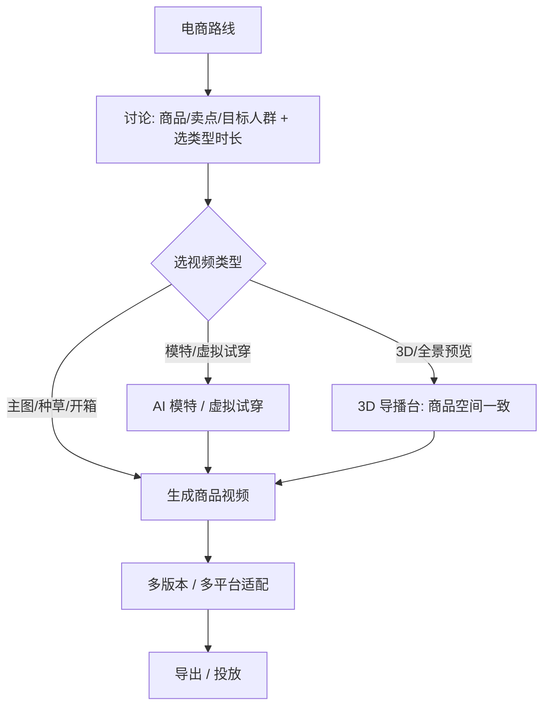

## 关键对象与状态

> 定型高度：仅列核心对象 + 一句话关系；**不写字段/完整状态机/接口**（完整数据模型与状态机留 Make-PRD，见 05 Q13）。

| 对象 | 一句话关系 | 状态 |
|------|-----------|------|
| **Project（项目）** | 一次创作的根，属于某 Route | ✅ 已确认 |
| **Route（路线）** | 漫剧/创意短片/电商，决定流程与题材；Project 选一个 | ✅ 已确认（漫剧 MVP，余 Roadmap） |
| **Episode（集）** | Project 下分集（整季多集），含叙事单元/场景/镜头 | ✅ 关系确认；分集粒度待 PRD |
| **Scene（场景）** | 剧情发生地，可仅 2D 图或升级 720° 全景；被多个 Shot 复用 | ✅ 已确认 |
| **Shot（镜头）** | 最小制作单元，属某 Scene/Episode | ✅ 关系确认；字段待 PRD |
| **Character（角色）** | 人/非人，含多个 CharacterForm | ✅ 已确认 |
| **CharacterForm（角色形态）** | 同角色的年龄/身份变体，各有基准图，被 Shot 引用以保一致 | ✅ 概念确认；引用机制待 PRD |
| **Prop（道具）** | 特效类/实物类，归属场景/角色 | ✅ 已确认 |
| **Asset（资产）** | Character/Scene/Prop/基准图/全景 的统称；项目内 + 全局库可跨项目复用 | ✅ 两层确认；复用机制待 PRD |
| **GenerationTask（生成任务）** | 挂在某 Shot/Asset 上，走生成适配层 | ✅ 存在确认；完整状态机待 PRD |
| **GeneratedFile（生成产物）** | 图/视频/成片，关联回 Shot/Asset/Project | ✅ 关系确认；存储方案待 PRD |
| **WorkflowTemplate（工作流模板）** | 成功画布案例/参数沉淀，可复用 | ⏳ 概念确认；Roadmap 细化 |

> 另有 Storyboard（分镜脚本，Episode→逐 Shot）、Keyframe（分镜图，仅图生 Shot）作为派生对象——关系已确认，细节待 PRD。

## 高风险流程识别

> 仅识别风险节点与性质，**不给解法/状态机**（解法留 Make-PRD，未决项见 05）。

**1. 异步生成（排队/等待/失败/重试/部分完成）**
- 节点：角色基准图、全景图、分镜图（批量）、**视频片段（最久）**。
- 风险：长耗时、排队、单镜失败、整批部分完成。→ 流程四含重试/降级；等待态设计 = 05 Q16（待 PRD）。

**2. 人在环（开发期：导出提示词 → 外部跑 → 回传）**
- 环节：所有**图像/视频**生成节点（角色基准图 / 全景图 / 分镜图 / 视频片段）。
- 文本节点**不走人在环**（直接公司 API）。
- 风险：回传错配、待回填态管理、交付物格式。→ 05 Q15（待 PRD）。

**3. 外部依赖**
- 文本：公司代理 API（`/api/proxy`，多模型）——可用。
- 图像/视频：开发期人在环外部工具；未来或走同站 aigc 接口——待 Q5/落地。
- 全景生成/裁切：开源全景模型（PanFusion/DiT360…）+ PTZ 裁切——待选型 Q3。
- 视频+语音：Kling 3.0 / Seedance 2.0 / Veo 3.1——可用，闭源付费。

**4. Agent 编排（职责边界）**
- ✅ 已确认：混合制 = 总控「导演」+ 编剧/分镜/资产 专家；视频/合成 = 工具调用。
- ⏳ 未确认：专家最终粒度、编排是否动态、跨阶段记忆/上下文切片方式。→ 05 Q14 + 待 `07-agent-team.md` 细化。
