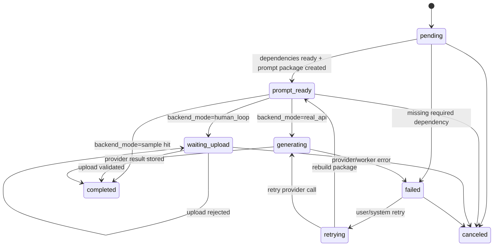

# Events and Jobs Spec

## Runtime Principle

ActNow owns the Harness data model and append-only event log. LangGraph or other agent runtimes may be plugged in later, but they must write back through these events and tables.

## Queues

| Queue | Backend | Purpose | Producer | Consumer |
| --- | --- | --- | --- | --- |
| `generation` | BullMQ + Redis | Image/video/sample generation, prompt package preparation, human-loop validation side effects | API / Agent tools | generation worker |
| `storyboard` | BullMQ + Redis | Longer text/storyboard jobs when not streamed inline | AgentRuntime / Storyboard service | storyboard worker |
| `export` | BullMQ + Redis | Composition/export jobs | Export service | export worker |
| `maintenance` | BullMQ + Redis | Cleanup, retry recovery, future scheduled jobs | system | maintenance worker |

PostgreSQL stores `generation_tasks` and event truth. Redis stores queue runtime state only.

## Harness Events

| Event | Triggered By | Consumer | Payload | Idempotency Key | Retry |
| --- | --- | --- | --- | --- | --- |
| `agent.message.created` | user sends message | AgentRuntime | thread_id, message_id, focus_ref | message_id | no |
| `agent.intent.parsed` | director/router parses intent | UI, logs | thread_id, intent, target_refs | event_id | no |
| `approval.requested` | risky/compound command | UI | approval_id, reason, impact_scope | approval_id | no |
| `approval.completed` | user confirms/rejects | AgentRuntime | approval_id, decision | approval_id | no |
| `tool.started` | harness starts a tool call | UI, logs | tool_call_id, tool_name, input_ref | tool_call_id | no |
| `tool.completed` | tool finishes | UI, logs | tool_call_id, output_ref | tool_call_id | no |
| `tool.failed` | tool fails | UI, logs | tool_call_id, error_code, error_message | tool_call_id | yes |
| `generation.status_changed` | task status changes | UI, workers, logs | task_id, from_status, to_status, reason | task_id + to_status + version | no |
| `upload.validated` | human-loop upload passes validation | UI, generation service | task_id, file_ids, manifest | task_id + checksum | no |
| `worker.job.completed` | BullMQ worker completes job | observability | queue, job_id, task_id, duration_ms | job_id | no |
| `worker.job.failed` | BullMQ worker fails job | observability | queue, job_id, task_id, error_code | job_id + attempts | yes |

## GenerationTask State Machine



## Job Payloads

### generation job

```json
{
  "job_type": "generation",
  "task_id": "task_xxx",
  "project_id": "project_xxx",
  "gen_type": "keyframe",
  "backend_mode": "human_loop",
  "target": { "type": "shot", "id": "shot_xxx" }
}
```

### storyboard job

```json
{
  "job_type": "storyboard",
  "project_id": "project_xxx",
  "episode_id": "episode_xxx",
  "scope": "episode"
}
```

## Observability Minimum

- Every job log must include `job_id`, `task_id` when present, `project_id`, `thread_id` when present.
- Every Agent tool call must create `tool.started` and either `tool.completed` or `tool.failed`.
- Every GenerationTask status change must append `generation.status_changed`.
