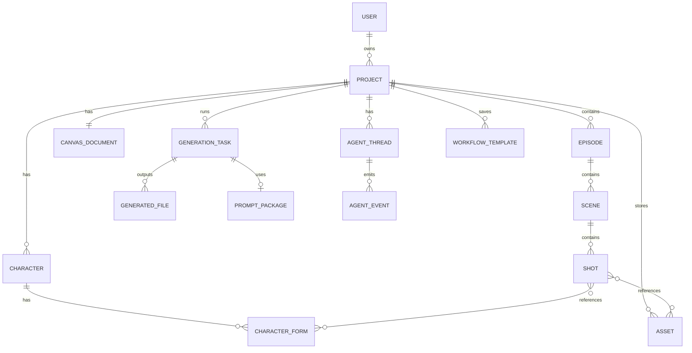

# 数据与状态

## 核心对象

| 对象 | 前端视图 | 后端实体 | 归属 | 创建时机 | 更新时机 |
| --- | --- | --- | --- | --- | --- |
| User | 用户/账号 | users | 系统 | 注册/单用户 demo 初始化 | 登录资料、额度、权限变化 |
| Project | 项目卡、当前工作区 | projects | User/Workspace | 开始创作 | 标题、路线、阶段、设置变化 |
| Route | 创作路线 | projects.route 或 routes | Project | 项目创建 | Roadmap 扩展 |
| Episode | 集/短片单元 | episodes | Project | 剧本锁定/创建结构 | 剧本版本、顺序变化 |
| Scene | 场景 | scenes | Episode | 剧本拆解 | 场景描述、绑定全景资产 |
| Shot | 分镜/镜头 | shots | Scene | 分镜生成 | 镜头描述、机位、情绪、时长、引用 |
| Character | 角色 | characters | Project/Global | 资产拆解/用户创建 | 角色设定变化 |
| CharacterForm | 角色形态 | character_forms | Character | 用户添加/AI 拆解 | 服装、年龄、参考图变化 |
| Prop | 道具 | props 或 assets(type=prop) | Project | 资产拆解/上传 | 元数据变化 |
| Asset | 资产/参考/全景 | assets | Project/Global | 上传、生成、收藏 | 标签、绑定、入库 |
| CanvasDocument | 画布文档 | canvas_documents | Project | 打开画布初始化 | 节点、连线、视口保存 |
| CanvasNode | 画布节点 | canvas_documents.nodes | CanvasDocument | 自动生成/用户拖入 | 位置、尺寸、引用、折叠 |
| GenerationTask | 生成任务 | generation_tasks | Project + target | 用户触发生成/Agent 工具调用 | 状态、重试、取消、回传 |
| PromptPackage | 提示词包 | prompt_packages | GenerationTask | 依赖齐备后组装 | 重新组装/版本变化 |
| GeneratedFile | 生成文件 | generated_files | GenerationTask/Asset/Shot | 回传或 API 完成 | 版本、元数据、清理 |
| AgentThread | Agent 会话 | agent_threads | Project | 创建项目/打开工作区 | mode、focus、状态变化 |
| AgentEvent | Agent 事件 | agent_events | AgentThread | 消息/工具调用/状态变化 | 只追加 |
| WorkflowTemplate | 组合技/模板 | workflow_templates | User/Project | 预置或用户保存 | 版本、参数变化 |

## 对象关系

## GenerationTask 状态机

| 状态 | 进入条件 | 可执行操作 | 退出状态 |
| --- | --- | --- | --- |
| `pending` | 创建任务，依赖未检查或等待排队 | 检查依赖、取消 | `prompt_ready` / `failed` / `canceled` |
| `prompt_ready` | 依赖齐备，提示词包已组装 | 导出提示词、调用真实 API、命中样例、取消 | `waiting_upload` / `generating` / `completed` / `canceled` |
| `waiting_upload` | 人在环模式等待用户外部生成后回传 | 上传结果、重传、取消 | `completed` / `waiting_upload` / `canceled` |
| `generating` | 真实 API 或后端 worker 正在生成 | 查询进度、取消 | `completed` / `failed` |
| `retrying` | 用户或系统触发重试 | 重新组装/重新调用 | `prompt_ready` / `generating` / `failed` |
| `completed` | 校验通过并生成 GeneratedFile | 查看、设为目标引用、创建新版本 | 终态或新 task |
| `failed` | 依赖、模型、队列、校验失败 | 重试、降级、取消 | `retrying` / `prompt_ready` / `waiting_upload` / `canceled` |
| `canceled` | 用户取消或上游对象删除 | 查看日志 | 终态 |

## AgentRuntime 状态

| 对象 | 状态 | 进入条件 | 可执行操作 | 退出状态 |
| --- | --- | --- | --- | --- |
| AgentThread | `idle` | 无进行中任务 | 发送消息、切 focus | `thinking` |
| AgentThread | `thinking` | 总控理解意图 | 等待、取消 | `streaming` / `waiting_approval` / `failed` |
| AgentThread | `waiting_approval` | 复合指令影响范围较大 | 用户确认/拒绝 | `tool_running` / `idle` |
| AgentThread | `tool_running` | 调用专家或工具 | 查询进度、取消 | `streaming` / `failed` |
| AgentThread | `streaming` | 输出消息或结果 | 展示内容 | `idle` |
| AgentThread | `failed` | 模型/工具失败 | 重试、继续对话 | `thinking` / `idle` |

## Canvas 状态

| 对象 | 状态 | 进入条件 | 可执行操作 | 退出状态 |
| --- | --- | --- | --- | --- |
| CanvasDocument | `clean` | 已保存 | 编辑 | `dirty` |
| CanvasDocument | `dirty` | 节点/连线/视口变化 | 保存、撤销 | `saving` / `clean` |
| CanvasDocument | `saving` | 自动/手动保存中 | 等待 | `clean` / `save_failed` |
| CanvasDocument | `save_failed` | 保存失败 | 重试、继续本地编辑 | `saving` / `dirty` |
| CanvasNode | `idle` | 绑定对象稳定 | 编辑、触发生成 | `editing` / `task_bound` |
| CanvasNode | `task_bound` | 绑定 GenerationTask | 查看任务、上传、重试 | 跟随 task |

## 版本、审计与恢复

| 数据 | 是否版本化 | 保留策略 | 审计字段 | 恢复方式 |
| --- | --- | --- | --- | --- |
| ScriptDraft | 是 | 保留主要草稿和锁定版本 | created_by, updated_by, model_meta | 回滚到指定 script_version |
| Shot | 是 | 关键编辑保留版本 | updated_by, source_event_id | 回滚字段或整镜 |
| CharacterForm | 是 | 每个形态保留参考版本 | created_by, source_asset_id | 选择旧形态 |
| PromptPackage | 是 | 跟随 task 版本 | generated_by, template_version | 重新导出旧包 |
| GeneratedFile | 是 | 每 task 默认 5 版 | model_meta, upload_by, checksum | 设某版为当前 |
| CanvasDocument | 是 | 保存快照 + 操作日志待定 | version, updated_by | 乐观锁 + 快照恢复 |
| AgentEvent | 追加日志 | 按项目长期保留或归档 | thread_id, actor, tool_call_id | 从事件重建上下文摘要 |
