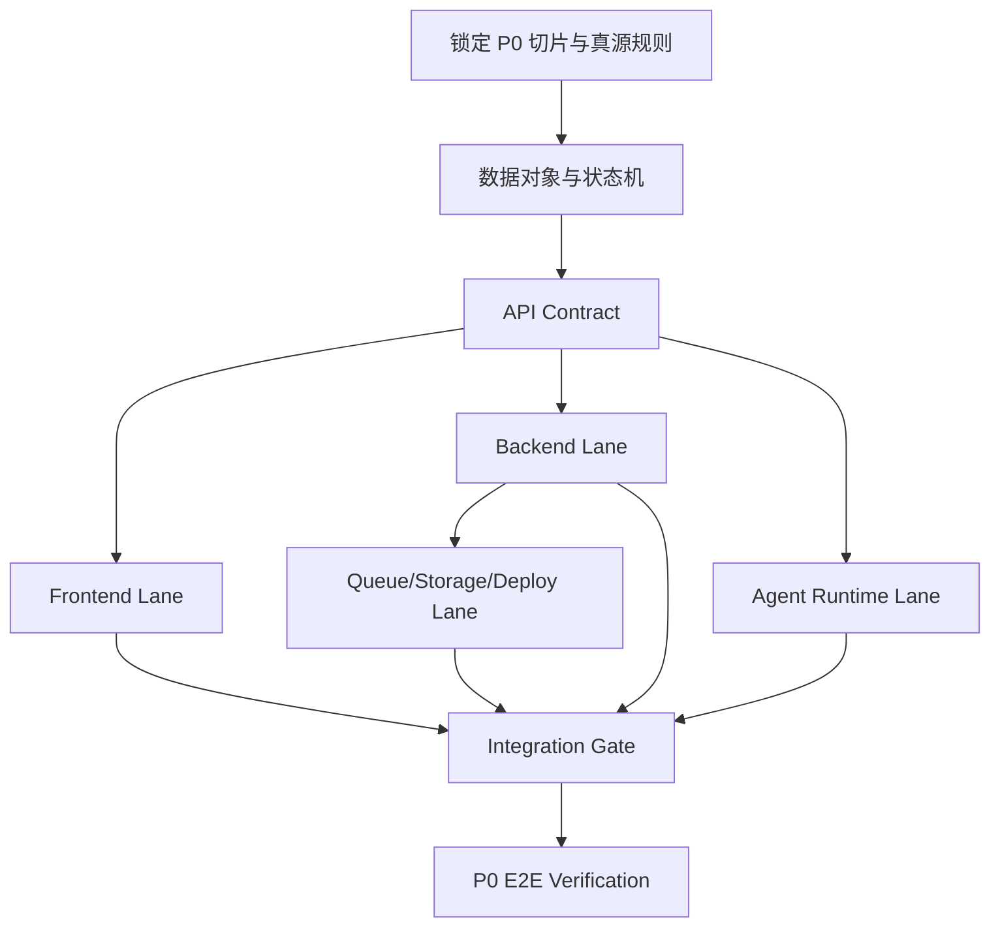

# Cowork 工程串并行执行计划

## 目标

让 PM、前端、后端、Agent、部署和 QA 可以围绕同一组 spec 并行推进，同时用 serial gate 控制不可并行的关键决策，避免 subagent 各写各的。

## 关键依赖图

## Serial Gates

| Gate | 必须先确定什么 | 阻塞哪些并行任务 | 决策人 | 状态 |
| --- | --- | --- | --- | --- |
| SG-001 | PRD vs 原型真源规则 | 所有切片验收口径 | 用户/PM | pending |
| SG-002 | 生产画布技术路线：React Flow 主线，tldraw 备选，react-konva 不进 MVP | 前端画布实现、Canvas schema | 用户/前端负责人 | confirmed |
| SG-003 | 后端默认技术栈与部署：NestJS/Prisma/Postgres/S3/Redis/BullMQ/Docker Compose | 后端、部署、队列、环境变量 | 用户/技术负责人 | confirmed |
| SG-004 | GenerationTask 状态机和 prompt package schema | 生成任务、人在环、真实 API 接入 | PM/后端/Agent | draft |
| SG-005 | P0 切片顺序 | subagent task packet 分配 | PM | draft |

## Parallel Lanes

| Lane | Owner/Subagent | 输入 | 输出 | 可并行原因 | 禁止改动 | 验证方式 | 状态 |
| --- | --- | --- | --- | --- | --- | --- | --- |
| PL-001 | Frontend Agent | `tech/01`、Canvas PRD、HTML 原型 | 组件树、状态表、页面任务 | API contract draft 可 mock | 不改 API 字段真源 | 原型对照 + mock flow | pending |
| PL-002 | Backend Agent | `tech/02`、`tech/04` | 服务模块、DB schema、队列方案 | 数据对象已在 PRD 有基础 | 不改产品规则 | migration + API tests | pending |
| PL-003 | API Contract Agent | `tech/03`、P0 切片 | OpenAPI、错误码、类型 | 可先于实现完成 | 不改业务范围 | schema lint + contract review | pending |
| PL-004 | Agent Runtime Agent | PRD 10、`tech/04` | ActNow Harness thread/event/tool-call/human-approval schema | 与 UI/后端并行定义 | 不把 LangGraph 当产品真源 | event replay review | pending |
| PL-005 | Deploy Agent | `tech/08` | Docker Compose、env、storage、migration plan | 可与业务实现并行 | 不引入未确认云厂商锁定 | fresh setup smoke test | pending |
| PL-006 | QA/Verifier Agent | `tech/06`、`completion-check.md` | E2E checklist、测试数据 | 可提前写验收 | 不改实现 | 手工/自动验证记录 | pending |

## Subagent Task Packets

| Task ID | Lane | Worker/Agent | Claim 方式 | 输入引用 | 输出引用 | Mailbox/回传位置 | Status |
| --- | --- | --- | --- | --- | --- | --- | --- |
| TT-FE-001 | PL-001 | Frontend Agent | human/agent | `prd/Canvas/PRD-Canvas.md`, `prototype/pages/workspace.html`, `tech/01-frontend-plan.md` | component plan, UI state map | `tech/changes/<id>/` 或 PR | pending |
| TT-BE-001 | PL-002 | Backend Agent | human/agent | `tech/02-backend-plan.md`, `tech/04-data-and-state.md` | service module plan, DB schema draft | `spec/database.md` | pending |
| TT-API-001 | PL-003 | API Contract Agent | human/agent | `tech/03-api-contract.md` | OpenAPI draft | `spec/openapi.yaml` | pending |
| TT-AG-001 | PL-004 | Agent Runtime Agent | human/agent | PRD 10, `tech/04-data-and-state.md` | ActNow Harness: AgentThread/Event/ToolCall/HumanApproval/RuntimeResource spec | `spec/events.md` | pending |
| TT-DEP-001 | PL-005 | Deploy Agent | human/agent | `tech/08-engineering-governance.md` | Docker/env/deploy plan | `spec/env.md`, `spec/storage.md` | pending |
| TT-QA-001 | PL-006 | QA Agent | human/agent | `tech/06-delivery-slices.md`, `completion-check.md` | E2E check matrix | `tech/completion-check.md` | pending |

## Runtime Resources

| Resource | 来源项目启发 | 本项目是否需要 | 真源/路径 | 风险 |
| --- | --- | --- | --- | --- |
| Memory | deer-flow / ironclaw | 需要，先做 AgentThread 摘要与 project context | `tech/04`、`spec/events.md` | 上下文过期或误召回 |
| Sandbox | deer-flow / danghuangshang | 暂不需要代码执行 sandbox；生成/合成 worker 需容器隔离 | `tech/08` | 权限、成本 |
| Skill/Tool | deer-flow / gstack | 需要，组合技/WorkflowTemplate 作为轻量 Skill 载体 | `tech/04` | 工具能力漂移 |
| HumanApproval | ironclaw / ws-workspace | 需要，复合 Agent 指令和 PRD 回写需要确认 | `tech/07`、AgentEvent | 阻塞或误审批 |

## Merge Gates

| Gate | 合并条件 | 检查文件 | 证据 | 状态 |
| --- | --- | --- | --- | --- |
| MG-001 | `tech/01-09` 无占位，待确认问题集中 | `tech/*.md` | 本轮 draft | in_progress |
| MG-002 | P0 API/DB/events/storage 真源存在 | `spec/*` | spec review | pending |
| MG-003 | 至少 S1-S6 feature specs 可追溯 | `specs/<feature>/` | tasks + quickstart | pending |
| MG-004 | Docker/env/migration 能启动新环境 | `spec/env.md`、deploy files | smoke test | pending |
| MG-005 | E2E 路径跑通并更新 completion-check | `tech/completion-check.md` | 验证记录 | pending |

## API / AI 调用编排

| 用户动作 | 调用链 | 模式 | 超时 | 重试 | 缓存 | 降级 | 前端反馈 |
| --- | --- | --- | --- | --- | --- | --- | --- |
| 输入灵感 | Agent message -> text model proxy -> ScriptDraft | stream | 30-60s | 用户重发 | thread summary | mock/sample reply | thinking + streaming |
| 锁定剧本 | Script lock -> scene/shot extraction -> canvas init | serial | 30s | 可重跑 | project snapshot | 手工编辑 | progress + confirm |
| 生成分镜脚本 | Agent/Storyboard -> text model -> Shot updates | queue/stream | 60s | 2 次 | script context | 保留旧版本 | task progress |
| 生成分镜图 | GenerationTask -> prompt package -> human upload/API | manual/API queue | 人在环不限/API 120s | 重传/重试 | prompt package | 样例/人在环 | prompt_ready/waiting_upload |
| 生成视频 | GenerationTask -> prompt package/API -> GeneratedFile | manual/API queue | 人在环不限/API 长超时 | 重传/重试 | reference assets | 人在环/样例 | long task status |
| Agent 复合指令 | Director -> plan -> approval -> expert/tool calls | serial + parallel substeps | 60s+ | 局部重试 | context slice | 反问澄清 | approval card + events |

## Event / Observability Schema

| Event | normalized_event | raw_event | task_id | actor | tool | duration/cost | retention |
| --- | --- | --- | --- | --- | --- | --- | --- |
| Agent 消息创建 | `agent.message.created` | provider payload | thread_id | human | agent | tokens/cost | project lifetime |
| 工具调用开始 | `tool.started` | tool args | tool_call_id | agent | storyboard/generation/canvas | start_at | project lifetime |
| 生成任务状态变化 | `generation.status_changed` | task diff | task_id | system/agent/human | generation | duration | project lifetime |
| 人在环审批/回传 | `approval.completed` / `upload.validated` | manifest/files | task_id | human | upload | file count/size | project lifetime |
| worker 完成 | `task.completed` | worker result | task_id | system | worker | duration/cost | 180d+ |

## Terminal / Remote Control Policy

| 能力 | 默认策略 | 允许条件 | 禁止项 |
| --- | --- | --- | --- |
| 终端多会话 | disabled | 用户明确要求并限定目标 | 轮询等待、误操作普通 shell |
| 远程 agent 控制 | disabled | 有鉴权、审计、撤销 | 公网裸露、共享密钥 |
| 浏览器/外部平台 | review_required | 明确账号和合规边界 | 私自登录、绕过平台规则 |

## 性能预算

| 场景 | 目标 | 风险 | 策略 |
| --- | --- | --- | --- |
| workspace 首屏 | 2s 内可交互 | 聚合数据过重 | 分层加载 project summary + lazy canvas |
| 画布 pan/zoom | 60fps 目标 | 节点/连线过多 | 虚拟化、节流保存、避免重布局 |
| 用户操作反馈 | 100-300ms 内视觉反馈 | 长任务阻塞 | optimistic/loading/streaming |
| 长任务状态 | 任务状态可恢复 | 页面关闭/网络断开 | polling/SSE + task 持久化 |

## Open Questions

| ID | Question | Impact | Default |
| --- | --- | --- | --- |
| PQ-001 | 是否立刻拆独立 subagent skill，还是先用 task packet | cowork 组织 | 先 task packet |
| PQ-002 | 是否启用终端多会话工具 | agent 协作 | 默认禁用 |
| PQ-003 | 是否需要人机共享 workspace UI | PM 审查 | 后续接入，不阻塞 P0 |
